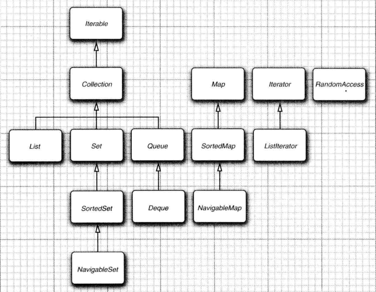
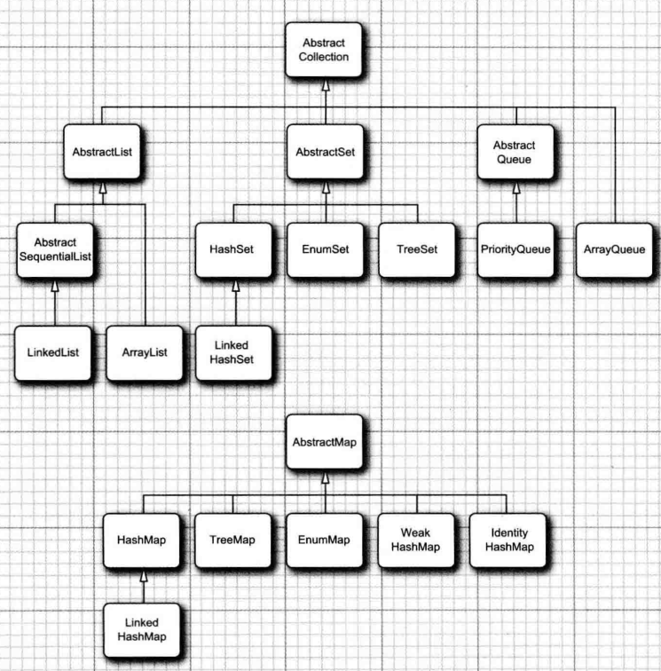

# 第九章 集合

## Java 集合框架

* 集合API中以Abstract开头的类是为类库实现者设计的,扩展这些类比直接实现接口要简单得多
* 集合类的基本接口是`Collection`,它继承了`Iterable`接口, 方法`iterator()`返回`Iterator`接口, 它是一个迭代器. 注意, 当要删除元素时, 必须先调用`next()`然后调用`remove()`, 也就是说remove方法必须与next组合使用.
* `Iterator`接口提供了一个函数式方法`forEachRemaining(Consumer<? super E> action)` 可以做迭代
* 集合框架中的接口

* `RandomAccess`是一个标记接口, 可以用它判断集合是否支持高效随机访问
* `Set`接口不允许有元素重复. java6新增了`NavigableSet`,`NavigableMap`接口, 包含用于遍历和查找的方法

## 具体的集合

ArrayList: 一种可以动态增长和缩减的索引序列
LinkedList: 一种可以在任何位置进行高效地插人和删除操作的有序序列
ArrayDeque: 一种用循环数组实现的双端队列
HashSet: 一种没有重复元素的无序集合
TreeSet: — 种有序集
EnumSet: 一种包含枚举类型值的集
LinkedHashSet: 一种可以记住元素插人次序的集
PriorityQueue: 一种允许高效删除最小元素的集合
HashMap: 一种存储键/值关联的数据结构
TreeMap: — 种键值有序排列的映射表
EnumMap: 一种键值属于枚举类型的映射表
LinkedHashMap: 一种可以记住键/值项添加次序的映射表
WeakHashMap: 一种其值无用武之地后可以被垃圾回收器回收的映射表
IdentityHashMap: 一种用 == 而不是用 equals 比较键值的映射表

散列表: 通过计算元素的hash值, 将他们放置在桶中, 每个桶的数据结构是一个链表, 如果查找对象就可以根据hash值与桶数量取余, 然后根据余数获取桶的索引, 再从对应的桶中读取所需元素.

* 双端队列, Deque接口,有ArrayDeque和LinkedList实现.
* 优先级队列PriorityQueue, 永远删除的是最小的元素

## 映射

* merge, comouter 方法可以使用计算结果更新节点值
* *ifAbsent() 方法在有元素的时候才执行方法的动作
* 映射视图,entrySet(),keySet(),values() 等方法返回的是映射视图, 只能删除元素, 不能新增元素.
* `WeakHashMap`弱引用映射, 以弱引用方式保存键, GC有一种特有的方式回收不使用的元素
* `EnumSet` 使用静态工厂方法生成实例
* `IdentityHashMap` 使用==比较, 其hash值是`System.identityHashCode()`计算得到, 计算的是对象的内存地址.

## 视图与包装器

* `Array.asList(..)` 返回一个视图, 它最终调用`Collections.nCopies(n,anObject)`
* sub* 方法返回一个子范围
* Collections.unmodifiable* 方法返回不可修改的视图
* 同步视图, Collections.synchronized*()返回的视图可以多线程访问

## 算法

* java中的排序是将元素转移到一个数组, 排序完成后copy回去
* `Collections.shuffle()`混排元素
* 二分法查找的前提是数组应该是可以随机访问的, 另外数组是排序的`Collections.binarySearch()`

## 遗留的集合

* Properties 键值对
* BitSet 位集
