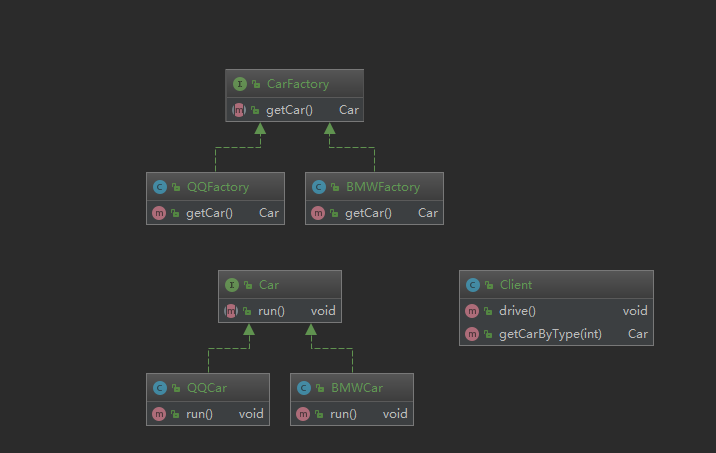

# 设计模式二: 工厂方法(Factory Method)

## 简介

工厂方法模式是创建型模式的一种, 核心结构有四个角色: 抽象工厂,具体工厂,抽象产品,具体产品;

实现层面上,该模式定义一个创建产品的接口,将实际创建工作推迟到具体工厂类实现, 一个产品对应一个工厂, 这样的好处是当有新产品引入时可以不修改具体的工厂角色.

## 意图

定义了一个创建对象的接口，但由子类决定要实例化哪个类。工厂方法把实例化操作推迟到子类。

## 类图



## 实现

以汽车举例. 按照本模式核心的四个角色分别定义, 并增加模式调用角色(此处顺便提一下简单工厂模式, 比较简单, 具体实现参看代码).

一. 抽象产品, 定义接口  `Car`

```Java
/**
 * 汽车接口
 */
public interface Car {

    /**
     * 开车
     */
    void run();

}
```

二. 抽象工厂  `CarFactory`

```Java
/**
 * 汽车工厂接口
 */
public interface CarFactory {

    /**
     * 生产汽车
     * @return 实现Car接口的类实例
     */
    Car getCar();

}
```

三. 具体产品  `BMWCar`,`QQCar`

```Java
/**
 * BMW 汽车实现类
 */
public class BMWCar implements Car {

    public void run() {
        System.out.println("BMW run...");
    }

}

/**
 * QQ 汽车实现类
 */
public class QQCar implements Car {

    public void run() {
        System.out.println("QQ run...");
    }

}
```

四. 具体工厂  `BMWFactory`,`QQFactory`

```Java
/**
 * BMW 汽车工厂实现
 */
public class BMWFactory implements CarFactory {

    public Car getCar() {
        return new BMWCar();
    }

}

/**
 * QQ 汽车工厂实现
 */
public class QQFactory implements CarFactory {

    public Car getCar() {
        return new QQCar();
    }

}
```

五. 调用类   `Client`

```Java
/**
 * 调用方角色
 */
public class Client {

    /**
     * 调用演示
     */
    public void drive(){
        CarFactory bmwFactory = new BMWFactory();
        Car bmwCar = bmwFactory.getCar();
        bmwCar.run();

        CarFactory qqFactory = new QQFactory();
        Car qqCar = qqFactory.getCar();
        qqCar.run();

        Car car = getCarByType(1);
        if (car!=null){
            car.run();
        }
        car = getCarByType(2);
        if (car!=null){
            car.run();
        }
    }

    /**
     * 简单工厂实现, 通过传入的参数返回具体的汽车
     * @param carType
     * @return
     */
    public Car getCarByType(int carType){

        Car car = null;
        switch (carType){
            case 1:
                CarFactory bmwFactory = new BMWFactory();
                Car bmwCar = bmwFactory.getCar();
                car = bmwCar;
                break;
            case 2:
                CarFactory qqFactory = new QQFactory();
                Car qqCar = qqFactory.getCar();
                car = qqCar;
                break;
        }

        return car;
    }

}
```

## 总结

优点: 1. 隐藏产品创建细节,我们只需要关系具体产品对应的具体工厂; 2. 完全符合设计模式"开闭"原则,当有新产品加入时只需要实现对应的工厂类;

缺点: 产品种类太多时维护难度增加.
