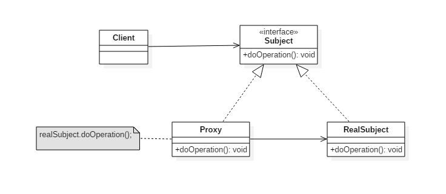

# 设计模式三: 代理模式(Proxy) -- JDK的实现方式

## 简介

代理模式属于行为型模式的一种, 控制对其他对象的访问, 起到中介作用.

代理模式核心角色: 真实角色,代理角色; 

按实现方式不同分为静态代理和动态代理两种;

## 意图

控制对其它对象的访问。

## 类图



## 实现

JDK自带了Proxy的实现, 下面我们先使用JDK的API来演示代理如何使用, 随后再探究Proxy的实现原理,并自己来实现Proxy.

### JDK代理类的使用: (`InvocationHandler`,`Proxy`)

使用JDK实现的代理代码如下, 先定义业务接口`Car`,然后实现该接口`QQCar`,实现类即为真实角色. 继续定义代理类`Agent`,代理类需要实现接口`InvocationHandler`的`invoke()`方法, 最后是调用;
注意代理类使用了`Proxy.newProxyInstance()`方法动态生成代理对象, 在稍后手写代码时我们将参考本方法定义我们自己的实现方式.

```Java
/**
 * 汽车接口,定义业务规范
 */
public interface Car {
    void sale();
}
```
```Java
/**
 * 接口Car的具体实现,是代理模式中的真实角色
 */
public class QQCar implements Car {
    public void sale() {
        System.out.println("卖了一辆qq");
    }
}
```
```Java
/**
 * 经纪公司,或者经销商
 */
public class Agent implements InvocationHandler {

    private Car car ;

    /**
     * 返回代理对象,接收被代理对象
     * @param car
     * @return
     * @throws Exception
     */
    public Object getInstance(Car car) throws Exception {
        this.car=car;
        Class clazz = car.getClass();
        // 看下代理前后的具体类型
        System.out.println("代理前对象的类型"+car.getClass().getName());
        Object obj = Proxy.newProxyInstance(clazz.getClassLoader(),clazz.getInterfaces(),this);
        // 看下代理前后的具体类型
        System.out.println("代理后对象类型变为"+obj.getClass().getName());
        return obj;
    }

    public Object invoke(Object proxy, Method method, Object[] args) throws Throwable {
        System.out.println("Agent find some costumers");
        //this.car.sale();
        method.invoke(this.car, args);
        System.out.println("Agent saled the car");
        return null;
    }
}
```

```Java
try {
    Car car = (Car) new Agent().getInstance(new QQCar());
    car.sale();
}catch (Exception e){
    e.printStackTrace();
}
```

总结JDK原理如下:
1. 获取真实角色对象的引用并获取其接口
2. Proxy生成一个代理类,并实现接口的方法
3. 获取被代理对象的引用
4. 动态生成代理类的class字节码
5. 加载到内存供调用

### 手写实现Proxy

要自己实现JDK的代理模式,我们首先要搞清楚JDK的Proxy是如何实现的, 通过调试及查看源码可以知道JDK生成了一个`$Proxy0`的类型,我们也将该类型名称打印到了控制台. 如果能动态生成,编译并将这个类加载到内存, 我们就可以自己实现Proxy了.

1. 首先拿到`$Proxy0`的代码,供我们后面生成代理类的源码时参考

```Java
//生产接口Car对应的代理类class文件并保存到文件
byte[] data = ProxyGenerator.generateProxyClass("$Proxy0",new Class[]{Car.class});
FileOutputStream outputStream = new FileOutputStream("E:\\design-patterns\\src\\main\\java\\com\\xlx\\pattern\\proxy\\jdk\\$Proxy0.class");
outputStream.write(data);
outputStream.close();
```

生成的$Proxy0.class文件反编译后的代码如下, 可以看到其实现了Car接口.
```Java
//
// Source code recreated from a .class file by IntelliJ IDEA
// (powered by Fernflower decompiler)
//

import com.xlx.pattern.proxy.jdk.Car;
import java.lang.reflect.InvocationHandler;
import java.lang.reflect.Method;
import java.lang.reflect.Proxy;
import java.lang.reflect.UndeclaredThrowableException;

public final class $Proxy0 extends Proxy implements Car {
    private static Method m1;
    private static Method m2;
    private static Method m3;
    private static Method m0;

    public $Proxy0(InvocationHandler var1) throws  {
        super(var1);
    }

    public final boolean equals(Object var1) throws  {
        try {
            return (Boolean)super.h.invoke(this, m1, new Object[]{var1});
        } catch (RuntimeException | Error var3) {
            throw var3;
        } catch (Throwable var4) {
            throw new UndeclaredThrowableException(var4);
        }
    }

    public final String toString() throws  {
        try {
            return (String)super.h.invoke(this, m2, (Object[])null);
        } catch (RuntimeException | Error var2) {
            throw var2;
        } catch (Throwable var3) {
            throw new UndeclaredThrowableException(var3);
        }
    }

    public final void sale() throws  {
        try {
            super.h.invoke(this, m3, (Object[])null);
        } catch (RuntimeException | Error var2) {
            throw var2;
        } catch (Throwable var3) {
            throw new UndeclaredThrowableException(var3);
        }
    }

    public final int hashCode() throws  {
        try {
            return (Integer)super.h.invoke(this, m0, (Object[])null);
        } catch (RuntimeException | Error var2) {
            throw var2;
        } catch (Throwable var3) {
            throw new UndeclaredThrowableException(var3);
        }
    }

    static {
        try {
            m1 = Class.forName("java.lang.Object").getMethod("equals", Class.forName("java.lang.Object"));
            m2 = Class.forName("java.lang.Object").getMethod("toString");
            m3 = Class.forName("com.xlx.pattern.proxy.jdk.Car").getMethod("sale");
            m0 = Class.forName("java.lang.Object").getMethod("hashCode");
        } catch (NoSuchMethodException var2) {
            throw new NoSuchMethodError(var2.getMessage());
        } catch (ClassNotFoundException var3) {
            throw new NoClassDefFoundError(var3.getMessage());
        }
    }
}

```

2. 参考JDK的实现,我们分别定义`MyClassLoader`,`MyInvocationHandler`,`MyProxy`,分别对应`ClassLoader`,`InvocationHandler`,`Proxy`; 
其中接口`MyInvocationHandler`代码如下:

```Java
/**
 * 代理类需要实现该接口
 */
public interface MyInvocationHandler {
    Object invoke(Object proxy, Method method, Object[] args) throws Throwable;
}
```

3. 定义代理类`MyAgent`对应我们使用JDK时定义的`Agent`, 但`getInstance()`方法实现全部改为2中自定义的类,实现2中定义的接口

```Java
/**
 * 代理类
 */
public class MyAgent implements MyInvocationHandler {

    private Car car;

    public Object invoke(Object proxy, Method method, Object[] args) throws Throwable {
        System.out.println("Agent find some costumers");
        //this.car.sale();
        method.invoke(this.car,args);
        System.out.println("Agent saled the car");
        return null;
    }

    public Object getInstance(Car car) throws Exception {
        this.car=car;
        Class clazz = car.getClass();
        Object obj = MyProxy.newProxyInstance(new MyClassLoader(),clazz.getInterfaces(),this);
        return obj;
    }
}
```

4. 实现`MyProxy`中生成代理对象的方法`newProxyInstance()`
具体又分为以下几步:

        1. 定义动态代理类的源码
        2. 保存源码文件到磁盘
        3. 编译源码文件为.class文件
        4. 加载.class字节码到内存 (具体实现见5.实现MyClassLoader))
        5. 返回代理对象

```Java
/**
 * 生成代理对象的代码, Proxy的具体原理在这里体现
 */
public class MyProxy {

    private static final String ln = "\r\n";

    public static Object newProxyInstance(MyClassLoader loader, Class<?>[] interfaces, MyInvocationHandler h) {
        File f = null;
        try {
            // 第一步: 生成源代码
            String src = generateSrc(interfaces[0]);

            // 第二步: 保存生成的源码文件
            String filePath = MyProxy.class.getResource("").getPath();
            f = new File(filePath + "/$Proxy0.java");
            FileWriter writer = new FileWriter(f);
            writer.write(src);
            writer.flush();
            writer.close();

            // 第三步: 编译生成.class文件
            JavaCompiler compliler = ToolProvider.getSystemJavaCompiler();
            StandardJavaFileManager manager = compliler.getStandardFileManager(null, null, null);
            Iterable iterable = manager.getJavaFileObjects(f);
            JavaCompiler.CompilationTask task = compliler.getTask(null, manager, null, null, null, iterable);
            ((JavaCompiler.CompilationTask) task).call();
            manager.close();

            // 第四步: 加载class字节码到内存(MyClassLoader类实现)
            Class proxyClass = loader.findClass("$Proxy0");
            // 第五步: 返回代理对象
            Constructor constructor = proxyClass.getConstructor(MyInvocationHandler.class);
            return constructor.newInstance(h);

        } catch (Exception e) {
            e.printStackTrace();
        } finally {
            if (null != f) {
                f.delete();
            }
        }
        return null;
    }

    /**
     * 生成源码的方法
     *
     * @param interfaces 为了演示,按一个接口处理
     * @return
     */
    private static String generateSrc(Class<?> interfaces) {
        StringBuffer src = new StringBuffer();
        src.append("package com.xlx.pattern.proxy.my;" + ln);
        src.append("import java.lang.reflect.Method;" + ln);
        src.append("public class $Proxy0 extends MyProxy implements " + interfaces.getName() + "{" + ln);
        src.append("MyInvocationHandler h;" + ln);

        src.append("public $Proxy0(MyInvocationHandler h){" + ln);
        src.append("this.h=h;" + ln);
        src.append("}" + ln);

        // 循环定义方法,与被代理类的方法同名
        for (Method m : interfaces.getMethods()) {
            src.append("public " + m.getReturnType().getName() + " " + m.getName() + "(){" + ln);

            src.append("try{" + ln);
            src.append("Method m =" + interfaces.getName() + ".class.getMethod(\"" + m.getName() + "\",new Class[]{});" + ln);
            src.append("this.h.invoke(this,m,null);" + ln);
            src.append("}catch(Throwable e){e.printStackTrace();}" + ln);
            src.append("}" + ln);
        }

        src.append("}" + ln);
        return src.toString();
    }
}
```

5. 实现`MyClassLoader`的`findClass()`方法,最终由父类`ClassLoader.defineClass()`方法加载,完成最后拼图

```Java
/**
 * 代码生成,编译,重新加载到内存
 * 类加载器, 使用ClassLoader
 */
public class MyClassLoader extends ClassLoader{

    File basePath ;

    public MyClassLoader(){
        String basePath = MyClassLoader.class.getResource("").getPath();
        this.basePath = new File(basePath) ;
    }

    @Override
    public Class<?> findClass(String name) throws ClassNotFoundException{

        String className = MyClassLoader.class.getPackage().getName()+"."+name;

        if (null!=basePath){
            File classFile = new File(basePath,name.replaceAll("\\.","/")+".class");
            if (classFile.exists()){
                FileInputStream in = null;
                ByteArrayOutputStream out= null;
                try {
                    in = new FileInputStream(classFile);
                    out = new ByteArrayOutputStream();
                    byte[] buffer = new byte[1024];
                    int len;
                    while ((len=in.read(buffer))!=-1){
                        out.write(buffer,0,len);
                    }
                    return defineClass(className,out.toByteArray(),0,out.size());
                }catch (Exception e){
                    e.printStackTrace();
                }finally {
                    classFile.delete();
                    if (null!=in){
                        try{
                            in.close();
                        }catch (Exception e){
                            e.printStackTrace();
                        }
                    }
                    if (null!=out){
                        try{
                            out.close();
                        }catch (Exception e){
                            e.printStackTrace();
                        }
                    }
                }
            }
        }

        return null;
    }
}

```

## 总结

上面我仿照JDK自带API用自己的代码实现了Proxy, 这样写了一次之后对Proxy的实现原理加深了很多.Proxy作为一种重要的模式已经大量用在了目前流行的很多框架上, 理解了原理就更有信心去学习框架以及框架的实现思想了.

优点: 1. 职责清晰,真实角色专注实现业务逻辑,代理角色去完成具体的事务,代码结构简洁清晰;2. 可扩展