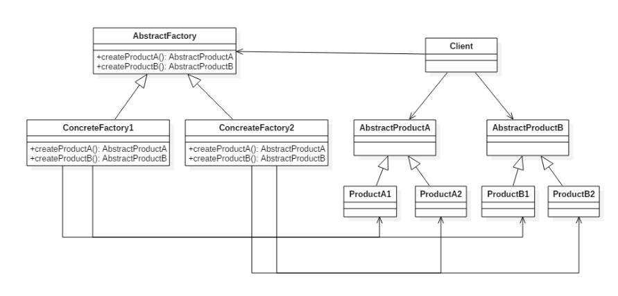

# 设计模式四: 抽象工厂(Abstract Factory)

## 简介

抽象工厂模式是创建型模式的一种, 与工厂方法不同的是抽象工厂针对的是生产一组相关的产品, 即一个产品族.

抽象工厂使用工厂方法模式来生产单一产品, 单一产品的具体实现分别属于不同的产品族. 抽象工厂即是对产品族的抽象.

工厂类一般使用单例实现(工厂方法的工厂类也是如此)

## 意图

定义了一个创建对象的接口，用于创建**一组**相关的对象.

## 类图



## 实现

组装电脑需要CPU和内存, 对于Windows和Mac来说所需的是两个不同的系列产品, Windows用Windows系列的CPU,RAM, Mac用Mac系列的CPU,RAM; 

一. 使用工厂模式,分别定义CPU,RAM相关的接口和实现

```Java
// 抽象产品,定义接口
public interface CPU {
}
public interface RAM {
}

// 抽象每个产品的工厂
public interface CPUFactory {
    CPU createCPU();
}
public interface RAMFactory {
    RAM createRAM();
}

// 实现具体产品
public class MacCPU implements CPU {
}
public class MacRAM implements RAM {
}
public class WindowsCPU implements CPU {
}
public class WindowsRAM implements RAM {
}

// 工厂方法具体实现
public class MacCPUFactory implements CPUFactory {
    public CPU createCPU() {
        return new MacCPU();
    }
}
public class MacRAMFactory implements RAMFactory {
    public RAM createRAM() {
        return new MacRAM();
    }
}
public class WindowsCPUFactory implements CPUFactory {
    public CPU createCPU() {
        return new WindowsCPU();
    }
}
public class WindowsRAMFactory implements RAMFactory {
    public RAM createRAM() {
        return new WindowsRAM();
    }
}
```

二. 定义抽象工厂接口

```Java
/**
 * 抽象工厂接口
 */
public interface PCAbstractFactory {
    CPU createCPU();
    RAM createRAM();
}
```

三. 定义抽象工厂的实现

```Java
/**
 * Mac的工厂实现
 */
public class MacFactory implements PCAbstractFactory{
    public CPU createCPU() {
        return new MacCPUFactory().createCPU();
    }

    public RAM createRAM() {
        return new MacRAMFactory().createRAM();
    }
}

/**
 * Windows的工厂实现
 */
public class WindowsFactory implements PCAbstractFactory{
    public CPU createCPU() {
        return new WindowsCPUFactory().createCPU();
    }

    public RAM createRAM() {
        return new WindowsRAMFactory().createRAM();
    }
}
```

四. 调用

```Java
PCAbstractFactory factory = new MacFactory();
CPU cpu = factory.createCPU();
RAM ram = factory.createRAM();
```

## 总结

优点: 1. 将产品的生产分离出来; 2. 易于改变产品系列; 3. 利于产品一致性,一次生产一系列产品

缺点: 不利于新增产品,新增则抽象工厂及工厂实现类均要增加相关对象方法
