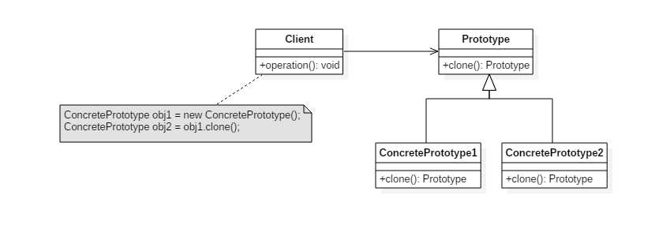

# 设计模式五: 原型模式(Prototype)

## 简介

原型模式是属于创建型模式的一种,是通过拷贝原型对象来创建新的对象.

万能的Java超类Object提供了clone()方法来实现对象的拷贝.

可以在以下场景中使用原型模式:

1. 构造函数创建对象成本太大(性能或安全成本)
2. 要保存对象的状态, 且状态变化较小, 不会过多占用内存时(状态变化较大的使用状态模式会更合适)

## 意图

使用原型实例指定要创建的对象类型,并通过拷贝这个原型来创建新对象。

## 类图



## 实现

一. 浅拷贝和深拷贝的概念

`Object.clone()`方法实现的是对象的浅拷贝, 所谓浅拷贝就是当对象中有复杂引用类型的域变量时, 只拷贝该域变量的引用而不是内容, 当有任一方法修改域变量的状态时会同时影响原型对象及拷贝对象, 实际上他们共用了同一个堆内存. 深拷贝创建的对象即是对原对象的完全拷贝,对任一对象的操作不会影响其他对象的状态.

java中提供了Cloneable接口, 约定实现接口`Cloneable`且重写`Object.clone()`方法的类可以用来拷贝自身. `Cloneable`是一个标记接口, 其中没有定义任何方法.

二. 下面的代码演示了使用clone()方法实现的深拷贝,这种方式更适合用于比较简单的对象,否则clone()方法的实现可能会变得异常复杂.

```Java
import lombok.AllArgsConstructor;
import lombok.Data;

@Data
@AllArgsConstructor
public class CarProperty implements Cloneable {

    private String power;
    private double maxSpeed;
    private double oilPerKm;

    public Object clone(){
        Object obj = null;
        try {
            obj = super.clone();
        } catch (CloneNotSupportedException e) {
            e.printStackTrace();
        }
        return obj;
    }
}
```

```Java

import lombok.AllArgsConstructor;
import lombok.Data;

@Data
@AllArgsConstructor
public class Car implements Cloneable {

    private String brand;
    private double price;
    private CarProperty carProperty;

    /**
     * 深拷贝在此实现,对于复杂的应用类型, 这里的代码可能会相当复杂,如果类有修改(新增成员变量等),这里也需要相应修改
     * @return
     */
    public Object clone(){
        Object car = null;
        try {
            car = super.clone();
            CarProperty carPropertyClone = (CarProperty)this.getCarProperty().clone();
            ((Car)car).setCarProperty(carPropertyClone);
        } catch (CloneNotSupportedException e) {
            e.printStackTrace();
        }
        return car;
    }

    public static void main(String[] args) {

        CarProperty carProperty = new CarProperty("8匹",250,30);
        Car car= new Car("BMW",200,carProperty);

        Car copy = (Car) car.clone();
        System.out.println("copy最大速度为: "+copy.getCarProperty().getMaxSpeed());
        System.out.println("原型最大速度为: "+car.getCarProperty().getMaxSpeed());
        car.getCarProperty().setMaxSpeed(360);
        System.out.println("copy最大速度为: "+copy.getCarProperty().getMaxSpeed());
        System.out.println("原型最大速度为: "+car.getCarProperty().getMaxSpeed());
    }

}
```

三. 深拷贝的其他实现方式: 除了上面的方法,还可以使用反射机制创建对象的深拷贝, 另外一种更简单的方式是使用序列化;
下面的代码使用序列化方式实现对象的深拷贝,需实现`Serializable`接口.

```Java
import java.io.*;

public class DeepCloneBase implements Serializable {
    public Object deepClone() {
        ByteArrayOutputStream byteArrayOutputStream = null;
        ObjectOutputStream objectOutputStream = null;
        ByteArrayInputStream byteArrayInputStream = null;
        ObjectInputStream objectInputStream = null;
        try {
            byteArrayOutputStream = new ByteArrayOutputStream();
            objectOutputStream = new ObjectOutputStream(byteArrayOutputStream);
            objectOutputStream.writeObject(this);
            byteArrayInputStream = new ByteArrayInputStream(byteArrayOutputStream.toByteArray());
            objectInputStream = new ObjectInputStream(byteArrayInputStream);
            return objectInputStream.readObject();
        } catch (Exception e) {
            e.printStackTrace();
        } finally {
            try {
                byteArrayOutputStream.close();
                objectOutputStream.close();
                byteArrayInputStream.close();
                objectInputStream.close();
            } catch (Exception e) {
                e.printStackTrace();
            }
        }
        return null;
    }

}
```
```Java
import lombok.AllArgsConstructor;
import lombok.Data;
import java.io.Serializable;

@Data
@AllArgsConstructor
public class MyCar extends DeepCloneBase {

    private String brand;
    private double price;
    private CarProperty carProperty;

    public static void main(String[] args) throws  Exception{
        // 注意CarProperty也需要实现Serializable接口,代码不再单独列出
        CarProperty carProperty = new CarProperty("8匹",250,30);
        MyCar car= new MyCar("BMW",200,carProperty);

        MyCar copy = (MyCar)car.deepClone();

        if (copy!=null){
            System.out.println("copy最大速度为: "+copy.getCarProperty().getMaxSpeed());
            System.out.println("原型最大速度为: "+car.getCarProperty().getMaxSpeed());
            car.getCarProperty().setMaxSpeed(360);
            System.out.println("copy最大速度为: "+copy.getCarProperty().getMaxSpeed());
            System.out.println("原型最大速度为: "+car.getCarProperty().getMaxSpeed());
        }else{
            System.out.println("对象没拷贝成功....");
        }
    }
}
```

## 总结

优点: 1. 如果对象创建比较复杂, 可以简化创建过程, 提高效率;2. 可以保留对象状态;
缺点: 对于clone()方式,如果类有修改则需要修改clone()的实现,不符合开闭原则; 复杂对象的clone逻辑可能较复杂;

## JDK

[java.lang.Object#clone()](http://docs.oracle.com/javase/8/docs/api/java/lang/Object.html#clone%28%29)
