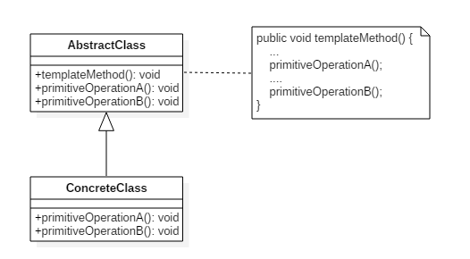

# 设计模式六: 模板方法(Template Method)

## 简介

模板方法属于行为型模式的一种.

实现层面上, 在抽象类中定义了算法或流程的骨架, 将其中易变的部分延迟到子类实现, 也就是允许它的子类实现其中的某些步骤. 

模板方法适用于算法不变, 但算法中某些步骤有变化的场景, 例如Spring中JDBC事务操作,打开连接-->开启事务-->执行sql-->提交事务-->关闭连接, 每次操作均按照这个步骤进行, 变化的是执行的sql不一样.

## 意图

定义算法框架，并将一些步骤的实现延迟到子类实现。

## 类图



## 实现

一. 定义抽象类, 并将算法的骨架定义封装到方法,**注意方法用final修饰,防止有人继承该类后对算法做恶意修改**, 不变的步骤可以实现

```Java
/**
 * 磨坊
 */
public abstract class MillTemplate {

    /**
     * 模板方法,定义步骤
     */
    public final void produce(){
        //准备(可能是小麦,也可能是玉米)
        prepare();
        //开机器
        start();
        //包装
        packaging();
        //运输(可能水路也可能火车)
        transport();
    }

    //准备(可能是小麦,也可能是玉米)
    protected abstract void prepare();

    private void start(){
        System.out.println("启动机器, 开始研磨...");
    }

    private void packaging(){
        System.out.println("包装...");
    }

    //运输(可能水路也可能火车)
    protected abstract void transport(); 
}
```

二. 定义子类继承抽象类, 并实现抽象方法

```Java
/**
 * 玉米磨坊
 */
public class CoreMill extends MillTemplate {
    protected void prepare() {
        System.out.println("准备好玉米");
    }

    protected void transport() {
        System.out.println("火车运输");
    }
}
```

```Java
/**
 * 小麦磨坊
 */
public class WheatMill extends MillTemplate {

    protected void prepare() {
        System.out.println("准备好小麦");
    }

    protected void transport() {
        System.out.println("船运");
    }
}
```

三. 调用

```Java
public class TemplateTest {
    public static void main(String[] args) {
        MillTemplate millTemplate = new WheatMill();
        millTemplate.produce();

        millTemplate = new CoreMill();
        millTemplate.produce();
    }
}
```

四. 钩子方法, 钩子方法为模板的算法提供了更大灵活性, 子类可以根据钩子方法的结果控制一些步骤执行或不执行

我们在模板方法中增加钩子方法
```Java
...
/**
* 模板方法,定义步骤
*/
public final void produce(){
    //准备(可能是小麦,也可能是玉米)
    prepare();
    //开机器
    start();
    //包装
    packaging();

    //检查的钩子方法
    if(needRecheck()){
        recheck();
    }

    //运输(可能水路也可能火车)
    transport();
}
...
//钩子方法
protected boolean needRecheck(){
    return true;
}
//检查
private void recheck(){
    System.out.println("检查...");
}
...
```

子类重载钩子方法已达到控制算法某一步骤是否执行的目的

```Java
//WheatMill 中增加
@Override
protected boolean needRecheck(){
    return false;
}
```

## 总结

优点: 1. 封装了不变部分, 可变部分易于扩展;2. 便于代码重用,便于维护

缺点: 每个不同的实现都需要一个子类, 导致类数量增加, 系统过于庞大

