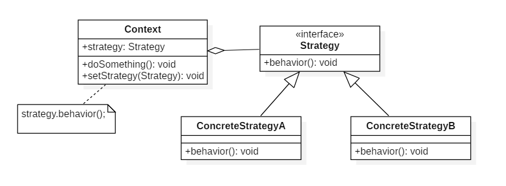

# 设计模式七: 策略(Strategy)

## 简介

策略属于行为型模式的一种,策略模式允许对象的行为或算法在运行时改变,使用不同的算法达成相同的结果或目的.

实现层面上,定义一个抽象的算法接口, 然后根据具体算法的不同定义不同的类去实现该接口, 调用时不同实现的实例可以相互替换. 

策略模式适用于多个类只有行为不同,运行时根据上下文决定使用哪种行为; 根据实际情况不同算法可能不同, 或算法的最优实现在未来确定.

## 意图

定义一系列算法，封装每个算法，并使它们可以互换。

## 类图



## 实现

以绝地求生游戏为例, 要想赢得最后的比赛可能由多种方式(策略), 抽象出 **策略接口** `WinStrategy`, **实现策略** 比如激进点的方式`AlwaysKillWinStrategy`,猥琐点的方式`AlwaysHideWinStrategy`.

下面我们将实现策略模式(一,二,三步), 并最后讨论更具实际意义的策略与上下文通信的两种方式及其各自利弊(四).

一. 定义策略接口

```Java
/**
 * 赢得吃鸡的策略接口
 */
public interface WinStrategy {
    void win();
}
```

二. 实现策略,使用两种不同的算法实现

```Java
/**
 * 采用人挡杀人的模式
 */
public class AlwaysKillWinStrategy implements WinStrategy {
    public void win() {
        System.out.println("总是很钢,大杀四方");
    }
}

/**
 * 采用LYB的模式
 */
public class AlwaysHideWinStrategy implements WinStrategy {
    public void win() {
        System.out.println("总是很苟,活得长久");
    }
}
```

三. 调用

```Java
public class StrategyTest {
    public static void main(String[] args) {
        WinStrategy iWillWin = new AlwaysHideWinStrategy();
        iWillWin.win();
        iWillWin = new AlwaysKillWinStrategy();
        iWillWin.win();
    }

}
```

四. 策略与上下文

上面的例子中我们并没有体现出上下文的概念, 其隐藏的上下文在main()函数中. 除了 **策略接口** 和  **实现策略** 外, 还需要一个 **策略上下文** 角色.一般由上下文持有策略的引用, 并对策略进行实际调用,下面的代码定义该角色

```Java
/**
 * 上下文
 */
public class Context {

    private String weather;
    WinStrategy winStrategy;

    public Context(String weather, WinStrategy winStrategy) {
        this.weather = weather;
        this.winStrategy = winStrategy;
    }

    public void winGame() {
        winStrategy.win();
        System.out.println("天气情况:"+this.weather+"; 采用的策略:"+winStrategy.getClass());
    }

}

//调用
public class StrategyTest {
    public static void main(String[] args) {
        WinStrategy iWillWin = new AlwaysHideWinStrategy();
        Context context = new Context("雾天",iWillWin);
        context.winGame();
    }
}

```

策略中有时候也需要某些上下文信息, 例如`win()`方法需要游戏场景中的天气情况, 这种情况下可以将上下文引用传入策略, 代码修改如下:

```Java
/**
 * 赢得吃鸡的策略接口,上下文作为参数传入
 */
public interface WinStrategy {
    void win(Context context);
}

/**
 * 采用LYB的模式, 打印出天气情况
 */
public class AlwaysHideWinStrategy implements WinStrategy {
    public void win(Context context) {
        System.out.println("总是很苟,活得长久; 天气: "+context.getWeather());
    }
}

/**
 * 上下文
 */
@Data
public class Context {

    private String weather;
    WinStrategy winStrategy;

    public Context(String weather, WinStrategy winStrategy) {
        this.weather = weather;
        this.winStrategy = winStrategy;
    }

    public void winGame() {
        winStrategy.win(this);
        System.out.println("天气情况:"+this.weather+"; 采用的策略"+winStrategy.getClass());
    }

}
```

上面通过将上下文引用作为参数传递给策略来实现了策略与上下文的通信, 对于不同策略的实现,未必都会用到上下文中的全部信息, 这种情况下传递上下文引用成为了一种"浪费". 因此有的人更愿意将使用的信息作为属性定义在策略实现类中,实现更有针对性的代码

两种方式各有利弊, 传递上下文引用的方式利于扩展, 且可以做到风格统一, 但可能会导致"浪费", 如果扩展太多上下文子类不利于理解. 注入的方式实现在策略类中方式比较简单, 容易实现, 但也会导致策略与其他策略风格不一致. 

```Java
/**
 * 赢得吃鸡的策略接口
 */
public interface WinStrategy {
    void win();
}

/**

 * 采用人挡杀人的模式
 */
@AllArgsConstructor
public class AlwaysKillWinStrategy implements WinStrategy {

    private String weather;

    public void win() {
        System.out.println("总是很钢,大杀四方"+" 天气:"+weather);
    }
}

public class StrategyTest {
    public static void main(String[] args) {
        WinStrategy iWillWin = new AlwaysKillWinStrategy("雾天");
        Context context = new Context("雾天",iWillWin);
        context.winGame();
    }
}
```

## 总结

优点: 1. 易于扩展;2.避免了if...else... 3. 代码重用

缺点: 调用方需要知道使用的哪种算法, 算法需要完全暴露; 可能会导致实现类过多;

