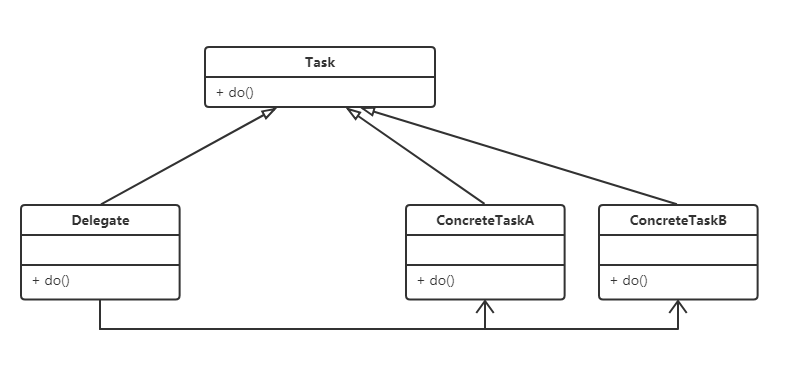

# 设计模式八: 委派(Delegate)

## 简介

委派模式不属于GOF23种设计模式, 主要角色有三种: 抽象任务角色, 委派者角色, 具体任务角色. 

实现层面上, 定义一个抽象接口, 它有若干实现类, 他们真正执行业务方法, 这些子类是具体任务角色; 定义委派者角色也实现该接口, 但它负责在各个具体角色实例之间做出决策, 由它判断并调用具体实现的方法.

委派模式对外隐藏了具体实现, 仅将委派者角色暴露给外部, 如Spring的DispatcherServlet.

## 意图

定义抽象接口的一个实现类, 他负责判断和调用哪个实现类的实例。

## 类图



## 实现

一. 定义抽象任务角色接口

```Java
/**
 * 抽象任务角色
 */
public interface Task {
    void doTask();
}
```

二. 具体任务角色, 实现上面的接口, 这里定义两个实现类

```Java
/**
 * 具体实现类A
 */
public class ConcreteTaskA implements Task {
    public void doTask() {
        System.out.println("执行 , 由A实现");
    }
}

/**
 * 具体实现类B
 */
public class ConcreteTaskB implements Task {
    public void doTask() {
        System.out.println("执行 , 由B实现");
    }
}

```

三. 委派角色, 是整个模式的核心角色, 下面代码中我们使用随机数来判断应该实例化哪个具体实现类

```Java
import java.util.Random;
/**
 * 代理角色
 */
public class TaskDelegate implements Task{
    public void doTask() {
        System.out.println("代理执行开始....");

        Task task = null;
        if (new Random().nextBoolean()){
        task = new ConcreteTaskA();
        task.doTask();
        }else{
            task = new ConcreteTaskB();
            task.doTask();
        }

        System.out.println("代理执行完毕....");
    }
}
```

四. 调用

```Java
public class TaskTest {
    public static void main(String[] args) {
        new TaskDelegate().doTask();
    }
}
```

## 总结

优点: 对内隐藏实现, 易于扩展; 简化调用;

委派模式大量使用在spring,mybatis等开源框架中, 理解委派模式的实现原理可以更好理解这些框架源码. 

委派模式的核心是委派类的实现. 

