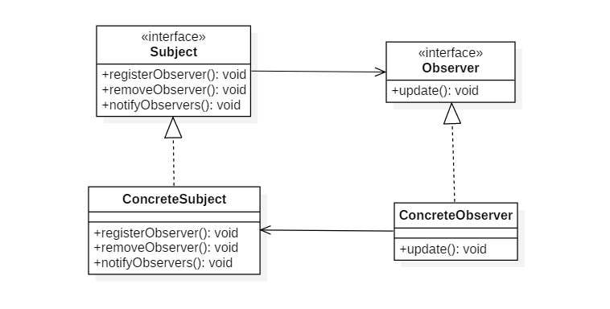

# 设计模式九: 观察者模式(Observer Pattern)

## 简介

观察者属于行为型模式的一种, 又叫发布-订阅模式. 如果一个对象的状态发生改变,依赖他的对象都将发生变化, 那么这种情况就适合使用观察者模式. 

它包含两个术语,主题(Subject),观察者(Observer), 主题管理一个观察者的列表, 并在状态发生变化时通知到他们. 

实现层面上, 主题定义了一个观察者列表并可以管理这个列表(将观察者注册进去和撤销注册的行为), 同时定义了通知到所有观察者的行为.

Java类库有默认的观察者实现类[Observer](https://docs.oracle.com/javase/8/docs/api/java/util/Observer.html). 使用观察者模式的还有事件监听, RxJava等.

## 意图

定义对象之间的一对多依赖，当一个对象状态改变时，它的所有依赖都会收到通知并且自动更新状态。

## 类图



## 实现

一. 定义抽象观察者

```Java
/**
 * 观察者抽象角色
 */
public interface MyObserver {
    void update(Subject subject);
}
```

二. 定义抽象主题

```Java
/**
 * 主题抽象角色
 */
public abstract class Subject {
    private ArrayList<MyObserver> list = new ArrayList<MyObserver>();

    public Subject register(MyObserver observer){
        if(!list.contains(observer)){
            list.add(observer);
        }
        return this;
    }

    public Subject unRegister(MyObserver observer){
        if(list.contains(observer)){
            list.remove(observer);
        }
        return this;
    }

    public final void notifyObservers(){
        for (MyObserver item:list) {
            item.update(this);
        }
    }

    /**
     * 具体状态的变更
     */
    abstract void change();
}
```

三. 定义具体主题

```java
/**
 * 具体主题角色
 */
@Data
public class ConcreteSubject extends Subject {
    private String name;
    public void change() {
        this.setName("王多鱼");
        super.notifyObservers();
    }
}
```

四. 定义观察者的实现, 分别定义两个不同实现

```java
public class UncleObserver implements MyObserver {
    public void update(Subject subject) {
        ConcreteSubject concreteSubject = (ConcreteSubject)subject;
        System.out.println("UncleObserver 知道了: "+concreteSubject.getName());
    }
}

public class HentaiObserver implements MyObserver {
    public void update(Subject subject) {
        ConcreteSubject concreteSubject = (ConcreteSubject)subject;
        System.out.println("HentaiObserver 知道了: "+concreteSubject.getName());
    }
}
```

五. 调用, 首先注册观察者,然后调用主题的变更方法

``` java
// 实例化主题后为其注册了两个观察者的实例, 并最终调用主题的变更方法触发通知行为
public static void main(String[] args) {
    new ConcreteSubject()
            .register(new UncleObserver())
            .register(new HentaiObserver())
            .change();
}
```

## 总结

关键点: 定义通知到观察者的方法要注意, 如果有耗时严重的会阻塞其他观察者得到通知, 可以异步多线程实现; 避免循环引用;

观察者分推模式和拉模式, 推模式是指将主题的变更信息发送给观察者, 观察者可以用, 也可以不用. 拉模式则是将主题的引用发送给观察者, 观察者通过引用根据自己需要获取所需信息. 示例中使用的就是这种模式. 

代码修改为推模式
``` java
// 观察者的方法接收具体信息
void update(String name);

// 主题的通知方法做相应修改
public final void notifyObservers(){
    for (MyObserver item:list) {
        item.update("王多鱼");
    }
}
```


