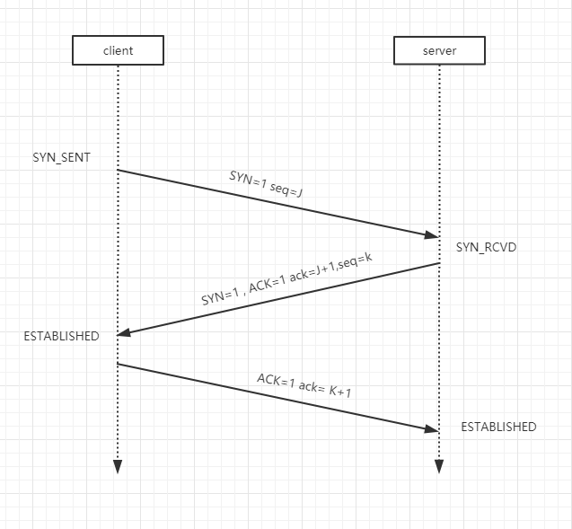
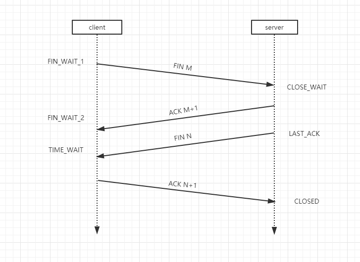

# 分布式系列二: 分布式系统的通信

通信是分布式架构的一个基本问题, 通信是基于通信协议, 通过网络IO来实现的, 基本的通信协议有TCP,HTTP,UDP等, Java的IO分为BIO,NIO,AIO等, java领域有很多支持通信的技术, 如RMI,MINA,JMS等. 

## 网络协议

* TCP/IP: 

    五层模型: 基于OSI七层模型. 包含: 应用层,传输层(TCP/IP协议),网络层(ICMP,IGMP),链路层,物理层. OSI还包含表现层,会话层.

    三次握手: 

    

    Dos攻击就是在第三步发生, 发送大量连接请求, 使网络处在半连接状态. server端的连接未完成, 导致阻塞.

    四次挥手:

    TCP协议是全双工的, 全双工是双方可以相互发起通信, 数据可以往两个方向传输; 半双工是某个阶段只能一方传输; 单工是只能一方往另一方传输数据.

    

* UDP/IP:

## 阻塞的概念

了解阻塞, 就首先需要了解TCP传输协议的缓存区概念.

应用层发送数据的时候, 首先数据会暂存到传输层的缓存区. 

数据传输的时候有个滑动窗口的概念, 窗口的大小可以控制, 这样可以保证接收方缓存区不够大导致缓存溢出. 窗口的数据全部发送且接收方确认收到后才可以向前继续滑动.

发送方和接收方均有缓存区, 当缓存区满(或空, 分别对应写和读)的时候就会发生阻塞, 必须等缓存区有足够空间容纳更多数据的时候才能继续发送或接收.

阻塞分为BIO(同步阻塞),NIO(同步非阻塞, 同路复用技术,netty等使用这种方式),AIO(异步非阻塞, java7开始)

阻塞和非阻塞, 同步和异步分开理解比较好.阻塞和非阻塞是针对调用者, 阻塞是缓冲区读写没有数据的时候线程等待, 非阻塞是缓冲区读写没有数据时立即返回, 线程去做其他的事情; 同步和异步是针对被调用者, 被调用者处理时不返回时, 调用者需要等待结果是同步, 被调用者立即返回,同时做处理时异步.

## Java 网络API

TCP Socket通信

```java
// 服务端
public class SocketServer {
    public static void main(String[] args) throws IOException {
        ServerSocket serverSocket = null;

        try{
            serverSocket = new ServerSocket(8888);
            Socket socket= serverSocket.accept();
            // 缓冲区读取
            BufferedReader reader = new BufferedReader(new InputStreamReader(socket.getInputStream()));
            System.out.println(reader.readLine());
            reader.close();
            socket.close();
        }catch (Exception e){

        }finally {
            if(serverSocket!=null){
                serverSocket.close();
            }
        }
    }
}

//客户端
public class SocketClient {
    public static void main(String[] args) throws IOException {

        try{
            Socket socket = new Socket("localhost",8888);
            PrintWriter writer = new PrintWriter(socket.getOutputStream(),true);
            writer.println("this is a message from client");
            writer.close();
            socket.close();
        }catch (Exception e){

        }finally {

        }
    }
}
```

Multicast 多播

``` Java
// 服务端
public class MulticastServer {
    public static void main(String[] args) throws IOException, InterruptedException {
        // 多播必须是224网段
        InetAddress group = InetAddress.getByName("224.7.8.9");
        MulticastSocket socket = new MulticastSocket();
        for (int i = 0; i < 10; i++) {
            String data = "multcast"+i;
            byte[] bytes = data.getBytes();
            socket.send(new DatagramPacket(bytes,bytes.length,group,8888));
            TimeUnit.SECONDS.sleep(2);
        }
    }
}

// 客户端
public class MulticastClient {
    public static void main(String[] args) throws IOException, InterruptedException {
        // 多播必须是224网段
        InetAddress group = InetAddress.getByName("224.7.8.9");
        MulticastSocket socket = new MulticastSocket(8888);
        socket.joinGroup(group);
        byte[] buf = new byte[32];
        while (true){
            DatagramPacket packet = new DatagramPacket(buf,buf.length);
            socket.receive(packet);
            String reveived = new String(packet.getData());
            System.out.println("received:"+reveived);
        }
    }
}
```

