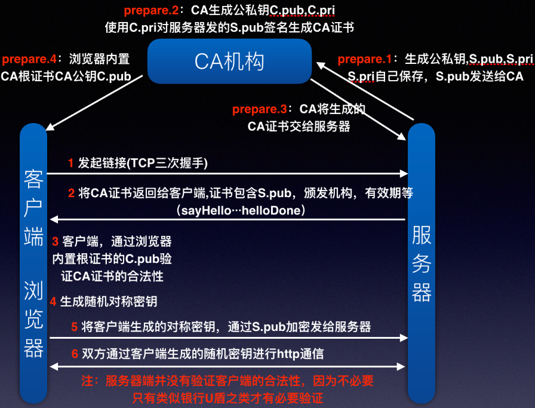

# 分布式系列四: HTTP及HTTPS协议

非常全面的一篇HTTP的文章: [关于HTTP协议，一篇就够了](http://www.cnblogs.com/ranyonsue/p/5984001.html)

还有一个帮助理解HTTPS的文章: [也许，这样理解HTTPS更容易](https://showme.codes/2017-02-20/understand-https/) 本文的一些描述摘自这篇文章

## HTTP协议

Http(HyperText Transfer Protocol 超文本传输协议)协议定义了客户端和服务器端信息传输的标准. 是基于TCP协议上的一种网络协议.

由于其简捷、快速的方式，适用于分布式超媒体信息系统.

### 特点

1. 简单快速: 只需要传输请求方法和路径;
2. 灵活: MEMI可以指定传输对象的类型, Content-Type标记
3. 无连接
4. 无状态

### URI(Uniform Resource Identifiers)和URL(Uniform Resource Locator)

URL: 统一资源定位符, 网络上资源的唯一标识. 长得类似这个样子  sheme://host.com:port/path/index.html?query-string=val#anchor
包含协议,域名主机地址,端口,虚拟路径,资源文件,请求参数,锚点

> URI是以一种抽象的，高层次概念定义统一资源标识，而URL和URN则是具体的资源标识的方式。URL和URN都是一种URI。笼统地说，每个 URL 都是 URI，但不一定每个 URI 都是 URL。这是因为 URI 还包括一个子类，即统一资源名称 (URN)，它命名资源但不指定如何定位资源。上面的 mailto、news 和 isbn URI 都是 URN 的示例。
> 
> 在Java的URI中，一个URI实例可以代表绝对的，也可以是相对的，只要它符合URI的语法规则。而URL类则不仅符合语义，还包含了定位该资源的信息，因此它不能是相对的。
> 在Java类库中，URI类不包含任何访问资源的方法，它唯一的作用就是解析。
> 相反的是，URL类可以打开一个到达资源的流。

### MIME(Multipurpose Internet Mail Extensions)

> 最早的HTTP协议中，并没有附加的数据类型信息，所有传送的数据都被客户程序解释为超文本标记语言HTML 文档，而为了支持多媒体数据类型，HTTP协议中就使用了附加在文档之前的MIME数据类型信息来标识数据类型。
> MIME意为多功能Internet邮件扩展，它设计的最初目的是为了在发送电子邮件时附加多媒体数据，让邮件客户程序能根据其类型进行处理。然而当它被HTTP协议支持之后，它的意义就更为显著了。它使得HTTP传输的不仅是普通的文本，而变得丰富多彩。

### 方法

* get
* post
* delete
* put
* head

### 报文(Request和Response)

* 起始行(状态行)
* 头部字段
* 主体

一个Request的报文示例如下:

<pre>
GET / HTTP/1.1
Host: www.baidu.com
Connection: keep-alive
Upgrade-Insecure-Requests: 1
User-Agent: Mozilla/5.0 (Windows NT 10.0; Win64; x64) AppleWebKit/537.36 (KHTML, like Gecko) Chrome/53.0.2785.143 Safari/537.36
Accept: text/html,application/xhtml+xml,application/xml;q=0.9,image/webp,*/*;q=0.8
Referer: https://www.baidu.com/
Accept-Encoding: gzip, deflate, sdch, br
Accept-Language: zh-CN,zh;q=0.8
Cookie: BIDUPSID=670A04B660AAF2716D3120BEAF946A11; BAIDUID=2454D4....
RA-Ver: 3.0.8
RA-Sid: CA623F7A-20150914-060054-2b9722-5fde41

q=xkxk
</pre>

一个Response的报文示例如下:

<pre>
HTTP/1.1 200 OK
Date: Tue, 18 Sep 2018 07:38:57 GMT
Server: suggestion.baidu.zbb.df
Content-Length: 129
Content-Type: text/javascript; charset=UTF-8
Cache-Control: private
Expires: Tue, 18 Sep 2018 08:38:57 GMT
Content-Encoding: gzip
Proxy-Connection: Keep-alive

["http baow",["http 报文格式","http 报文","http 报文 长度","http报文结构","http 报文 文件","http 报文拦截","http 报文体乱码","http报文解析","http 报文大小","http 报文定义"]]
</pre>

### 状态码

* 1xx 提示信息
* 2xx 成功
* 3xx 重定向
* 4xx 客户端错误
* 5xx 服务端错误

## HTTPS(Hyper Text Transfer Protocol over Secure Socket Layer)

* SSL/TLS 
* 对称加密和非对称加密

    对称加密是一个密钥能同时对内容进行加解密;
    非对称加密是需要生成一对公私钥, 私钥加密的内容公钥可以解密, 但公钥加密的内容只能是私钥进行解密. 所有私钥一般存储在服务端.

> HTTPS要使客户端与服务器端的通信过程得到安全保证，必须使用的对称加密算法，但是协商对称加密算法的过程，需要使用非对称加密算法来保证安全，然而直接使用非对称加密的过程本身也不安全，会有中间人篡改公钥的可能性，所以客户端与服务器不直接使用公钥，而是使用数字证书签发机构颁发的证书来保证非对称加密过程本身的安全。这样通过这些机制协商出一个对称加密算法，就此双方使用该算法进行加密解密。从而解决了客户端与服务器端之间的通信安全问题。

下面是网络上找的一张图,[原文点这里](https://www.cnblogs.com/mddblog/p/6948980.html)

参照上图可以更方便理解整个过程:

逆推的流程如下:

1. 客户端/服务器最终使用对称加密算法生成的密钥D通信
2. D由客户端生成(三次随机数加密生成,此时生成第三个随机数), 并通过服务端的非对称公钥P加密传输给服务端
3. 公钥P从服务端的传递给客户端的证书中获得, 证书的内容包括: CA机构,证书本身的数字签名,公钥,签名算法
4. 证书是三方CA机构提供给服务端的, 证书通过CA的私钥CAS进行加密
5. 客户端会保存一份CA的根证书, 其中有CA的公钥CAP
6. 接第三步, 客户端使用CAP验证证书合法性,并得到解密后的公钥P
7. 服务端收到客户端请求并生成随机数(第二个随机数),发送给客户端
8. 客户端发起请求, 内容包括生成的随机数(第一个随机数),加密算法
