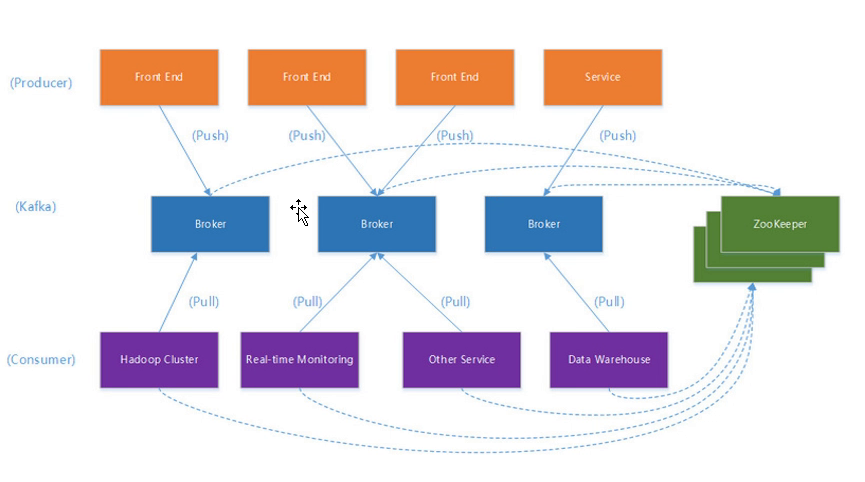
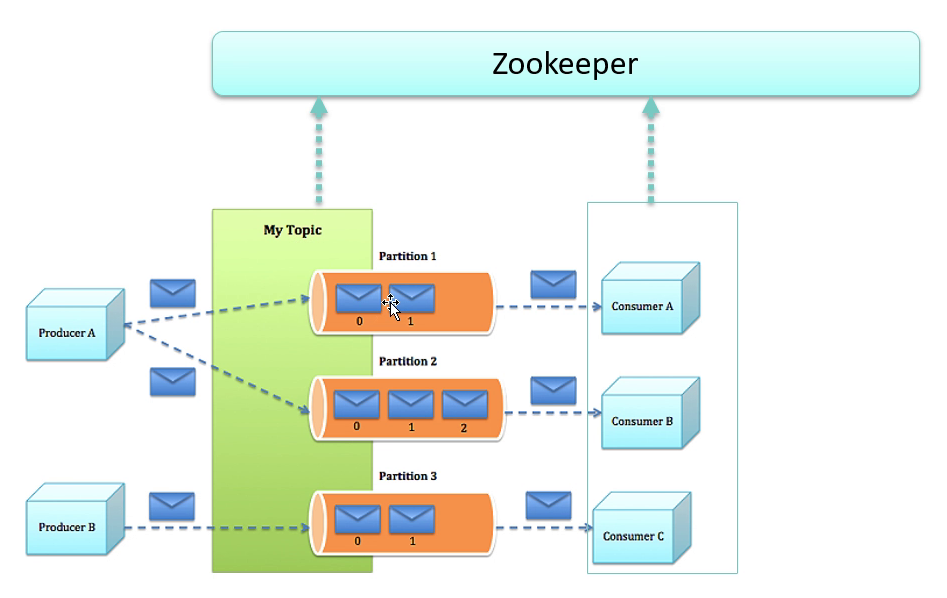
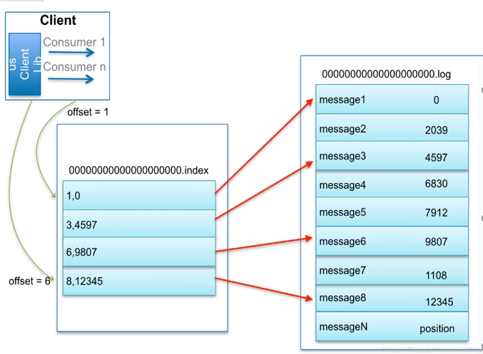

# 分布式系列九: kafka

官网上的介绍是kafka是apache的一种分布式流处理平台. 最初由Linkedin开发, 使用Scala编写. 具有高性能,高吞吐量的特定.

包含三个关键能力:

* 发布/订阅, 类似于消息队列或企业消息系统;
* 容错容忍
* 即时处理流记录

 ## 适合的应用场景

 因为其高性能,高吞吐量,时效性等特定, 同时内置的集群,分区, 复制支持, 使其更适合于处理大规模消息能力. 一些大数据相关的场景, 比如日志收集, 消息系统, 用户行为分析, 运营指标数据-服务器性能数据, 实时流处理统计等均可用kafka. 

## 安装和集群配置

1. 如同其他组件一样, 下载解压后, 使用`bin`目录下的脚本启动.

2. 转到`config`目录下, 此目录下的文件时kafka的配置文件. 

3. `server.properties` 文件中的`broker.id`节点表示集群的本机的节点id. 例如:`broker.id=1`; 
`server.properties` 文件中的`listeners`节点配置本机ip, 否则启动会报错. 例如: ` listeners=PLAINTEXT://192.168.1.11:9092`
其他比较重要的节点: 
`num.partitions=1` topic的分区数量.
`log.dirs=/tmp/kafka-logs` log日志目录

4. `server.properties` 文件的`zookeeper.connect=ip1:2181,ip2:2181`配置zookeeper集群的链接,逗号分割各zookeeper地址.

## kafka架构

> 其中 broker 可以理解为kafka的一个服务, 多个broker组成kafka的一个集群. 

> kafka通过zookeeper做集群管理. 

> topic 是kafka存储流记录的类别. 一个topic可能对应对个分区partition. 

> consumer group 消费者可以按节点划分为若干组, 组内只有一个consumer可以处理同一个消息.但组之间都可以接收同一消息. 

## kafka实现

### 几个重要概念

* kafka在一个或多个能跨多个数据中心的节点服务器组成的集群上运行
* kafka集群存储的记录流是称为 `topics` 的类型
* 每个记录由key,value以及timestamp组成

### kafka包含四个核心API

* Producer 
* Consumer
* Streams : 以流处理器的形式,将一个或多个topics输入流消费为一个或多个输出的topics. 
* Connector : 构建和运行可重用的, 连接kafka的topics到已有程序或数据系统的生产者或消费者程序. 例如, 连接到关系数据库中的表, 捕获对其的任何更改. 

### Topics和日志

kafka 的 topics 总是多端注册的. 一个 topic 可能有0个或多个订阅到其写入的数据的消费者. 

topics 维护了一个 partition 组的日志. 每个 partition 其中的每个记录都是顺序的, 不可变的. 每条记录都有给其分配的序列id, 叫做`offset`. 

kafka 集群使用配置的保留周期持久化保存了所有的记录, 不管是否被消费. 例如, 如果保留策略为2天, 那一条记录被发布后的两天内都是可以被消费的,过后其将被丢弃以腾出空间. 

消费者其实仅保留了`offset`. 消费者可以根据这个offset线性读取记录, 但也可以控制offset来处理历史数据或跳过最近的记录. 

分区的目的: 一是伸缩性得到保证;二是每个分区可以作为一个并行单元. 

### 分布式

可以为每个分区设置0个或多个容错备份. 

对于每个分区都有leader和follower, leader处理读写请求, follower同步leader, leader下线后,follower中会自动选举出新的leader. 每个服务器都作为某些分区的leader以及其他分区的follower, 这样就实现了负载均衡. 

### 消费者

消费者使用consumer group名称标记它们. consumer group相同的消费者将作为一个整体,仅消费一次. 如果每个消费者都有各自的group, 那每个记录将广播给所有的消费者处理. 如果所有的消费者都标记为同一个group, 则这些消费者之间以负载均衡的形式执行消费. 

将若干constomer标记为一个group一般用来做容错和负载均衡. 

## kafka作为消息系统

基于queue的消息系统和pub/sub的消息系统都有各自的优缺点. queue 的特点是记录从消费者的池中选择一个来进行处理, pub/sub 的特定是广播给所有消费者. 因此, queue可以在多个实例间分片处理, 不幸的是queue无法广播, 一旦读取数据就不存在了. pub/sub 允许广播, 但无法伸缩处理, 因为消息广播给所有消费者了. 

kafka 可以使用 consumer group 来实现两种概念. 同时其也有队列系统的顺序保证. 因此kafka做的更好, 因为partition的存在, 可以使得队列顺序性和可伸缩性同时得到保证, 但要注意, 消费者实例不能多余分区数. 

## kafka作为存储系统

数据写入kafka的磁盘并且可以复制容错. kafka允许生产者等到确认, 这样就能保证数据被真正持久化了. 另外, 分布式结构很好使用了伸缩性. 

kafka可视为一种专用于高性能, 低延迟的日志存储分布式文件系统.

## kafka用于流处理

它使用生产者和消费者API进行输入，使用Kafka进行有状态存储，并在流处理器实例之间使用相同的组机制来实现容错。

适用的场景是处理无序数据, 代码修改后的重新处理, 执行有序状态计算. 

## 组合使用

消息系统, 存储系统, 和实时流处理可以在适当的场景组合使用. 

## kafka操作命令

* `sh kafka-topics.sh --create --topic MyTopic --zookeeper localhost:2181 --partitions 3 --replication-factor 2`  MyTopic 分为三个区(`partitions 3`); 并每个分区有一个备份(`--replication-factor 2`);  命令执行成功后可以在日志目录看到创建的文件

> ISR(in-sync replicas) 在zookeeper中可以看到此节点, 该节点存储副本集合, 当leader挂掉后会从中选择一个称为新的leader. 当其中没有任何副本时, kafka也可以退而求其次, 它有两种选择:1.等待重新加入ISR的节点; 2.选取第一个节点(当然不必时ISR中的). 后一种可能导致数据丢失.

> HW&LEO (High Water & Last End Offset) replica同步数据时的两种状态, 未同步的将标记为leo, 同步后标记为hw.

* `sh kafka-console-producer.sh --broker-list ip:port --topic MyTopic` 启动客户端发送

* `sh kafka-console-consumer.sh --zookeeper ip:port --topic MyTopic --from-begging` 启动消费端接收

* `sh kafka-run-class.sh kafka.tools.DumpLogSegments --file /tmp/kafka-logs/MyTopic-0/000000000000000.log` 查看日志

> 每个Topic分区下初始包含四个文件, 其中00000000000000.log,00000000000000.index成对出现, index文件中存储log中的索引信息.

> 随着记录增多, 文件数量也会增加, 文件名以其保存记录的第一条的序列值作为名称. 

