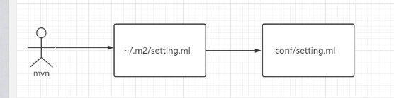
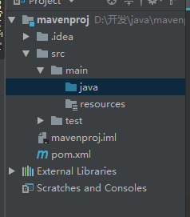

# （一）Java工程化--Maven基础

**Maven 读作['mevən] 翻译成中文是"内行,专家"**

## Maven是什么

1. 包依赖的前世今生:
    原始的jar包引用--> ant --> maven.
    是一种项目管理工具
2. Maven优势:
    * convertion over configuration 约定优于配置: 这个原则不仅适用于maven, 更是目前大多数框架遵循的原则,如mvc
    * 简单
    * 易于测试
    * 构建简单
    * CI(持续集成)
    * 插件丰富

## 下载和安装

1. 下载: http://maven.apache.org/download.cgi
2. 安装: 解压安装即可
3. 环境变量配置:
    * windows: 配置path MAVEN_HOME
    * linux: 在 .bash_profile 文件中
    * 运行参数: 定义环境变量MAVEN_OPS
    * 配置settings.xml: settings.xml文件是个空模板,我们可以在这个文件进行一些自定义配置. 常用的配置如:repo存储目录<localRepository>;mirror镜像地址;proxy配置<proxies>;插件<pluginGroups>;私服配置(用户名密码等)<servers>;环境<profile>
    查找顺序:
    
4. 安装路径下的这个文件, 超级pom定义在这个jar包下 \libmaven-model-builder-3.5.4.jar

## 创建maven项目

* 项目结构: 遵循约定优于配置原则, 项目包的组织结构如下

* pom.xml
<pre>
    groupId 公司组织id
    artifactId 功能命名
    version 版本号
    packageing 打包方式,默认jar,可修改为maven-plugin,war
    dependancyManagement 最好之出现在父pom中,用于统一版本号,只做声明依赖,子模块pom中还需要引用,但不需要制定version.
    dependancy
        type 默认jar
        scope 指定哪个阶段适用,各阶段如下:
        1. compile 编译,打包,默认 如spring-core
        2. test 测试 如spring-test
        3. provided 编译 如servlet
        4. runtime 运行时 如JDBC驱动实现包
        5. system 本地一些jar
    依赖传递
    依赖仲裁:(1)最短路径原则,根据依赖树就近取最接近的版本;(2)加载顺序原则;(3)exclusions 排除包
</pre>

> 命令: mvn dependancy:tree

## Maven生命周期(三个过程)

区分术语:lifecycle/phase/goal

生命周期:
1. clean 
    
    包含的phase: pre-clean --> clean --> post-clean

2. default

    compile package install deploy ...

3. site

    pre-site --> site -->post-site --> site-deploy

> A Build Lifecycle is Made Up of Phases 一个构建生命周期是有多个phase组成

> A Build Phase is Made Up of Plugin Goals  一个构建phase是由多个插件目标goal构成

