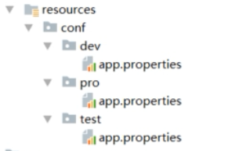

# （二）Java工程化--Maven实践

## Maven项目版本号

* 默认版本号: 1.0-SNAPSHOT 最佳实践是约定该版本为不稳定版本,如果发布一定要删除; 
* 建议的版本规则: 主版本号.次版本号.增量版本号-<里程碑版本> 如:1.0.0-RELEASE  10.2.5-FINAL 等. 最佳实践是结合自身情况制定大家都认可的版本号规则.

## 常见命令

内置的maven插件提供了常见的命令, 可以在以下位置找到对应的包: .m2\repository\org\apache\maven\plugins

* compile 
* clean 删除/target,将已编译的二进制文件等删除
* test  test case   junit/testNG
* package  打包
* install  把项目install到本地仓库
* deploy 发布jar到remote服务器
* mvn help:system 查看环境变量

## 插件

#### 插件仓库 

* https://maven.apache.org/plugins/ 
* http://www.mojohaus.org/plugins.html 

##### 常见插件

* findbugs 静态代码检查
* versions 统一升级版本号 统一升级版本  http://www.mojohaus.org/versions-maven-plugin/ 可以查看使用示例, 常用的设置版本的命令为mvn versions: set –DnewVersion=1.1.0-final
* mvn versions:set -DnewVersion=1.1 
* source 打包源代码，当jar提供给外部的时候斟酌使用
* assembly 打包zip、war
* tomcat7

``` Xml
<plugins>
    <!--静态代码bug扫描-->
    <plugin>
        <groupId>org.codehaus.mojo</groupId>
        <artifactId>findbugs-maven-plugin</artifactId>
        <version>3.0.0</version>
        <configuration>
            <threshold>High</threshold>
            <effort>Default</effort>
            <findbugsXmlOutput>true</findbugsXmlOutput>
            <findbugsXmlOutputDirectory>target/site</findbugsXmlOutputDirectory>
        </configuration>
    </plugin>
    <!--版本号管理-->
    <plugin>
        <groupId>org.codehaus.mojo</groupId>
        <artifactId>versions-maven-plugin</artifactId>
        <version>2.3</version>
    </plugin>
    <!--打包源代码-->
    <plugin>
        <artifactId>maven-source-plugin</artifactId>
        <version>2.3</version>
        <executions>
            <execution>
                <id>attach-sources</id>
                <phase>install</phase>
                <goals>
                    <goal>jar-no-fork</goal>
                </goals>
            </execution>
        </executions>
    </plugin>
    <!--这个有点晕,生成可执行jar包什么的-->
    <plugin>
        <artifactId>maven-assembly-plugin</artifactId>
        <version>3.0.0</version>
        <configuration>
            <archieve>
                <manifest>
                    <mainClass>com.xlx.Test</mainClass>
                </manifest>
            </archieve>
            <descriptorRefs>
                <descriptorRef>jar-with-dependencies</descriptorRef>
            </descriptorRefs>
        </configuration>
    </plugin>
    <!--tomcat插件-->
    <plugin>
        <groupId>org.apache.tomcat.maven</groupId>
        <artifactId>tomcat7-maven-plugin</artifactId>
        <version>2.2</version>
        <configuration>
            <port>8080</port>
            <path>/</path>
        </configuration>
    </plugin>
</plugins>
```

## 自定义插件

学习地址[https://maven.apache.org/guides/plugin/guide-java-plugin-development.html](https://maven.apache.org/guides/plugin/guide-java-plugin-development.html)

1. 创建项目
2. 修改pom的`<packaging>maven-plugin</packaging>`
3. 添加依赖
``` Xml
<dependencies>
    <dependency>
        <groupId>org.apache.maven</groupId>
        <artifactId>maven-plugin-api</artifactId>
        <version>LATEST</version>
    </dependency>
    <dependency>
        <groupId>org.apache.maven.plugin-tools</groupId>
        <artifactId>maven-plugin-annotations</artifactId>
        <version>LATEST</version>
        <scope>provided</scope>
    </dependency>
</dependencies>
```
4. 写代码实现`AbstractMojo`

```Java
@Mojo(name="xlxTest",defaultPhase = LifecyclePhase.PACKAGE)
public class Test extends AbstractMojo {

    /**
     * 接收的参数
     */
    @Parameter
    private String message;

    /**
     * 接收多个值的参数
     */
    @Parameter
    private List<String> options;

    /**
     * 命令行中接收,注意必须有property mvn:package -Dargs=this is from cmd
     */
    @Parameter(property = "args")
    private String args;

    public void execute() throws MojoExecutionException, MojoFailureException {
        System.out.println("my first maven plugin message is : " + message);
        System.out.println("my first maven plugin options is : " + options);
        System.out.println("my first maven plugin args from evm is : " + args);
    }
}
```
5. mvn install
6. 使用, maven可以接收参数, 也可以使用环境变量取,如${settings.localRepository},${project.baseUri}等
```Xml
<!--项目pom修改-->
<build>
    <plugins>
        <plugin>
            <groupId>com.xlx</groupId>
            <artifactId>engineering</artifactId>
            <version>1.0-SNAPSHOT</version>
            <executions>
                <execution>
                    <phase>package</phase>
                    <goals>
                        <goal>xlxTest</goal>
                    </goals>
                </execution>
            </executions>
            <configuration>
                <message>message</message>
                <options>
                    <option>one</option>
                    <option>two</option>
                </options>
            </configuration>
        </plugin>
    </plugins>
</build>
```

## Profile

* 不同运行环境 dev/prod/test等
* mvn clean package –P dev
* settings.xml  可以指定不同服务器仓储配置` <profile.active>私服或者官方</profile.active>`

多环境配置的配置文件路径


```Xml
<profiles>
    <profile>
        <id>dev</id>
        <properties>
            <profile.active>dev</profile.active>
        </properties>
        <activation>
            <activeByDefault>true</activeByDefault>
        </activation>
    </profile>
    <profile>
        <id>test</id>
        <properties>
            <profile.active>test</profile.active>
        </properties>
    </profile>
</profiles>

<build>
    <resources>
        <resource>
            <directory>${baseDir}/src/main/resources</directory>
            <excludes>
                <exclude>conf/**</exclude>
            </excludes>
        </resource>
         <resource>
            <directory>src/main/resources/conf/${profile.active}</directory>
        </resource>
    </resources>
</build>
```

## 私服

* 下载：  https://www.sonatype.com/download-oss-sonatype?hsCtaTracking=920dd7b5-7ef3-47fe-9600-10fecad8aa32%7Cf59d5f10-099f-4c66-a622-0254373f4a92
* 安装， 解压即可， 如果需要修改端口号等信息, 可以修改文件\nexus-3.13.0-01\etc\nexus-default.properties
* 启动命令 转到\nexus-3.13.0-01\bin下， nexus /run 可查看启动日志
* 使用： http://books.sonatype.com/nexus-book/reference3/index.html

pom中增加发布节点
```Xml
<distributionManagement>
    <repository>
        <id>nexus-release</id>
        <name>nexus-release</name>
        <url>http://localhost:8099/repository/maven-releases/</url>
    </repository>
    <snapshotRepository>
        <id>nexus-snapshot</id>
        <name>nexus-snapshot</name>
        <url>http://localhost:8099/repository/maven-snapshots/</url>
    </snapshotRepository>
</distributionManagement>
```

修改settings.xml 增加服务器账号密码信息
```Xml
<server>
    <id>nexus-release</id>
    <username>admin</username>
    <password>admin123</password>
</server>
<server>
    <id>nexus-snapshot</id>
    <username>admin</username>
    <password>admin123</password>
</server>
```

## 生成脚手架

* mvn archetype: create-from-project  从项目生成脚手架
* cd /target/generated-soource/archetype  转到此目录
* mvn install  发布到仓库
* 可以添加到ide的脚手架列表
* mvn archetype:generate –DarchetypeCatagory=local  命令行方式创建项目 local参数指定走本地仓库
