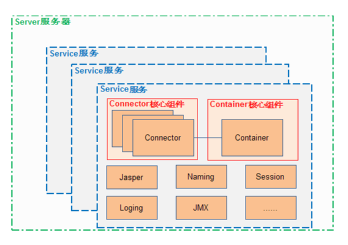
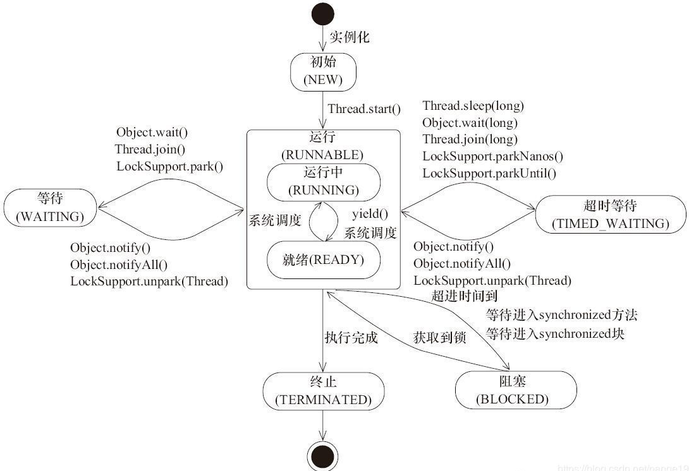

# 自我介绍

答: 

我是XXX, 07年毕业到现在工作已经11年了, 先后在太原语信科技公司, 北京拓明科技, 搜房网(房天下)工作. 

(太原的工作是启蒙阶段, 完成了从一个萌新到程序员的进化, 拓明科技是技能提升阶段, 逐渐完善了自己的技能库和专业经验(前端, sql, .net oop等), 搜房网是进阶阶段, 技能方面更注重宏观整体系统的架构等方面, 对互联网分布式也有了更清晰的认识, 管理方面从一个工程师到有一定管理经验的管理者蜕变, 对团队管理, 人员分工, 下属激励等方面都有了一定的理解.) **这段可以不说**

先后做过会计核算系统, 指标考核系统, 基础网络设备管理系统BMOP, 业主委托, 二手房电商, 经纪云, 经纪人大学改造等项目. 其中电商, 经纪云等项目是带领团队完成的比较大的项目. 

# 项目介绍

答:

二手房电商是14年10月份开始, 背景是经纪公司联合抵制搜房平台, 公司做出的做自有经纪公司的重大转型决策. 系统分为B端的工作台WEB项目, API 接口项目, 统计后台, 主要是这三大块. 业务模块有房源, 客源, 用户中心, 管理, 考核, 积分, 考勤, 投诉等模块组成. 我负责的是核心模块之一的房源模块的搭建开发以及团队管理工作, 团队人数多的时候有20人, 工作内容由我组织分配管理.

整个系统是. Net MVC 开发, 使用了IOC 框架lightinject, orm ORMlite 等开源框架搭建, 同时也使用了memcache, redis 等中间件. 房源模块最重要的是房源信息管理, 权限, 还有一些流程性的业务如钥匙, 实勘审批, 角色人流转等. 以权限为例, 大的方面我们使用权限配置管理模块在实现, 也就是一些页面, 功能模块的可见性管理; 除此之外, 细小的功能权限如页面的按钮或者字段对于某些角色甚至某些场景不可见等, 我们初始采用编程的方式, 后来慢慢抽象出一个权限控制模块. 最后搭建了一套权限配置规则引擎, 完全走配置了.

还有就是数据库优化, 在业务峰值出现的时候, 由于大量访问落到数据库导致了几次数据库CPU满载, 一方面我们优化查询, 另一方面优化设计, 大量使用缓存, 表的重新设计, 一些查询使用了solar.

# 面试题

参看:

[2017 Java面试题](https://blog.csdn.net/huangshulang1234/article/details/79480244)

[JAVA多线程和并发基础面试问答](http://ifeve.com/java-multi-threading-concurrency-interview-questions-with-answers/)

## Java 基础

### Java 跨平台的原理?

答:

JVM 和 字节码class文件是 Java 跨平台的基础. JVM 针对不同的平台有不同的实现, 用来将字节码指令翻译为特定平台的指令, JVM 屏蔽了平台的差异性, 对于上层的 API 为开发者提供了一个统一的接口, 从而使得生成的同一份class文件可以部署到不同的机器.

### Java 中的几种基本类型? 各占多少字节 ?

答:

|基本类型|字节|取值范围|
|--------|---|-------|
|byte|1|-128~127（-2的7次方到2的7次方-1）|
|short|2|-32768~32767（-2的15次方到2的15次方-1）|
|int|4|-2147483648~2147483647（-2的31次方到2的31次方-1）|
|long|8|-9223372036854774808~9223372036854774807（-2的63次方到2的63次方-1）|
|char|2|前128字节编码与ASCII兼容, 字符的存储范围在\u0000~\uFFFF|
|float|4|3.402823e+38 ~ 1.401298e-45（e+38表示是乘以10的38次方，同样，e-45表示乘以10的负45次方）|
|double|8|1.797693e+308~ 4.9000000e-324|
|boolean|4|true / false|

> 注意: JDK 官方文档 boolean 只定义了取值范围为 `true` 或 `false` . 但没有给出具体的占用大小. 看虚拟机的具体实现而定, 可能是4字节的 (int) , 也可能是一字节的 (boolean 数组) .

### String 能否被继承, 为什么?

答:

其定义为 `public final class String implements java.io.Serializable, Comparable<String>, CharSequence {...}` 由关键字 final 修饰, 所以不能被继承.

### String, StringBuilder, StringBuffer 的区别? 什么是常量池? 

答:

三者均通过 `char[] value` 的域变量来保存字符串. String 与二者不同的是, 它的变量 `value` 是使用 `final` 修饰的, 所以其不能被重新赋值, 这也是 String 是不可变变量的原因. 

 `StringBuilder` 与 `StringBuffer` API几乎相同, 不同的是 `StringBuffer` 使用了同步 `synchronized` 因此可以认为是线程安全的字符串操作类. 另外, 二者的 `toString()` 方法实现不同, `StringBuffer` 缓存了结果.

``` java
// StringBuilder 的实现
@Override
public String toString() {
    // Create a copy, don't share the array
    return new String(value, 0, count);
}

// StringBuffer 的实现

/**

* A cache of the last value returned by toString. Cleared
* whenever the StringBuffer is modified.

*/
private transient char[] toStringCache; 

@Override
public synchronized String toString() {
    if (toStringCache == null) {
        toStringCache = Arrays.copyOfRange(value, 0, count);
    }
    return new String(toStringCache, true);
}
```

 `StringBuilder` 自1.5开始出现, 是为了提高在单线程环境下字符串操作效率. `StringBuffer` 从1.0 就有了.

三者均使用 `final` 修饰, 不能被继承.

### 下面代码输出结果为?

```java
Double i1 = 100.0; 
Double i2 = 100.0; 
Double i3 = 200.0; 
Double i4 = 200.0; 

System.out.println(i1==i2); 
System.out.println(i3==i4); 

Boolean i1 = false; 
Boolean i2 = false; 
Boolean i3 = true; 
Boolean i4 = true; 

System.out.println(i1==i2); 
System.out.println(i3==i4); 
```

答: Double 装箱类型, 返回的是一个新实例对象, 所以结果均为 `false` . 使用了 `valueOf()` 方法

```java
public static Double valueOf(double d) {
   return new Double(d); 
}
```

Boolean 装箱类型, 但返回结果均为 `true` . 查看 `valueOf()` 可知返回的字段是两个静态初始化的变量. 

```java
public static final Boolean TRUE = new Boolean(true); 
public static final Boolean FALSE = new Boolean(false); 

public static Boolean valueOf(boolean b) {
   return (b ? TRUE : FALSE); 
}
```

### 下面代码的输出分别为? 

1. `String a = "hello2";  String b = "hello" + 2; 　　System.out.println((a == b));` 

答: true 原因是编译期字面量优化, `"hello" + 2` 被优化为 `"hello2"` 了. 

2. `String a = "hello2"; 　  String b = "hello";       String c = b + 2;       System.out.println((a == c));` 

答: false, 无法进行编译器优化, 认为是两个不同的对象. 

3. `String a = "hello2";   　 final String b = "hello";       String c = b + 2;       System.out.println((a == c));` 

答: true, `final` 的变量会内联执行, 所以同问题1一样. 

4. 

```java
public static void main(String[] args) {
    String a = "hello2";
    final String b = getHello();
    String c = b + 2;
    System.out.println((a == c));
}
    
public static String getHello() {
    return "hello";
}
```

答: false, 通过方法获取的值无法内联优化. 

5. 

```java
public class Main {
    public static void main(String[] args) {
        String a = "hello";
        String b =  new String("hello");
        String c =  new String("hello");
        String d = b.intern();
        System.out.println(a==b);
        System.out.println(b==c);
        System.out.println(b==d);
        System.out.println(a==d);
    }
}
```

答: 分别为: `false` , `false` , `false` , `true` . `b.intern()` 为本地方法, 会通过常量池查找, 因此, 因此它与 `a` 为同一对象. 

6. `String str = new String("abc")` 创建了多少对象? 

答: 在**类加载**过程中, 在常量池创建了 `"abc"` 对象, 在**代码执行**中创建了字符串对象. (加载-连接(检查-准备-解析)-初始化) 因此这段代码涉及两个对象的创建, 但创建过程分别在不同的阶段. 严格讲, 代码执行过程中只有一个对象创建. 一共创建了两个对象.  

7. 1和2处的代码区别?

```java
public class Main {
    public static void main(String[] args) {
        String str1 = "I";
        //str1 += "love"+"java";        1)
        str1 = str1+"love"+"java";      //2)
         
    }
}
```

答: 1 的效率比 2 的高. 这也涉及到编译器优化, 1 会将 "love" 和 "java" 优化为 "lovejava". 

### ArrayList 和 LinkedList 的区别? 使用场景? 

答: 

二者均实现了 `List` 接口. 

* `ArrayList` 底层基于数组实现, 可以使用下标快速访问元素, 支持随机访问(时间复杂度为O(1)), `LinkedList` 使用链表, 访问某个元素需要遍历(时间复杂度为O(n)); 

* `LinkedList` 因为每个节点保留了与之相邻元素的引用, 所以对于元素的增加/删除等操作更快, `ArrayList` 则因为操作后需要调整数组元素位置, 所以效率会低. 

* `LinkedList` 因为需要多存储节点之间的引用关系, 所以占用空间会大一点.

参看[这篇文章](https://blog.csdn.net/weixin_42468526/article/details/81178698)

### ArrayList 扩容的原理是什么? 

答: 

 `ArryList` 底层使用数组实现, 当容量超过数组大小时会发生扩容, 这个数组又叫做动态数组.    

```java
private void grow(int minCapacity) {
    // overflow-conscious code
    int oldCapacity = elementData.length;
    int newCapacity = oldCapacity + (oldCapacity >> 1);
    if (newCapacity - minCapacity < 0)
        newCapacity = minCapacity;
    if (newCapacity - MAX_ARRAY_SIZE > 0)
        newCapacity = hugeCapacity(minCapacity);
    // minCapacity is usually close to size, so this is a win:
    elementData = Arrays.copyOf(elementData, newCapacity);
}
```

最终调用 native 方法 `public static native void arraycopy(Object src,  int  srcPos,Object dest, int destPos,int length);` 

### 类的实例化顺序是? 

答: 类加载器实例化时的顺序为 加载 -> 连接 -> 初始化

1）父类的静态成员；静态方法块； -> 2）子类中的静态成员；静态方法块；-> 3）父类中的成员变量；方法块；-> 5）父类构造函数 -> 4）子类中的成员变量；方法块；-> 6）子类构造函数

初始化块的一个问题, 参看[这篇文章](https://segmentfault.com/q/1010000008546313)

### Map 类有哪些? HashMap 是否线程安全? 原理是什么? 自定义对象做 key 需要注意什么? 

答: 常用的 `HashMap` , `HashTable` , `ConcurrentHashMap` , `TreeMap` 等.

 `HashMap` 并非线程安全的类. `HashTable` , `ConcurrentHashMap` 被认为是线程安全的(但 `ConcurrentHashMap` 放弃了若一致性要求), 但 `HashTable` 因为性能问题很少使用了. HashMap的扩容可能导致循环链表(1.7). 

 `HashMap` 使用数组+链表, 1.8的话使用数组+链表+红黑树实现. 数组称为 Hash 桶, 的每个元素称为Node或Entry, 存储key, value, hash, next; 当put元素时, 通过元素的key计算其hash值, 并与(capture-1)做 `&` 操作. 从而得到数组的下标. 1.8的实现中, 通过高16位和低16位异或运算来使hash更加分散.

扩容原理需要注意两个变量 `threshold` 和 `loadFactor` , threshold = length * LoadFactor. HashTable 扩容一般以容量的2次方增加, 这样设计对重新 hash 效率有好处. 重新Hash 时二进制低位不变, 高位+1, 这样更容易计算新元素的下标. map 有 hash 碰撞问题发生, 可以使用扰动函数来减少碰撞, 并将key定义为final的对象. 

自定义 key 需要同时重写 `hashCode` 和 `equals` 方法, 并保持对象的 hashCode 不可变. 如参与 hashCode 的字段定义为 final. 

> 与HashMap不同的是，ConcurrentHashMap并不允许key或者value为null，按照Doug Lea的说法，这么设计的原因是在ConcurrentHashMap中，一旦value出现null，则代表HashEntry的key/value没有映射完成就被其他线程所见，需要特殊处理。

参看[这篇文章](https://baijiahao.baidu.com/s?id=1618550070727689060&wfr=spider&for=pc)

### Java8的 ConcurrentHashMap 为什么放弃了分段锁, 有什么问题? 还有什么优化? 

答: 

* 分段锁Segment继承了 `ReentrantLock` , 使用并发度来控制Segment的数量. 所以锁的粒度可以设置, 但不灵活, 也很难保证性能和并发的平衡. Java8的锁有了更好的实现, 锁的粒度控制在只是锁一个Node, 而且只在必要的时候加锁. java8并没有使用 `ReentrantLock` , 而是使用 `synchronized` 修饰, 这种基于jvm的实现方式可能后期更有利于随着jvm升级而得到优化. 

 `TreeBin` 是包装很多 `TreeNode` 节点的对象. 这个类带有读写锁. 

* 大量使用 CAS 算法. 

* 设计了MOVED状态 当resize的中过程中 线程2还在put数据，线程2会帮助resize。

* 使用3个CAS操作来确保node的一些操作的原子性，这种方式代替了锁。

* sizeCtl的不同值来代表不同含义，起到了控制的作用。

可以参看[这篇文章](https://blog.csdn.net/woaiwym/article/details/80675789)

### 有没有有顺序的 Map 实现类， 如果有， 他们是怎么保证有序的?

答: `LinkedHashTable` 或 `TreeMap` . LinkedHashTable 每个Entry节点定义了双向引用, 可以记录元素的插入顺序. TreeMap 需要一个 Comparator 来判断元素key的大小.

可以参看[这篇文章](https://uule.iteye.com/blog/1522291).

### 抽象类和接口的区别，类可以继承多个类么，接口可以继承多个接口么, 类可以实现多个接口么?

答: 

1、抽象类和接口都不能直接实例化，如果要实例化，抽象类变量必须指向实现所有抽象方法的子类对象，接口变量必须指向实现所有接口方法的类对象。 
2、抽象类要被子类继承，接口要被类实现。 
3、接口只能做方法申明，抽象类中可以做方法申明，也可以做方法实现 
4、接口里定义的变量只能是公共的静态的常量，抽象类中的变量是普通变量。 
5、抽象类里的抽象方法必须全部被子类所实现，如果子类不能全部实现父类抽象方法，那么该子类只能是抽象类。同样，一个实现接口的时候，如不能全部实现接口方法，那么该类也只能为抽象类。 
6、抽象方法只能申明，不能实现。abstract void abc(); 不能写成abstract void abc(){}。 
7、抽象类里可以没有抽象方法 
8、如果一个类里有抽象方法，那么这个类只能是抽象类 
9、抽象方法要被实现，所以不能是静态的，也不能是私有的。 
10、接口可继承接口，并可多继承接口，但类只能单根继承。

### 继承和聚合的区别在哪?

答: 继承指的是一个类（称为子类、子接口）继承另外的一个类（称为父类、父接口）的功能，并可以增加它自己的新功能的能力，继承是类与类或者接口与接口之间最常见的关系；在Java中此类关系通过关键字extends明确标识，在设计时一般没有争议性； 

聚合是关联关系的一种特例，他体现的是整体与部分、拥有的关系，即has-a的关系，此时整体与部分之间是可分离的，他们可以具有各自的生命周期，部分可以属于多个整体对象，也可以为多个整体对象共享；比如计算机与CPU、公司与员工的关系等；表现在代码层面，和关联关系是一致的，只能从语义级别来区分； 

### 讲讲你理解的 nio 和 bio 的区别是啥，谈谈 reactor 模型?

答: nio(non-blocking io 或者 new io)是同步非阻塞io, 采用多路复用机制. 

* 区别1: io 面向流, nio 面向缓存; Java IO面向流意味着每次从流中读一个或多个字节，直至读取所有字节，它们没有被缓存在任何地方。此外，它不能前后移动流中的数据。如果需要前后移动从流中读取的数据，需要先将它缓存到一个缓冲区。Java NIO: 数据读取到一个它稍后处理的缓冲区，需要时可在缓冲区中前后移动。这就增加了处理过程中的灵活性。但是，还需要检查该缓冲区中是否包含所有您需要处理的数据。而且，需确保当更多的数据读入缓冲区时，不要覆盖缓冲区里尚未处理的数据。

* 区别2: Java IO的各种流是阻塞的。这意味着，当一个线程调用read()或write()时，该线程被阻塞，直到有一些数据被读取，或数据完全写入。该线程在此期间不能再干任何事情了。 Java NIO的非阻塞模式，使一个线程从某通道发送请求读取数据，但是它仅能得到目前可用的数据，如果目前没有数据可用时，就什么都不会获取。而不是保持线程阻塞，所以直至数据变得可以读取之前，该线程可以继续做其他的事情。 非阻塞写也是如此。一个线程请求写入一些数据到某通道，但不需要等待它完全写入，这个线程同时可以去做别的事情。 线程通常将非阻塞IO的空闲时间用于在其它通道上执行IO操作，所以一个单独的线程现在可以管理多个输入和输出通道（channel）。

#### Reactor 模型

IO读写时，多路复用机制都会依赖对一个事件多路分离器，负责把源事件的IO 事件分离出来，分别到相应的read/write事件分离器。涉及到事件分离器的两种模式分别就是 `Reactor` 和 `Proactor` ， Reactor 是基于同步IO的，Proactor是基于异步IO的。Reactor 关注是否可用, Proactor 关注是否完成.

在Reactor模式中，事件分离者等待某个事件或者可应用或个操作的状态发生(比如文件描述符可读写，或者是socket可读写), 事件分离者就把这个事件传给事先注册的事件处理函数或者回调函数，由后者来做实际的读写操作。

在Proactor模式中，事件处理者(或者代由事件分离者发起)直接发起一个异步读写操作(相当于请求)，而实际的工作是由操作系统来完成的。发起时，需要提供的参数包括用于存放读到数据的缓存区，读的数据大小，或者用于存放外发数据的缓存区，以及这个请求完后的回调函数等信息。事件分离者得知了这个请求，它默默等待这个请求的完成，然后转发完成事件给相应的事件处理者或者回调。举例来说，在Windows上事件处理者投递了一个异步IO操作(称有 overlapped的技术)，事件分离者等IOCompletion事件完成. 这种异步模式的典型实现是基于操作系统底层异步API的，所以我们可称之为“系统级别”的或者“真正意义上”的异步，因为具体的读写是由操作系统代劳的。

### 反射的原理，反射创建类实例的三种方式是什么?

答: 

Java反射是Java被视为动态（或准动态）语言的一个关键性质。这个机制允许程序在运行时透过Reflection APIs取得任何一个已知名称的class的内部信息，包括其modifiers（诸如public, static 等）、superclass（例如Object）、实现之interfaces（例如Cloneable），也包括fields和methods的所有信息，并可于运行时改变fields内容或唤起methods。

Java反射机制容许程序在运行时加载、探知、使用编译期间完全未知的classes。

换言之，Java可以加载一个运行时才得知名称的class，获得其完整结构。

* 反射创建类实例的方式: 

1. 调用类的Class对象的newInstance方法，该方法会调用对象的默认构造器，如果没有默认构造器，会调用失败.
2. 调用默认Constructor对象的newInstance方法
3. 调用带参数Constructor对象的newInstance方法

* 获取类的 `Class` 对象的方法?

1. `instance.getClass()` 
2. `ClassName.class` 
3. `Class.forName("classNameString")` 
4. 包装类对象返回原生类: `Boolean.TYPE` 

### 反射中，Class.forName 和 ClassLoader 区别? 

答: 

类加载器通过三个步骤装载类, 装载、链接和初始化; 

* 装载：查找和导入类或接口的二进制数据； 
* 链接：执行下面的校验、准备和解析步骤，其中解析步骤是可以选择的； 
    + 校验：检查导入类或接口的二进制数据的正确性； 
    + 准备：给类的静态变量分配并初始化存储空间； 
    + 解析：将符号引用转成直接引用； 
* 初始化：激活类的静态变量的初始化Java代码和静态Java代码块。

Class.forName(className)方法，其实调用的方法是 `forName0(className, true, ClassLoader.getClassLoader(caller), caller)` ; 注意看第2个boolean参数，它表示的意思，在loadClass后必须初始化。比较下我们前面准备jvm加载类的知识，我们可以清晰的看到在执行过此方法后，目标对象的 static块代码已经被执行，static参数也已经被初始化。

 再看ClassLoader.loadClass(className)方法，其实他调用的方法是 `loadClass(name, false)` ; 还是注意看第2个 boolean参数，该参数表示目标对象被装载后不进行链接，这就意味这不会去执行该类静态块中间的内容。因此二者的区别就显而易见了。

 

### 描述动态代理的几种实现方式，分别说出相应的优缺点? (动态代理与 cglib 实现的区别?) (为什么 CGlib 方式可以对接口实现代理?)

 答: 

 * jdk : 基于反射, 必须定义要代理的借口, 且必须实现 `InvocationHandler` 接口, 使用反射效率较低, 但JDK6+已经优化了效率. JDK8的效率高于CGLib. 
 * cglib: 基于asm框架, 增强字节码. 但声明为 `final` 的方法无法代理. CGLib原理是动态生成被代理类的子类。

 

### final 的用途?

 答: 
 
 final 修饰的类不能被继承, 方法不能被覆盖, 字段不能被重新赋值. 

* final 的好处:

    + final 关键字提高了性能。JVM 和 Java 应用都会缓存 final 变量。
    + final变量可以安全的在多线程环境下进行共享，而不需要额外的同步开销。
    + 使用final关键字，JVM会对方法、变量及类进行优化。

> 关于final 的知识点: 

> * `final` 关键字可以用于成员变量、本地变量、方法以及类。
> * `final` 成员变量必须在声明的时候初始化或者在构造器中初始化，否则就会报编译错误。
> * 你不能够对 `final` 变量再次赋值。
> * 本地变量必须在声明时赋值。
> * 在匿名类中所有变量都必须是 `final` 变量。
> * `final` 方法不能被重写。
> * `final` 类不能被继承。
> * `final` 关键字不同于 `finally` 关键字，后者用于异常处理。
> * `final` 关键字容易与 `finalize()` 方法搞混，后者是在 `Object` 类中定义的方法，是在垃圾回收之前被 JVM 调用的方法。
> * 接口中声明的所有变量本身是 `final` 的。
> * `final` 和 `abstract` 这两个关键字是反相关的， `final` 类就不可能是 `abstract` 的。
> * `final` 方法在编译阶段绑定，称为静态绑定(static binding)。
> * 没有在声明时初始化 `final` 变量的称为空白 `final` 变量(blank final variable)，它们必须在构造器中初始化，或者调用 `this()` 初始化。不这么做的话，编译器会报错“final变量(变量名)需要进行初始化”。
> * 将类、方法、变量声明为 `final` 能够提高性能，这样JVM就有机会进行估计，然后优化。
> * 按照 Java 代码惯例， `final` 变量就是常量，而且通常常量名要大写：

### 写出三种单例模式实现?

答: 

参看[设计模式一: 单例模式(Singleton)](https://www.cnblogs.com/walkinhalo/p/9513118.html)

### 如何在父类中为子类自动完成所有的 hashcode 和 equals 实现？这么做有何优劣?

答: 

Object 本身提供了equals 实现. 某些情况下, 并不需要对类的实例进行逻辑相等判定, 认为每个实例都是唯一的, 那么这种情况下子类就可以使用Object类的实现. 

另外, 父类如果提供了实例间逻辑相等的判定功能, 比如 AbstractSet , AbstractList 等, 则子类可以继承父类的实现. 

hashcode 和 equals 应该同时重写. 

### 请结合 OO 设计理念，谈谈访问修饰符 public、private、protected、default 在应用设计中的作用?

答: 

用于隔离保护. 对于不同的作用域, 使用响应的修饰符保护, 这样可以防止代码被不恰当的调用, 同时减少代码耦合. 

### 深拷贝和浅拷贝区别?

答: 

区别在于引用类型的实例域如何进行拷贝, 对于浅拷贝来说, 实例域会拷贝其上的值, 对于引用类型来说, 相当于拷贝了对象的引用, 而具体的对象由二者共享, 因此不是真正意义上的拷贝, 神拷贝除了复制引用, 同时也将对象同时拷贝一份, 两个对象之间不存在交集, 完全是两个独立的对象. 

### 数组和链表数据结构, 及其时间复杂度

答: 

数组的元素在内存中是顺序存储的, 链表则每个元素有指向前一个和后一个元素的引用, 相邻元素不一定物理上也是相邻的. 

数组支持快速随机访问, 时间复杂度为O(1); 链表为O(n); 
按值查找时, 因为均需要遍历, 时间复杂度为O(n), 有序时时间复杂度可以为O(logn)
插入和删除链表要快O(1) 数组则因为要移动元素. O(n)

### error 和 exception 的区别，CheckedException，RuntimeException 的区别

答: 

error 是错误, 一般虚拟机在发生错误时会退出, 所以此类异常不需要被处理; Exception 是异常, 发生时说明程序代码出现错误, 需要被处理. 一般是捕获处理或重新抛出.

CheckedException 是受查异常, 要求代码必须处理的异常， RuntimeException 与 error 一起被称为未受查异常, 发生RuntimeException 时说明是程序问题. 

* Checked异常, 会导致无法编译通过

    + `Java.lang.ClassNotFoundException` 
    + `Java.lang.NoSuchMetodException` 
    + `java.io.IOException` 

* 我们比较熟悉的RumtimeException类的子类有

    + `Java.lang.ArithmeticException` 
    + `Java.lang.ArrayStoreExcetpion` 
    + `Java.lang.ClassCastException` 
    + `Java.lang.IndexOutOfBoundsException` 
    + `Java.lang.NullPointerException` 

### 在自己的代码中，如果创建一个 java.lang. String 对象，这个对象是否可以被类加载器加载？为什么

答: 

类加载无须等到“首次使用该类”时加载，jvm允许预加载某些类

### 说一说你对 java.lang. Object 对象中 hashCode 和 equals 方法的理解。在什么场景下需要重新实现这两个方法。

答: 

这两个方法用来判定两个对象是否相等. 这里的相等一般是指逻辑相等. Object 类的实现是根据引用地址来判断的, 因此如果需要通过自定义的相等逻辑, 比如集合相等需要每个元素的值都相等, 来覆盖object 的默认实现. 

### 在 jdk1.5 中，引入了泛型，泛型的存在是用来解决什么问题? 

答: 

泛型的本质是参数化类型，也就是说所操作的数据类型被指定为一个参数，泛型的好处是在编译的时候检查类型安全, 并且所有的强制转换都是自动和隐式的，以提高代码的重用率 

### hashcode() 有什么用，与 a.equals(b)有什么关系?

答: 

用一个数字来标识对象。比如在HashMap、HashSet等类似的集合类中，如果用某个对象本身作为Key，即要基于这个对象实现Hash的写入和查找，那么对象本身如何实现这个呢？就是基于hashcode这样一个数字来完成的，只有数字才能完成计算和对比操作。

equals相等两个对象，则hashcode一定要相等。但是hashcode相等的两个对象不一定equals相等。 

### 有没有可能 2 个不相等的对象有相同的 hashcode?

答: 有可能

### Java 中的 HashSet 内部是如何工作的?

答: 

对于 HashSet 而言，它是基于 HashMap 实现的，底层采用 HashMap 来保存元素.

### 什么是序列化，怎么序列化，为什么序列化，反序列化会遇到什么问题，如何解决?

答: 

序列化 (Serialization)是将对象的状态信息转换为可以存储或传输的形式的过程。

> `Externalizable` 继承了 `Serializable` ，该接口中定义了两个抽象方法： `writeExternal()` 与 `readExternal()` 。当使用 `Externalizable` 接口来进行序列化与反序列化的时候需要开发人员重写 `writeExternal()` 与 ` readExternal()` 方法。由于上面的代码中，并没有在这两个方法中定义序列化实现细节，所以输出的内容为空。还有一点值得注意：在使用 `Externalizable` 进行序列化的时候，在读取对象时，会调用被序列化类的无参构造器去创建一个新的对象，然后再将被保存对象的字段的值分别填充到新对象中。所以，实现 `Externalizable` 接口的类必须要提供一个 `public` 的无参的构造器。

虚拟机是否允许反序列化，不仅取决于类路径和功能代码是否一致，一个非常重要的一点是两个类的序列化 ID 是否一致（就是 `private static final long serialVersionUID` ).

## JVM

### 什么情况下会发生栈内存溢出? 什么是内存泄漏?

答: 

如果线程请求的栈深度大于虚拟机所允许的深度，将抛出 `StackOverflowError` 异常。
如果虚拟机在动态扩展栈时无法申请到足够的内存空间，则抛出 `OutOfMemoryError` 异常。

当栈空间无法继续分配时，到底是内存太小，还是已使用的栈空间太大，其本质上只是对同一件事情的两种描述而已。在单线程的操作中，无论是由于栈帧太大，还是虚拟机栈空间太小，当栈空间无法分配时，虚拟机抛出的都是 `StackOverflowError` 异常，而不会得到 `OutOfMemoryError` 异常。而在多线程环境下，则会抛出 `OutOfMemoryError` 异常。

### JVM 的内存结构，Eden 和 Survivor 比例?

答: 

HotSpot JVM 把年轻代分为了三部分：1个 Eden 区和2个 Survivor 区（分别叫 from 和 to）。默认比例为8：1. 

### jvm 中一次完整的 GC 流程是怎样的，对象如何晋升到老年代，说说你知道的几种主要的 jvm 参数

答:

在 GC 开始的时候，对象只会存在于 Eden 区和名为 “From” 的 Survivor 区，Survivor 区 “To” 是空的。紧接着进行 GC，Eden 区中所有存活的对象都会被复制到 “To”，而在 “From” 区中，仍存活的对象会根据他们的年龄值来决定去向。年龄达到一定值(年龄阈值，可以通过 `-XX:MaxTenuringThreshold` 来设置)的对象会被移动到年老代中，没有达到阈值的对象会被复制到 “To” 区域。经过这次 GC 后，Eden 区和 From 区已经被清空。这个时候，“From” 和 “To” 会交换他们的角色，也就是新的 “To” 就是上次GC前的 “From”，新的 “From” 就是上次 GC 前的 “To”。不管怎样，都会保证名为 To 的 Survivor 区域是空的。Minor GC 会一直重复这样的过程，直到“To”区被填满，“To”区被填满之后，会将所有对象移动到年老代中。

有关年轻代的JVM参数

1. `-XX:NewSize` 和 `-XX:MaxNewSize` 

用于设置年轻代的大小，建议设为整个堆大小的1/3或者1/4, 两个值设为一样大。

2. `-XX:SurvivorRatio` 

用于设置Eden和其中一个Survivor的比值，这个值也比较重要。

3. `-XX:+PrintTenuringDistribution` 

这个参数用于显示每次 Minor GC 时 Survivor 区中各个年龄段的对象的大小。

4. `-XX:InitialTenuringThreshold` 和 `-XX:MaxTenuringThreshold` 

用于设置晋升到老年代的对象年龄的最小值和最大值，每个对象在坚持过一次 Minor GC 之后，年龄就加1。

参看[这篇文章](https://wangkang007.gitbooks.io/jvm/content/jvmcan_shu_xiang_jie.html)

### 垃圾回收算法? 垃圾标记算法? 你知道哪几种垃圾收集器，各自的优缺点，重点讲下 cms，包括原理，流程，优缺点?

答:

#### 标记算法: 

* 引用计数器算法(JDK1.1后淘汰); 
* 可达性分析算法; 

        GC Roots对象包括：

            1. 虚拟机栈（栈帧中的本地变量表）中的引用的对象。
            2. 方法区域中的类静态属性引用的对象。
            3. 方法区域中常量引用的对象。
            4. 本地方法栈中JNI（Native方法）的引用的对象。

#### 垃圾收集算法: 

1. 标记—清除算法: 标记和清除阶段的效率不高，而且清除后回产生大量的不连续空间

2. 复制算法: 复制算法实现简单，运行效率高，但是由于每次只能使用其中的一半，造成内存的利用率不高。现在的JVM用复制方法收集新生代，由于新生代中大部分对象（98%）都是朝生夕死的，所以两块内存的比例不是1:1(大概是8:1)，也就是常提到的一块Eden(80%)和两块Survivor(20%)。当然也会存在10%不够用的情况，会有一个补偿机制，也就是分配担保

3. 标记—整理算法: 根据老年代的特点提出了标记—整理算法。 标记—整理算法和标记—清除算法一样，但是标记—整理算法不是把存活对象复制到另一块内存，而是把存活对象往内存的一端移动，然后直接回收边界以外的内存

4. 分代收集: 根据各代对象的存活特点，每个代采用不同的垃圾回收算法。新生代采用标记—复制算法，老年代采用标记—整理算法.

#### 收集器:

1. Serial 收集器: 新生代收集器，单线程执行，使用复制算法

2. ParNew 收集器: 多条线程进行垃圾收集之外，其余行为与 Serial 收集器一样; 可以使用 `-XX:+UseParNewGC` 来强制开启，可以通过 `-XX:ParallelGCThreads` 来调整或者限制垃圾收集的线程数量

3. Parallel Scavenge 收集器: 是一个新生代收集器，它也是使用复制算法的收集器，又是并行多线程收集器; parallel Scavenge 收集器的特点是它的关注点与其他收集器不同，CMS 等收集器的关注点是尽可能地缩短垃圾收集时用户线程的停顿时间，而 parallel Scavenge 收集器的目标则是达到一个**可控制的吞吐量**。吞吐量=程序运行时间/(程序运行时间 + 垃圾收集时间)，虚拟机总共运行了100分钟。其中垃圾收集花掉1分钟，那吞吐量就是99%。

控制最大垃圾收集停顿时间的 `-XX:MaxGCPauseMillis` 参数以及直接设置吞吐量大小的 `-XX:GCTimeRatio` 参数. 还有一个参数 `-XX:+UseAdaptiveSizePolicy` 值得关注。这是一个开关参数，当这个参数打开之后，就不需要手工指定新生代的大小（ `-Xmn` ）、Eden与Survivor区的比例（ `-XX:SurvivorRatio` ）、晋升老年代对象年龄（ `-XX:PretenureSizeThreshold` ）等细节参数了，虚拟机会根据当前系统的运行情况收集性能监控信息，动态调整这些参数以提供最合适的停顿时间或者最大的吞吐量，这种调节方式称为GC自适应的调节策略（GC Ergonomics）

4. Serial Old 收集器: Serial收集器的老年代版本. 使用“标记－整理”算法, 这个收集器的主要意义也是在于给 Client 模式下的虚拟机使用。如果在Server模式下，那么它主要还有两大用途：一种用途是在JDK 1.5以及之前的版本中与 Parallel Scavenge 收集器搭配使用，另一种用途就是作为 CMS 收集器的后备预案，在并发收集发生Concurrent Mode Failure 时使用。这两点都将在后面的内容中详细讲解。

5. Parallel Old 收集器: Parallel Old是Parallel Scavenge 收集器的老年代版本，使用多线程和“标记－整理”算法。在注重吞吐量以及 CPU 资源敏感的场合，都可以优先考虑 Parallel Scavenge 加 Parallel Old 收集器.

6. CMS (Concurrent Mark Sweep) 收集器: 是一种以获取最短回收停顿时间为目标的收集器。

是基于“标记—清除”算法实现的, 分四个步骤: 

    1. 初始标记（CMS initial mark）
    2. 并发标记（CMS concurrent mark）
    3. 重新标记（CMS remark）
    4. 并发清除（CMS concurrent sweep）

初始标记、重新标记这两个步骤仍然需要“Stop The World”. 

CMS收集器无法处理浮动垃圾（Floating Garbage），可能出现“Concurrent Mode Failure”失败而导致另一次Full GC的产生。

 `-XX:+UseCMSCompactAtFullCollection` 开关参数（默认就是开启的）用于在CMS收集器顶不住要进行 FullGC 时开启内存碎片的合并整理过程，内存整理的过程是无法并发的，空间碎片问题没有了，但停顿时间不得不变长。另外一个参数 `-XX:CMSFullGCsBeforeCompaction` ，这个参数是用于设置执行多少次不压缩的Full GC后，跟着来一次带压缩的（默认值为0，表示每次进入Full GC时都进行碎片整理）。

7. G1 收集器: 

具有如下特点:

* 并行与并发：G1能充分利用多CPU、多核环境下的硬件优势，使用多个CPU（CPU或者CPU核心）来缩短Stop-The-World停顿的时间，部分其他收集器原本需要停顿Java线程执行的 GC 动作，G1 收集器仍然可以通过并发的方式让 Java 程序继续执行。

* 分代收集：与其他收集器一样，分代概念在G1中依然得以保留。虽然 G1 可以不需要其他收集器配合就能独立管理整个 GC 堆，但它能够采用不同的方式去处理新创建的对象和已经存活了一段时间、熬过多次GC的旧对象以获取更好的收集效果。

* 空间整合：与 CMS 的“标记—清理”算法不同，G1从整体来看是基于“标记—整理”算法实现的收集器，从局部（两个Region之间）上来看是基于“复制”算法实现的，但无论如何，这两种算法都意味着G1运作期间不会产生内存空间碎片，收集后能提供规整的可用内存。这种特性有利于程序长时间运行，分配大对象时不会因为无法找到连续内存空间而提前触发下一次GC。

* 可预测的停顿：这是G1相对于CMS的另一大优势，降低停顿时间是G1和CMS共同的关注点，但G1除了追求低停顿外，还能建立可预测的停顿时间模型，能让使用者明确指定在一个长度为M毫秒的时间片段内，消耗在垃圾收集上的时间不得超过N毫秒，这几乎已经是实时Java（RTSJ）的垃圾收集器的特征了。

> 在G1之前的其他收集器进行收集的范围都是整个新生代或者老年代，而G1不再是这样。使用G1收集器时，Java堆的内存布局就与其他收集器有很大差别，它将整个Java堆划分为多个大小相等的独立区域（Region），虽然还保留有新生代和老年代的概念，但新生代和老年代不再是物理隔离的了，它们都是一部分Region（不需要连续）的集合。

### g1 和 cms 区别, 吞吐量优先和响应优先的垃圾收集器选择?

答: 

Cms是以获取最短回收停顿时间为目标的收集器。基于标记-清除算法实现。比较占用cpu资源，切易造成碎片。 
G1是面向服务端的垃圾收集器，是jdk9默认的收集器，基于标记-整理算法实现。可利用多核、多cpu，保留分代，实现可预测停顿，可控。 

CMS是一款优秀的收集器，主要优点：并发收集、低停顿。

缺点：

1. CMS收集器对CPU资源非常敏感。在并发阶段，它虽然不会导致用户线程停顿，但是会因为占用了一部分线程而导致应用程序变慢，总吞吐量会降低。

2. CMS收集器无法处理浮动垃圾，可能会出现“Concurrent Mode Failure（并发模式故障）”失败而导致Full GC产生。

浮动垃圾：由于CMS并发清理阶段用户线程还在运行着，伴随着程序运行自然就会有新的垃圾不断产生，这部分垃圾出现的标记过程之后，CMS无法在当次收集中处理掉它们，只好留待下一次GC中再清理。这些垃圾就是“浮动垃圾”。

3. CMS是一款“标记--清除”算法实现的收集器，容易出现大量空间碎片。当空间碎片过多，将会给大对象分配带来很大的麻烦，往往会出现老年代还有很大空间剩余，但是无法找到足够大的连续空间来分配当前对象，不得不提前触发一次Full GC。

G1的特点:

G1是一款面向服务端应用的垃圾收集器。G1具备如下特点：

1. 并行于并发：
2. 分代收集：
3. 空间整合：
4. 可预测的停顿：

G1 运作步骤：

1. 初始标记；
2. 并发标记；
3. 最终标记；
4. 筛选回收

上面几个步骤的运作过程和 CMS 有很多相似之处。初始标记阶段仅仅只是标记一下GC Roots能直接关联到的对象，并且修改TAMS的值，让下一个阶段用户程序并发运行时，能在正确可用的Region中创建新对象，这一阶段需要停顿线程，但是耗时很短，并发标记阶段是从GC Root开始对堆中对象进行可达性分析，找出存活的对象，这阶段时耗时较长，但可与用户程序并发执行。而最终标记阶段则是为了修正在并发标记期间因用户程序继续运作而导致标记产生变动的那一部分标记记录，虚拟机将这段时间对象变化记录在线程Remenbered Set Logs里面，最终标记阶段需要把 Remembered Set Logs 的数据合并到Remembered Set Logs 里面，最终标记阶段需要把Remembered Set Logs 的数据合并到Remembered Set中，这一阶段需要停顿线程，但是可并行执行。最后在筛选回收阶段首先对各个Region的回收价值和成本进行排序，根据用户所期望的GC停顿时间来制定回收计划。

CMS 收集器和 G1 收集器的区别: 

* 区别一： 使用范围不一样

CMS收集器是老年代的收集器，可以配合新生代的Serial和ParNew收集器一起使用
G1收集器收集范围是老年代和新生代。不需要结合其他收集器使用

* 区别二： STW的时间

CMS收集器以最小的停顿时间为目标的收集器。
G1收集器可预测垃圾回收的停顿时间（建立可预测的停顿时间模型）

* 区别三： 垃圾碎片

CMS收集器是使用“标记-清除”算法进行的垃圾回收，容易产生内存碎片
G1收集器使用的是“标记-整理”算法，进行了空间整合，降低了内存空间碎片。

* 区别四： 垃圾回收的过程不一样

|步骤|CMS收集器|G1收集器|
|----|---------|-------|
|1|初始标记|初始标记|
|2|并发标记|并发标记|
|3|重新标记|最终标记|
|4|并发清除|筛选回收|

### 当出现了内存溢出，你怎么排错? 如何解决?

答: 

常见的内存溢出问题:

1. 年老代堆空间被占满: 

所有堆空间都被无法回收的垃圾对象占满，虚拟机无法再在分配新空间。这种情况一般来说是因为内存泄漏或者内存不足造成的。

某些情况因为长期的无法释放对象，运行时间长了以后导致对象数量增多，从而导致的内存泄漏.

另外一种就是因为系统的原因，大并发加上大对象，Survivor Space区域内存不够，大量的对象进入到了老年代, 然而老年代的内存也不足时，从而产生了Full GC，但是这个时候Full GC也无发回收。这个时候就会产生java.lang. OutOfMemoryError: Java heap space

解决方案如下：

* 代码内的内存泄漏可以通过一些分析工具进行分析，然后找出泄漏点进行改善。
* 第二种原因导致的 `OutOfMemoryError` 可以通过，优化代码和增加 Survivor Space 等方式去优化。

2. 持久代被占满: 

在Java反射大量使用的今天这个异常比较常见了。主要原因就是大量动态反射生成的类不断被加载，最终导致Perm区被占满.

解决方案：

* 增加持久代的空间 `-XX:MaxPermSize=100M` 。
* 如果有自定义类加载的需要排查下自己的代码问题。

3. 堆栈溢出

一般就是递归没返回，或者循环调用造成

4. 线程堆栈满

java中一个线程的空间大小是有限制的。JDK5.0以后这个值是1M。与这个线程相关的数据将会保存在其中。但是当线程空间满了以后，将会出现上面异常。 

解决方案：

* 增加线程栈大小。 `-Xss2m` 。但这个配置无法解决根本问题，还要看代码部分是否有造成泄漏的部分。

5. 系统内存被占满

这个异常是由于操作系统没有足够的资源来产生这个线程造成的。系统创建线程时，除了要在Java堆中分配内存外，操作系统本身也需要分配资源来创建线程。

解决：

* 重新设计系统减少线程数量。
* 线程数量不能减少的情况下，通过 `-Xss` 减小单个线程大小。以便能生产更多的线程。

### JVM 内存模型的相关知识了解多少，比如重排序，内存屏障，happen-before，主内存，工作内存等?

答: 

内存屏障：为了保障执行顺序和可见性的一条cpu指令; store load
重排序：为了提高性能，编译器和处理器会对执行进行重排, 编译器重排序; 处理器并行重排序; 内存系统重排序
happen-before：操作间执行的顺序关系。有些操作先发生。 
主内存：共享变量存储的区域即是主内存 
工作内存：每个线程copy的本地内存，存储了该线程以读/写共享变量的副本

参看[这篇文章](https://www.infoq.cn/article/java-memory-model-1)

### 简单说说你了解的类加载器。

答: 

1. Bootstrap ClassLoader

负责加载 `$JAVA_HOME` 中 `jre/lib/rt.jar` 里所有的class，由C++实现，不是ClassLoader子类

2. Extension ClassLoader

负责加载java平台中扩展功能的一些jar包，包括 `$JAVA_HOME` 中 `jre/lib/*.jar` 或 `-Djava.ext.dirs` 指定目录下的jar包

3. App ClassLoader

负责记载classpath中指定的jar包及目录中class

4. Custom ClassLoader

属于应用程序根据自身需要自定义的ClassLoader，如tomcat、jboss都会根据j2ee规范自行实现ClassLoader

双亲委派模式: 加载过程中会先检查类是否被已加载，检查顺序是自底向上，从Custom ClassLoader 到 BootStrap ClassLoader 逐层检查，只要某个 classloader 已加载就视为已加载此类，保证此类只所有 ClassLoader 加载一次。而加载的顺序是自顶向下，也就是由上层来逐层尝试加载此类。

### 线上应用的 JVM 参数有哪些?

答: 

-server 
-Xms6000M 
-Xmx6000M 
-Xmn500M 
-XX: PermSize=500M 
-XX: MaxPermSize=500M 
-XX: SurvivorRatio=8 
-XX: MaxTenuringThreshold=0 
-Xnoclassgc 
-XX:+DisableExplicitGC 
-XX:+UseParNewGC 
-XX:+UseConcMarkSweepGC 
-XX:+UseCMSCompactAtFullCollection 
-XX: CMSFullGCsBeforeCompaction=0 
-XX:+CMSClassUnloadingEnabled 
-XX:-CMSParallelRemarkEnabled 
-XX: CMSInitiatingOccupancyFraction=90 
-XX: SoftRefLRUPolicyMSPerMB=0 
-XX:+PrintClassHistogram 
-XX:+PrintGCDetails 
-XX:+PrintGCTimeStamps 
-XX:+PrintHeapAtGC 
-Xloggc:log/gc.log

## 开源框架

### 简单讲讲 tomcat 结构，以及其类加载器流程?

答: 

Tomcat 的结构:



Service(*), Connector(*), Container(1), 其他组件如Jasper, Naming, Session, JMX, Logging等; 

Container 的父子层次关系是, Engine > Host > Context > Wrapper

主要的组件均实现了 `Lifecycle` 生命周期接口. 其中定义了 `start()` , `stop()` 方法, 并定义了生命周期相关的事件 `LifeCycleListener[]` . 

Tomcat 的类加载器:

1. Bootstrap 引导类加载器 : 加载JVM启动所需的类，以及标准扩展类（位于jre/lib/ext下）
2. System 系统类加载器 : 加载tomcat启动的类，比如bootstrap.jar，通常在catalina.bat或者catalina.sh中指定。位于CATALINA_HOME/bin下
3. Common 通用类加载器 : 加载tomcat使用以及应用通用的一些类，位于CATALINA_HOME/lib下，比如servlet-api.jar
4. webapp 应用类加载器 : 每个应用在部署后，都会创建一个唯一的类加载器。该类加载器会加载位于 WEB-INF/lib下的jar文件中的class 和 WEB-INF/classes下的class文件

当应用需要到某个类时，则会按照下面的顺序进行类加载：

* Tomcat 6

    1. 使用bootstrap引导类加载器加载
    2. 使用system系统类加载器加载
    3. 使用应用类加载器在WEB-INF/classes中加载
    4. 使用应用类加载器在WEB-INF/lib中加载
    5. 使用common类加载器在CATALINA_HOME/lib中加载

* Tomcat8

    1. JVM 的 Bootstrap 类
    2. Web 应用的 /WEB-INF/classes 类
    3. Web 应用的 /WEB-INF/lib/*.jar 类
    4. System 类加载器的类
    5. Common 类加载器的类

Tomcat 8 打破了双亲委派模式, 可以使用配置 `<Loader delegate="true"/>` ，表示遵从双亲委托机制.

### tomcat 如何调优，涉及哪些参数?

答: 

* 启动参数优化, 也就是 JVM 优化

* Tomcat 优化: 

```xml
<Connector port="8080" protocol="HTTP/1.1" URIEncoding="UTF-8"  minSpareThreads="25" maxSpareThreads="75" enableLookups="false" disableUploadTimeout="true" connectionTimeout="20000" acceptCount="300"  maxThreads="300" maxProcessors="1000" minProcessors="5" useURIValidationHack="false" compression="on" compressionMinSize="2048" compressableMimeType="text/html, text/xml, text/javascript, text/css, text/plain"  redirectPort="8443"
/>
```

参看[这篇文章](https://blog.csdn.net/lifetragedy/article/details/7708724)

### 讲讲 Spring 加载流程?

答: 

 `AbstractApplicationContext.refresh()` 方法是核心, 调用了工厂创建, bean 加载, 创建实例

如果是 MVC , 引导启动可能是 listener .

### 讲讲 Spring 事务的传播属性?

答:

七种传播属性, 定义了两个事务行为之间事务应该以何种方式执行. 

* `TransactionDefinition.PROPAGATION_REQUIRED` ：如果当前存在事务，则加入该事务；如果当前没有事务，则创建一个新的事务。
* `TransactionDefinition.PROPAGATION_REQUIRES_NEW` ：创建一个新的事务，如果当前存在事务，则把当前事务挂起。
* `TransactionDefinition.PROPAGATION_SUPPORTS` ：如果当前存在事务，则加入该事务；如果当前没有事务，则以非事务的方式继续运行。
* `TransactionDefinition.PROPAGATION_NOT_SUPPORTED` ：以非事务方式运行，如果当前存在事务，则把当前事务挂起。
* `TransactionDefinition.PROPAGATION_NEVER` ：以非事务方式运行，如果当前存在事务，则抛出异常。
* `TransactionDefinition.PROPAGATION_MANDATORY` ：如果当前存在事务，则加入该事务；如果当前没有事务，则抛出异常。
* `TransactionDefinition.PROPAGATION_NESTED` ：如果当前存在事务，则创建一个事务作为当前事务的嵌套事务来运行；如果当前没有事务，则该取值等价于 `TransactionDefinition.PROPAGATION_REQUIRED` 。

这里需要指出的是，前面的六种事务传播行为是 Spring 从 EJB 中引入的，他们共享相同的概念。而 `PROPAGATION_NESTED` 是 Spring 所特有的。以 `PROPAGATION_NESTED` 启动的事务内嵌于外部事务中（如果存在外部事务的话），此时，内嵌事务并不是一个独立的事务，它依赖于外部事务的存在，只有通过外部的事务提交，才能引起内部事务的提交，嵌套的子事务不能单独提交。如果熟悉 JDBC 中的保存点（ `SavePoint` ）的概念，那嵌套事务就很容易理解了，其实嵌套的子事务就是保存点的一个应用，一个事务中可以包括多个保存点，每一个嵌套子事务。另外，外部事务的回滚也会导致嵌套子事务的回滚。

### Spring 如何管理事务的?

答: 

事务分为本地事务和全局事务, SQL数据库管理的事务是本地事务, 而 Spring 中 `PlatformTransactionManager` 抽象了事务管理, 是全局事务. 

事务不仅是数据库的事务, 虽然数据库相关的事务占了生产中的绝大多数. Spring 可以通过编程方式和配置/注解驱动方式使用事务. 注解 `@Transactional` 从Spring 1.2 就支持了, 使用 AOP 来实现事务管理. 

### Spring 怎么配置事务? 

答: 

* 注解方式: `@Transactional(...)` 

* xml 方式:

1. 配置事务管理器

```xml
<bean id="transactionManager" class="org.springframework.jdbc.datasourceManager">
　　<property name="datasource" ref="datasource"></property>
</bean>
```

2. 配置事务属性

```xml
<tx:advice id="txAdvice" transaction-manager="transactionManager">
    <tx:attributes>
        <tx:method name="方法名" propagation="REQUIRES_NEW"/>    <!--新开事务-->
        <tx:method name="*"/>                                    <!--使用原有事务-->
    </tx:attributes>
</tx:advice>
```

3. 配置事务切入点，注入事务属性

```xml
<aop:config>
    <aop:pointcut expression="execution(.......)" id="txPointCut"/>
    <aop:advisor advice-ref="txAdvice" pointcut-ref="txPointCut"/>
</aop:config>
```

### 说说你对 Spring 的理解，非单例注入的原理？它的生命周期？循环注入的原理， aop 的实现原理，说说 aop 中的几个术语，它们是怎么相互工作的?

答:

1. Spring 的理解:

Spring 是目前最流行的 Java 框架, 特别是最近 Spring Boot 微服务的兴起, 使得 Spring 再一次焕发出了勃勃生机. Spring 的开始流行, 主要是因为它有几个特性深受开发者青睐, IoC 和 AOP 是 Spring 的两大特征, 在此基础上构建的框架同时也拥有了良好的向后兼容性, 优秀的API, 优雅的框架, 非侵入性框架, 延迟决策等诸多优点. 

整个框架的设计都很优秀, 大量的设计模式的综合使用堪称业内第一, 比如工厂模式, Proxy 模式, 代理模式, 策略模式, 模版模式等. 

Spring Boot 和 Spring Cloud 是 Spring 基础上发展起来的, 依然遵循 Spring 简化开发的宗旨, 可以说是简化了 Spring 框架的使用, 从一定意义上是做了自我革命. 这也是 Spring 生态一直保持勃勃生机的一个重要方面.  

2. 非单例注入的原理

单例是 Spring 的作用域 Scope 之一. Spring 默认的作用域就是单例. 与之对应的其他作用域如 `Prototype` , `Application` , `Request` , `Session` , `Websocket` . 另外还有一个 `ThreadLocal` 默认关闭, 可以设置为开启. Spring 可以使用硬编码如方法查找, 或实现 `ContextAware` 等方式来实现其他作用域 Bean 的获取. 也可以为 Bean 指定作用域, 如使用 `@Scope` 注解, 底层通过 AOP 来实现不同作用域 Bean 的获取.

还可以使用 `ObjectFactory<MyBean>` 的 `getObject()` 实现 bean 的按需获取. 或者使用变体 `ObjectProvider<MyTargetBean>` .

3. 循环注入的原理

构造器循环注入无法解决, 此情况将抛出异常. setter 注入的循环引用是通过早期对象的方式解决的. 就是在一个bean实例化结束之后放到三级缓存中提前曝光，让其他的依赖他的bean可以获得到还没有创建完成的它。当在填充属性的时候如果发现有一个需要注入的属性值是一个引用值，在类型转换的时候就会在IOC容器中查找这个引用的 bean，没有就先创建它，就这样一直递归着执行下去。由于是循环依赖，就不可能有任何一个bean可以直接创建完，所以只能先把还没有填充属性的bean的引用赋给当前bean，Spring很巧妙的用了三级缓存来保留住了这个引用. 但原型 bean 不支持. 

4. AOP 原理

AOP 是通过反射或增强字节码asm框架等来动态创建子类的过程. AOP 的术语有: `Advice` , `CutPoint` , `JoinPoint` , `Aspect` , `TargetObject` , `Proxy` , `Weaving` . Aspect 是一个抽象的关注点, 比如事务, log 等都可以作为一个切面. JoinPoint 是可以应用切面的位置, 比如方法. CutPoint 是具体的应用切面的位置, 比如一个方法的匹配表达式模式. Advice 是要在切面执行的具体动作. 

### Springmvc 中 DispatcherServlet 初始化过程?

答: 

API 调用如下: 

 `DispatcherServlet` initHandlerMappings <-- initStrategies <-- onRefresh <--
 `FrameworkServlet` initWebApplicationContext <-- initServletBean <--
 `HttpServletBean` init <--
 `GenericServlet` init(ServletConfig config)
最后的 `GenericServlet` 是servlet Api的.
 

## Linux

### Linux 下 IO 模型有几种，各自的含义是什么?

答:

阻塞式IO模型，非阻塞式IO模型，IO复用模型，信号驱动式IO模型，异步IO模型

### 平时用到哪些 Linux 命令?

答: 

 `top`  `ls` , `ps` , `grep` , `vim` , `tail` , `tar` , `pkill` , `pgrep` 等

### 用一行命令查看文件的最后五行?

答:

 `tail -n 5 filename` 

### 用一行命令输出正在运行的 java 进程

答:

 `ps -ef|grep Java` 

### 进程和线程的区别?

答:

Linux 实现并没有区分这两个概念（进程和线程） 

1. 进程：程序的一次执行 
2. 线程：CPU的基本调度单位 

一个进程可以包含多个线程。

## 并发

### 多线程的几种实现方式，什么是线程安全?

答:

本质上线程的创建都是使用 `Thread` 的实例, 并调用其 `start()` 方法. 

线程的使用方式可以有: 1. 实现 `Runnable` , `Callable` 并传递给 `Thread` . 2. 继承 `Thread` ; 3. 使用匿名类或 lamda 表达式; 

线程安全是指不管多个线程如何操作同一资源, 其结果都是可预测的. 

### volatile 的原理，作用，能代替锁么?

答: 

 `volatile` 修饰的变量可以保证在多线程环境下可见. JVM 的内存模型包括主存, 线程各自的工作内存, volatile 可以保证变量在被一个线程修改后将其更新到主存, 从而其他线程能获取到它的最新值. 这是通过内存屏障来实现的. 

 `volatile` 具有可见性, 和一定的原子性, 对复合的操作不具备原子性 . 其无法代替锁, 在某些场景下可以避免锁. 

参看[这篇文章](https://blog.csdn.net/gongzi2311/article/details/20715185)

### 线程的生命周期状态及相互转化?

答:



参看[这篇文章](https://blog.csdn.net/pange1991/article/details/53860651)

还有[这篇文章](https://blog.csdn.net/qq_37909508/article/details/89789189)

### sleep 和 wait 的区别?

答:

Sleep是休眠线程，wait是等待，sleep是thread的静态方法，wait则是object的方法。 

Sleep依旧持有锁，并在指定时间自动唤醒。wait则释放锁。

### Lock 与 Synchronized 的区别?

答:

 `Lock` 和 `synchronized` 都是实现线程安全的方式. `Lock` 包括其子类是 JDK 的 API , `synchronized` 是 Java 的关键字; `synchronized` 是可重入的, Lock 的可重入锁为 `ReentrantLock` ; `synchronized` 有些限制, 比如无法中断, 实现单一, 无法提供更细粒度的锁控制, `Lock` 则可以实现锁投票, 读写锁, 可重入锁, 中断锁等不同实现; `synchronized` 自动释放, `Lock` 则需要代码显式释放. 

### synchronized 的原理是什么，解释以下名词：重排序，自旋锁，偏向锁，轻量级锁，可重入锁，公平锁，非公平锁，乐观锁，悲观锁。

答:

 `synchronized` 是 JVM 实现的同步机制, 其原理是: 使用 monitor 来监视代码同步, `synchronized` 修饰的代码块字节码中会有 `monitorenter` , `monitorexit` 包围. `synchronized` 修饰的方法会在对象头设置一个标识 `ACC_SYNCHRONIZED` , 标记的代码块所在线程执行时需要先获得 monitor 锁对象才能执行. 

重排序: 是计算机为了提升单线程程序的执行而进行的优化, 允许在保证结果不变的情况下对指令执行顺序进行重新排序. 包含编译器重排序, 指令级并行重排序, 内存系统重排序. `volitaile` 关键字的实现机制就是防止重排序从而保证多线程环境下变量的可见性. 与之相关的概念还有内存屏障. 

1. 自旋锁

自旋锁可以使线程在没有取得锁的时候，不被挂起，而转去执行一个空循环，（即所谓的自旋，就是自己执行空循环），若在若干个空循环后，线程如果可以获得锁，则继续执行。若线程依然不能获得锁，才会被挂起。
使用自旋锁后，线程被挂起的几率相对减少，线程执行的连贯性相对加强。因此，对于那些锁竞争不是很激烈，锁占用时间很短的并发线程，具有一定的积极意义，但对于锁竞争激烈，单线程锁占用很长时间的并发程序，自旋锁在自旋等待后，往往毅然无法获得对应的锁，不仅仅白白浪费了CPU时间，最终还是免不了被挂起的操作 ，反而浪费了系统的资源。

在JDK1.6中，Java虚拟机提供 `-XX:+UseSpinning` 参数来开启自旋锁，使用 `-XX:PreBlockSpin` 参数来设置自旋锁等待的次数。
在JDK1.7开始，自旋锁的参数被取消，虚拟机不再支持由用户配置自旋锁，自旋锁总是会执行，自旋锁次数也由虚拟机自动调整。

*可能引起的问题*：

    1. 过多占据CPU时间：如果锁的当前持有者长时间不释放该锁，那么等待者将长时间的占据cpu时间片，导致CPU资源的浪费，因此可以设定一个时间，当锁持有者超过这个时间不释放锁时，等待者会放弃CPU时间片阻塞；

    

    2. 死锁问题：试想一下，有一个线程连续两次试图获得自旋锁（比如在递归程序中），第一次这个线程获得了该锁，当第二次试图加锁的时候，检测到锁已被占用（其实是被自己占用），那么这时，线程会一直等待自己释放该锁，而不能继续执行，这样就引起了死锁。因此递归程序使用自旋锁应该遵循以下原则：递归程序决不能在持有自旋锁时调用它自己，也决不能在递归调用时试图获得相同的自旋锁。

2. 阻塞锁

让线程进入阻塞状态进行等待，当获得相应的信号（唤醒，时间） 时，才可以进入线程的准备就绪状态，准备就绪状态的所有线程，通过竞争，进入运行状态。。
JAVA中，能够进入\退出、阻塞状态或包含阻塞锁的方法有 ， `synchronized` 关键字（其中的重量锁）， `ReentrantLock` ， `Object.wait()\notify()` 

3. 可重入锁

可重入锁，也叫做递归锁，指的是同一线程 外层函数获得锁之后 ，内层递归函数仍然有获取该锁的代码，但不受影响。
在JAVA环境下 `ReentrantLock` 和 `synchronized` 都是可重入锁.  可重入锁最大的作用是避免死锁. 

4. 悲观锁和乐观锁

悲观锁(Pessimistic Lock), 顾名思义就是很悲观，每次去拿数据的时候都认为别人会修改，所以每次在拿数据的时候都会上锁，这样别人想拿这个数据就会block直到它拿到锁。传统的关系型数据库里边就用到了很多这种锁机制，比如行锁，表锁等，读锁，写锁等，都是在做操作之前先上锁。独占锁是悲观锁的一种实现

乐观锁(Optimistic Lock), 顾名思义，就是很乐观，每次去拿数据的时候都认为别人不会修改，所以不会上锁，但是在更新的时候会判断一下在此期间别人有没有去更新这个数据，可以使用版本号等机制。乐观锁适用于多读的应用类型，这样可以提高吞吐量，像数据库如果提供类似于write_condition机制的其实都是提供的乐观锁。使用CAS来保证, 保证这个操作的原子性

两种锁各有优缺点，不可认为一种好于另一种，像乐观锁适用于写比较少的情况下，即冲突真的很少发生的时候，这样可以省去了锁的开销，加大了系统的整个吞吐量。但如果经常产生冲突，上层应用会不断的进行retry，这样反倒是降低了性能，所以这种情况下用悲观锁就比较合适。

5. 轮询锁和定时锁

由 `tryLock` 实现，与无条件获取锁模式相比，它们具有更完善的错误恢复机制。可避免死锁的发生：
 `boolean tryLock()` ：仅在调用时锁为空闲状态才获取该锁。如果锁可用，则获取锁，并立即返回值 `true` 。如果锁不可用，则此方法将立即返回值 `false` 。

 `boolean tryLock(long time, TimeUnit unit) throws InterruptedException：` 如果锁在给定的等待时间内空闲，并且当前线程未被中断，则获取锁。如果锁可用，则此方法将立即返回值 `true` 。如果锁不可用，出于线程调度目的，将禁用当前线程，并且在发生以下三种情况之一前，该线程将一直处于休眠状态：
    

    1. 锁由当前线程获得；或者
    2. 其他某个线程中断当前线程，并且支持对锁获取的中断；
    3. 或者已超过指定的等待时间

如果获得了锁，则返回值 true 。如果当前线程：

    1. 在进入此方法时已经设置了该线程的中断状态；或者
    2. 在获取锁时被中断，并且支持对锁获取的中断，则将抛出 InterruptedException，并会清除当前线程的已中断状态。

如果超过了指定的等待时间，则将返回值 `false` 。如果 `time` 小于等于 0，该方法将完全不等待。

6. 显示锁和内置锁

显示锁用 `Lock` 来定义、内置锁用 `syschronized` 。
内置锁：每个java对象都可以用做一个实现同步的锁，这些锁成为内置锁。线程进入同步代码块或方法的时候会自动获得该锁，在退出同步代码块或方法时会释放该锁。获得内置锁的唯一途径就是进入这个锁的保护的同步代码块或方法。
内置锁是互斥锁。

7. 读-写锁

 `Lock` 接口以及对象，使用它，很优雅的控制了竞争资源的安全访问，但是这种锁不区分读写，称这种锁为普通锁。为了提高性能，Java提供了读写锁，在读的地方使用读锁，在写的地方使用写锁，灵活控制，如果没有写锁的情况下，读是无阻塞的, 在一定程度上提高了程序的执行效率。
Java中读写锁有个接口 `java.util.concurrent.locks.ReadWriteLock` ，也有具体的实现 `ReentrantReadWriteLock` ，详细的API可以查看JavaAPI文档。
 `ReentrantReadWriteLock` 和 `ReentrantLock` 不是继承关系，但都是基于 `AbstractQueuedSynchronizer` 来实现。
 `lock` 方法 是基于CAS 来实现的
 `ReadWriteLock` 中暴露了两个Lock对象：

在读写锁的加锁策略中，允许多个读操作同时进行，但每次只允许一个写操作。读写锁是一种性能优化的策略。

 `RentrantReadWriteLock` 在构造时也可以选择是一个非公平的锁（默认）还是公平的锁。

8. 对象锁和类锁

java的对象锁和类锁在锁的概念上基本上和内置锁是一致的，但是，两个锁实际是有很大的区别的，对象锁是用于对象实例方法，或者一个对象实例上的，类锁是用于类的静态方法或者一个类的class对象上的。
类的对象实例可以有很多个，但是每个类只有一个class对象，所以不同对象实例的对象锁是互不干扰的，但是每个类只有一个类锁。但是有一点必须注意的是，其实类锁只是一个概念上的东西，并不是真实存在的，它只是用来帮助我们理解锁定实例方法和静态方法的区别的.
 `synchronized` 只是一个内置锁的加锁机制，当某个方法加上 `synchronized` 关键字后，就表明要获得该内置锁才能执行，并不能阻止其他线程访问不需要获得该内置锁的方法。

调用对象 `wait()` 方法时，会释放持有的对象锁，以便于调用 `notify` 方法使用。 `notify()` 调用之后，会等到 `notify` 所在的线程执行完之后再释放锁.

9. 锁粗化(Lock Coarsening)

锁粗化的概念应该比较好理解，就是将多次连接在一起的加锁、解锁操作合并为一次，将多个连续的锁扩展成一个范围更大的锁.

10. 互斥锁

指的是一次最多只能有一个线程持有的锁。如Java的Lock

11. 无锁状态-》偏向锁-》轻量级锁-》重量级锁。锁膨胀

锁的状态总共有四种：无锁状态、偏向锁、轻量级锁和重量级锁。随着锁的竞争，锁可以从偏向锁升级到轻量级锁，再升级的重量级锁（但是锁的升级是单向的，也就是说只能从低到高升级，不会出现锁的降级）。JDK 1.6中默认是开启偏向锁和轻量级锁的

锁膨胀：从轻量锁膨胀到重量级锁是在轻量级锁解锁过程发生的。

重量级锁： `Synchronized` 是通过对象内部的一个叫做监视器锁（monitor）来实现的。但是监视器锁本质又是依赖于底层的操作系统的 Mutex Lock 来实现的。而操作系统实现线程之间的切换这就需要从用户态转换到核心态，这个成本非常高，状态之间的转换需要相对比较长的时间，这就是为什么 `synchronized` 效率低的原因。因此，这种依赖于操作系统 Mutex Lock 所实现的锁我们称之为“重量级锁”。

轻量级锁：“轻量级”是相对于使用操作系统互斥量来实现的传统锁而言的。但是，首先需要强调一点的是，轻量级锁并不是用来代替重量级锁的，它的本意是在没有多线程竞争的前提下，减少传统的重量级锁使用产生的性能消耗。在解释轻量级锁的执行过程之前，先明白一点，轻量级锁所适应的场景是线程交替执行同步块的情况，如果存在同一时间访问同一锁的情况，就会导致轻量级锁膨胀为重量级锁。

使用轻量级锁时，不需要申请互斥量，仅仅将Mark Word中的部分字节CAS更新指向线程栈中的Lock Record，如果更新成功，则轻量级锁获取成功，记录锁状态为轻量级锁；否则，说明已经有线程获得了轻量级锁，目前发生了锁竞争（不适合继续使用轻量级锁），接下来膨胀为重量级锁。

偏向锁：　引入偏向锁是为了在无多线程竞争的情况下尽量减少不必要的轻量级锁执行路径，因为轻量级锁的获取及释放依赖多次CAS原子指令，而偏向锁只需要在置换ThreadID的时候依赖一次CAS原子指令（由于一旦出现多线程竞争的情况就必须撤销偏向锁，所以偏向锁的撤销操作的性能损耗必须小于节省下来的CAS原子指令的性能消耗）。上面说过，轻量级锁是为了在线程交替执行同步块时提高性能，而偏向锁则是在只有一个线程执行同步块时进一步提高性能。

无锁状态：在代码进入同步块的时候，如果同步对象锁状态为无锁状态。

11. 锁消除（Lock Elimination）：锁消除即删除不必要的加锁操作。根据代码逃逸技术，如果判断到一段代码中，堆上的数据不会逃逸出当前线程，那么可以认为这段代码是线程安全的，不必要加锁.

参看[这篇文章](https://blog.csdn.net/a314773862/article/details/54095819)

### 用过哪些原子类，他们的原理是什么?

答: 

 java.util.concurrent.atomic 包中提供了原子变量的 9 种风格（ `AtomicInteger` ； `AtomicLong` ； `AtomicReference` ； `AtomicBoolean` ；原子整型；长型；引用；及原子标记引用和戳记引用类的数组形式，其原子地更新一对值）. 基于CAS原语实现 ，比较并交换、加载链接/条件存储，最坏的情况下是旋转锁 

 `AtomicStampedReference` 可解决ABA问题; 

### 用过线程池吗，newCache 和 newFixed 有什么区别，他们的原理简单概括下，构造函数的各个参数的含义是什么，比如 coreSize，maxsize 等。

答:

1. `int corePoolSize` 指定了线程池里的线程数量
2. `int maximumPoolSize` 指定了线程池里的最大线程数量
3. `long keepAliveTime` 当线程池线程数量大于 `corePoolSize` 时候，多出来的空闲线程，多长时间会被销毁。
4. `TimeUnit unit` 时间单位
5. `BlockingQueue<Runnable> workQueue` 任务队列，用于存放提交但是尚未被执行的任务。
6. `ThreadFactory threadFactory` 线程工厂，用于创建线程，一般可以用默认的
7. `RejectedExecutionHandler handler` 拒绝策略，当任务过多时候，如何拒绝任务。

```java
public static ExecutorService newFixedThreadPool(int nThreads) {
    return new ThreadPoolExecutor(nThreads, nThreads,
                                    0L, TimeUnit.MILLISECONDS,
                                    new LinkedBlockingQueue<Runnable>());
}

public static ExecutorService newCachedThreadPool() {
    return new ThreadPoolExecutor(0, Integer.MAX_VALUE,
                                    60L, TimeUnit.SECONDS,
                                    new SynchronousQueue<Runnable>());
}

public static ExecutorService newSingleThreadExecutor() {
    return new FinalizableDelegatedExecutorService
        (new ThreadPoolExecutor(1, 1,
                                0L, TimeUnit.MILLISECONDS,
                                new LinkedBlockingQueue<Runnable>()));
}

public ScheduledThreadPoolExecutor(int corePoolSize, 
                                    ThreadFactory threadFactory) {
    super(corePoolSize, Integer.MAX_VALUE, 0, NANOSECONDS,
            new DelayedWorkQueue(), threadFactory);
}
```

 `ArrayBlockingQueue` ; 有界阻塞队列，由数组实现，需要指定数组大小
 `LinkedBlockingQueue` ; 无界阻塞队列，由链表实现，最大值是Integer的最大值 
 `SynchronousQueue` ; 这个队列不会保存提交的任务，而是将直接新建一个线程来执行新来的任务。

 `ThreadPoolExecutor.AbortPolicy` : 丢弃任务并抛出 `RejectedExecutionException` 异常。 
 `ThreadPoolExecutor.DiscardPolicy` ：也是丢弃任务，但是不抛出异常。 
 `ThreadPoolExecutor.DiscardOldestPolicy` ：丢弃队列最前面的任务，然后重新尝试执行任务（重复此过程）
 `ThreadPoolExecutor.CallerRunsPolicy` ：由调用线程处理该任务

### 线程池的关闭方式有几种，各自的区别是什么?

答:

 `shutDown()` : 当线程池调用该方法时, 线程池的状态则立刻变成 `SHUTDOWN` 状态。此时，则不能再往线程池中添加任何任务，否则将会抛出 `RejectedExecutionException` 异常。但是，此时线程池不会立刻退出，直到添加到线程池中的任务都已经处理完成，才会退出。 

 `shutdownNow()` : 执行该方法，线程池的状态立刻变成 `STOP` 状态，并试图停止所有正在执行的线程，不再处理还在池队列中等待的任务，当然，它会返回那些未执行的任务。 

### 假如有一个第三方接口，有很多个线程去调用获取数据，现在规定每秒钟最多有 10 个线程同时调用它，如何做到?

答:

使用 `ScheduledThreadPoolExecutor` 设置定时. 

### spring 的 controller 是单例还是多例，怎么保证并发的安全?

答:

单例, 一般情况下并没有并发的资源, 如果需要保证并发安全, 可以使用 `@Scope("prototype")` 等作用域. 

### 用三个线程按顺序循环打印 abc 三个字母，比如 abcabcabc?

答:

* 单例线程池
* 使用 `CountdownLatch` 等

### ThreadLocal 用过么，用途是什么，原理是什么，用的时候要注意什么?

答:

 `Threadlocal` 底层是通过 `threadlocalMap` 进行存储键值 每个 `ThreadLocal` 类创建一个 Map ，然后用线程的 ID 作为 Map 的 `key` ，实例对象作为 Map 的 `value` ，这样就能达到各个线程的值隔离的效果。 
 `ThreadLocal` 的作用是提供线程内的局部变量，这种变量在线程的生命周期内起作用，减少同一个线程内多个函数或者组件之间一些公共变量的传递的复杂度。

需要注意 , 用完移除. 

### 如果让你实现一个并发安全的链表，你会怎么做?

答:

 `ConcurrentLinkedQueue` , `ConcurrentLinkedDeque` , `Collections.synchronizedList()` 

使用装饰器模式包装一下 `LinkedList` 也可以实现. 

### 有哪些无锁数据结构，他们实现的原理是什么?

答:

 `AtomicInteger` 等, 使用 CAS 实现.

### 讲讲 java 同步机制的 wait 和 notify?

答:

这两个方法只能在同步代码块中调用，wait会释放掉对象锁，等待notify唤醒。 

### 多线程如果线程挂住了怎么办?

答:

唤醒线程. `notify()` 和 `notifyAll()` .

### countdowlatch 和 cyclicbarrier 的内部原理和用法，以及相互之间的差别?

答:

|CountDownLatch|CyclicBarrier|
|--------------|-------------|
|不可重置|可重置|
|计数递减|计数递增|
|计数=0则执行|计数到达预定则执行|

### 使用 synchronized 修饰静态方法和非静态方法有什么区别?

答:

对象锁和类锁 

### 简述 ConcurrentLinkedQueue LinkedBlockingQueue 的用处和不同之处?

答: 

 `LinkedBlockingQueue` 是一个基于单向链表的、范围任意的（其实是有界的）、FIFO 阻塞队列。 
 `ConcurrentLinkedQueue` 是一个基于链接节点的无界线程安全队列，它采用先进先出的规则对节点进行排序，当我们添加一个元素的时候，它会添加到队列的尾部，当我们获取一个元素时，它会返回队列头部的元素。它采用了“wait－free”算法来实现

### 导致线程死锁的原因？怎么解除线程死锁?

答:

死锁问题是多线程特有的问题，它可以被认为是线程间切换消耗系统性能的一种极端情况。在死锁时，线程间相互等待资源，而又不释放自身的资源，导致无穷无尽的等待，其结果是系统任务永远无法执行完成。死锁问题是在多线程开发中应该坚决避免和杜绝的问题。 
一般来说，要出现死锁问题需要满足以下条件： 

1. 互斥条件：一个资源每次只能被一个线程使用。 
2. 请求与保持条件：一个进程因请求资源而阻塞时，对已获得的资源保持不放。 
3. 不剥夺条件：进程已获得的资源，在未使用完之前，不能强行剥夺。 
4. 循环等待条件：若干进程之间形成一种头尾相接的循环等待资源关系。 

只要破坏死锁 4 个必要条件之一中的任何一个，死锁问题就能被解决。 

参看[这篇文章](https://www.ibm.com/developerworks/cn/java/j-lo-deadlock/)

### 非常多个线程（可能是不同机器），相互之间需要等待协调，才能完成某种工作，问怎么设计这种协调方案?

答:

分布式锁. 使用消息队列, redis, zookeeper 等中间件实现. 

## TCP 与 HTTP

### TCP 三次握手和四次挥手的流程，为什么断开连接要 4 次, 如果握手只有两次，会出现什么?

答:

参看[这篇文章](https://hit-alibaba.github.io/interview/basic/network/TCP.html)

### TIME_WAIT 和 CLOSE_WAIT 的区别?

答:

TIME_WAIT状态就是用来重发可能丢失的ACK报文。 
TIME_WAIT 表示主动关闭，CLOSE_WAIT 表示被动关闭。

### 说说你知道的几种 HTTP 响应码，比如 200, 302, 404?

答:

1xx：信息，请求收到，继续处理 
2xx：成功，行为被成功地接受、理解和采纳 
3xx：重定向，为了完成请求，必须进一步执行的动作 
4xx：客户端错误，请求包含语法错误或者请求无法实现 
5xx：服务器错误，服务器不能实现一种明显无效的请求 
200 ok 一切正常 
302 Moved Temporatily 文件临时移出 
404 not found 

### 如何避免浏览器缓存?

答:

无法被浏览器缓存的请求： 
HTTP信息头中包含Cache-Control:no-cache，pragma:no-cache，或Cache-Control:max-age=0等告诉浏览器不用缓存的请求 
需要根据Cookie，认证信息等决定输入内容的动态请求是不能被缓存的 
经过HTTPS安全加密的请求（有人也经过测试发现，ie其实在头部加入Cache-Control：max-age信息，firefox在头部加入Cache-Control: Public之后，能够对HTTPS的资源进行缓存，参考《HTTPS的七个误解》） 
POST请求无法被缓存 
HTTP响应头中不包含Last-Modified/Etag，也不包含Cache-Control/Expires的请求无法被缓存 

### 简述 Http 请求 get 和 post 的区别以及数据包格式(简述 HTTP 请求的报文格式). 

答:

参看[这篇文章](http://www.w3school.com.cn/tags/html_ref_httpmethods.asp)

### HTTPS 的加密方式是什么，讲讲整个加密解密流程?

答:

加密方式是tls/ssl，底层是通过对称算法，非对称，hash算法实现 
客户端发起HTTPS请求 –》2. 服务端的配置 –》 

3. 传送证书 —》4. 客户端解析证书 5. 传送加密信息 6. 服务段解密信息 7. 传输加密后的信息 8. 客户端解密信息 

## 架构设计与分布式

### 常见的缓存策略有哪些，你们项目中用到了什么缓存系统，如何设计的?

答:

将缓存分为3种工作模式，即单实例缓存模式（SingleInstance）、复制模式（Replication Cache）和分区模式（Partition Cache）。每种工作模式都有其适应的场景和优缺点。

**单实例模式:** 单实例模式是一种较为简单的缓存模式，多个应用服务器共享一个中央的缓存服务器。通过共享缓存的数据，能够极大提高系统的性能。该模式的主要限制在于缓存服务器的内存大小和节点增加之后服务器的处理能力和网络带宽。该模式的适应场景是：对缓存的要求比较简单；系统的吞吐量和数据量不大；性能要求不高。

**复制模式:**复制模式将缓存的数据复制到多台机器上，对于单一缓存服务器性能出现问题的情况下，可以通过缓存复制的方式将压力分解到多个缓存服务器。该模式的工作原理是：缓存客户端可以访问自己的缓存服务器，多个缓存服务器之间的数据是彼此同步的，对于性能要求更高的场景，这样的部署架构能够获得更高的吞吐能力。该模式的适应场景是：数据量不是特别大；需要极高的性能；数据改动的频率不是特别大。

**分区模式:**当需要缓存的数据已经超过一台服务器的内存上限时，可以考虑采用分区模式对数据进行线性缩放，也就是通过增加缓存服务器来解决数据增长和压力增加的情况。在分区模式中，其架构是无分享架构（Shared Nothing Architecture，SNA.，每个节点之间数据彼此独立，一个节点出现故障后不会影响到其他节点。在出现某个节点宕机或者其他故障的情况下，致使这部分的分区缓存无法使用，并不妨碍其他数据节点数据的正常工作。该模式的适应场景是：总体数据量较大，已经超出了单个缓存服务器的内存上限；系统缓存要求具有很大的可伸缩性；客户端数量庞大，单个客户端对缓存数据的数据量要求不大。

项目中用到的缓存系统: Cdn, Redis, memcache. Cdn 用来缓存静态资源, 如js, css, img等; Redis 采用哨兵模式, 这种主备方式可以提高性能, 并提供高可用特性. 用来缓存用户信息, 分布式锁等. memcache 因为无法持久化数据, 因此仅仅作为不太重要的数据的缓存系统.  

进行大规模分布式系统缓存机制设计时可能遇到的问题包括如何缓存服务器的工作模式选择；高可用性的设计考虑；缓存一致性与分布式算法；对象状态同步的考虑；缓存钝化/激活/过期和初始化，等等.

### 用java自己实现一个LRU?

答:

LRU算法的设计原则是：如果一个数据在最近一段时间没有被访问到，那么在将来它被访问的可能性也很小。也就是说，当限定的空间已存满数据时，应当把最久没有被访问到的数据淘汰。

```java
class LRUNode {
    String key;
    Object value;
    LRUNode prev;
    LRUNode next;
    public LRUNode(String key, Object value) {
        this.key = key;
        this.value = value;
    }
}

public class LRUCache {
    private HashMap<String, LRUNode> map;
    private int capacity;
    private LRUNode head;
    private LRUNode tail;
    public void set(String key, Object value) {
        LRUNode node = map.get(key);
        if (node != null) {
            node = map.get(key);
            node.value = value;
            remove(node, false);
        } else {
            node = new LRUNode(key, value);
            if (map.size() >= capacity) {
                // 每次容量不足时先删除最久未使用的元素
                remove(tail, true);
            }
            map.put(key, node);
        }
        // 将刚添加的元素设置为head
        setHead(node);
    }
    public Object get(String key) {
        LRUNode node = map.get(key);
        if (node != null) {
            // 将刚操作的元素放到head
            remove(node, false);
            setHead(node);
            return node.value;
        }
        return null;
    }
    private void setHead(LRUNode node) {
        // 先从链表中删除该元素
        if (head != null) {
            node.next = head;
            head.prev = node;
        }
        head = node;
        if (tail == null) {
            tail = node;
        }
    }
    // 从链表中删除此Node，此时要注意该Node是head或者是tail的情形
    private void remove(LRUNode node, boolean flag) {
        if (node.prev != null) {
            node.prev.next = node.next;
        } else {
            head = node.next;
        }
        if (node.next != null) {
            node.next.prev = node.prev;
        } else {
            tail = node.prev;
        }
        node.next = null;
        node.prev = null;
        if (flag) {
            map.remove(node.key);
        }
    }
    public LRUCache(int capacity) {
        this.capacity = capacity;
        this.map = new HashMap<String, LRUNode>();
    }
}
```

### 分布式集群下如何做到唯一序列号?

答:

1. 数据库自增: 优点是简单, 可作为排序分页; 缺点是不易于扩展, 分库分表比较麻烦, 数据库耦合, 迁移困难, 单点故障.

优化: 多个库集群, 每个设置不同的起始值和步长, 保证不重复. 使用数据库+节点自增方式, 生成分段id(也就是每个节点保存一段范围的id, 用完后再申请).

2. UUID : 优点是简单, 性能好, 全球唯一; 缺点是无序, 字符串存储效率低, 不可读; 

3. snowflake : 

4. redis: 可以用Redis的原子操作 INCR和INCRBY来实现, 集群的话类似数据库实现. 

优点是性能高, 灵活; 缺点是引用redis增加系统复杂度; 

5. zookeeper : 高并发不太理想

6. MongoDB 的 ObjectId

参看[这篇文章](http://www.cnblogs.com/haoxinyue/p/5208136.html)

### 设计一个秒杀系统，30 分钟没付款就自动关闭交易

答:

参看[这篇文章](https://mp.weixin.qq.com/s/kYPKAHAAA6qe9NOSuTs3mA)

1. 挑战

    1. 对现有系统形成冲击. 解决方案: 单独部署
    2. 高并发应用, 数据库负载. 解决方案: 重新设计, 内容静态化
    3. 网络带宽负载. 解决方案: 新增带宽, CDN 缓存
    4. 直接下单. 解决方案: URL动态化, 加入服务端校验参数, 秒杀开始才生成.
    5. 购买按钮的点亮.  解决方案: js脚本控制, 当秒杀开始的时候生成一个新的JavaScript文件（文件名保持不变，只是内容不一样），更新秒杀开始标志为是，加入下单页面的URL及随机数参数（这个随机数只会产生一个，即所有人看到的URL都是同一个，服务器端可以用redis这种分布式缓存服务器来保存随机数），并被用户浏览器加载，控制秒杀商品页面的展示。
    6. 重复提交的限制. 解决方案: 前端防重复提交. 假设下单服务器集群有10台服务器，每台服务器只接受最多10个下单请求。在还没有人提交订单成功之前，如果一台服务器已经有十单了，而有的一单都没处理，可能出现的用户体验不佳的场景是用户第一次点击购买按钮进入已结束页面，再刷新一下页面，有可能被一单都没有处理的服务器处理，进入了填写订单的页面，可以考虑**通过cookie的方式**来应对，符合一致性原则。当然可以采用**最少连接的负载均衡算法**，出现上述情况的概率大大降低.
    7. 下单前置检查. 

    下单服务器检查本机已处理的下单请求数目：

        如果超过10条，直接返回已结束页面给用户；
        如果未超过10条，则用户可进入填写订单及确认页面；
    检查全局已提交订单数目：

        已超过秒杀商品总数，返回已结束页面给用户；
        未超过秒杀商品总数，提交到子订单系统；

    8. 秒杀一般是定时上架: 后端控制, 时钟同步, 避免绕过前端.
    9. 减库存操作. 有两种选择，一种是拍下减库存 另外一种是付款减库存；目前采用的“拍下减库存”的方式，拍下就是一瞬间的事，对用户体验会好些。
    10. 超卖问题. 解决方案: 乐观锁

    ```sql
    update auction_auctions set
    quantity = #inQuantity#
    where auction_id = #itemId# and quantity = #dbQuantity#
    ```

    或者

    ```sql
    update auction_auctions set 
    quantity = quantity-#count# 
    where auction_id = #itemId# and quantity >= #count# 
    ```

    11. 秒杀器的应对. 解决方案: 根据购买记录, 验证码, 答题等方式.

2. 架构原则

    1. 尽量将请求拦截在系统上游
    2. 读多写少的使用缓存

3. 架构设计

    秒杀系统为秒杀而设计， 不同于一般的网购行为， 参与秒杀活动的用户更关心的是如何能快速刷新商品页面， 在秒杀开始的时候抢先进入下单页面， 而不是商品详情等用户体验细节， 因此秒杀系统的页面设计应尽可能简单。

    商品页面中的购买按钮只有在秒杀活动开始的时候才变亮， 在此之前及秒杀商品卖出后， 该按钮都是灰色的， 不可以点击。

    下单表单也尽可能简单， 购买数量只能是一个且不可以修改， 送货地址和付款方式都使用用户默认设置， 没有默认也可以不填， 允许等订单提交后修改； 只有第一个提交的订单发送给网站的订单子系统， 其余用户提交订单后只能看到秒杀结束页面。

    1. 前端设计:

        1. 第一个是秒杀页面的展示: 各类静态资源首先应分开存放，然后放到cdn节点上分散压力
        2. 倒计时: 时间同步
        3. 浏览器层请求拦截:  按钮防重复, 提交后一段时间不允许继续.

    

    2. 站点层设计

        1. 同一个uid，限制访问频度，做页面缓存，x秒内到达站点层的请求，均返回同一页面
        2. 同一个item的查询，例如手机车次，做页面缓存，x秒内到达站点层的请求，均返回同一页面

    

    3. 服务层设计

        1. 请求队列, 超过则直接返回

        Java的并发包提供了三个常用的并发队列实现， 分别是： `ConcurrentLinkedQueue` 、

 `LinkedBlockingQueue` 

        和 `ArrayBlockingQueue` 。

        2. 读请求使用缓存

未付款关闭交易: 可以使用消息队列, redis的watcher 等机制来实现. 

### 如何使用 redis 和 zookeeper 实现分布式锁？有什么区别优缺点，分别适用什么场景。

答:

Redis适用于对性能要求特别高的场景。redis可以每秒执行10w次，内网延迟不超过1ms . 缺点时锁无法释放.

使用Zookeeper可以有效的解决锁无法释放的问题. 

使用Zookeeper可以实现阻塞的锁，客户端可以通过在ZK中创建顺序节点，并且在节点上绑定监听器，一旦节点有变化，Zookeeper会通知客户端，客户端可以检查自己创建的节点是不是当前所有节点中序号最小的，如果是，那么自己就获取到锁，便可以执行业务逻辑了。

使用Zookeeper也可以有效的解决不可重入的问题，客户端在创建节点的时候，把当前客户端的主机信息和线程信息直接写入到节点中，下次想要获取锁的时候和当前最小的节点中的数据比对一下就可以了。如果和自己的信息一样，那么自己直接获取到锁，如果不一样就再创建一个临时的顺序节点，参与排队.

使用Zookeeper可以有效的解决单点问题，ZK是集群部署的，只要集群中有半数以上的机器存活，就可以对外提供服务。

### 如果有人恶意创建非法连接，怎么解决?

答:

可以使用filter过滤处理. 验证码, 重复IP标识, 大数据过滤等. 

### 分布式事务的原理，优缺点，如何使用分布式事务?

答:

1. XA 协议, 两阶段提交. 事务管理器和本地资源管理器。其中本地资源管理器往往由数据库实现，比如Oracle、DB2这些商业数据库都实现了XA接口，而事务管理器作为全局的调度者，负责各个本地资源的提交和回滚。为了解决两阶段提交在协议的一些问题，三阶段提交引入了超时机制和准备阶段

总的来说，XA协议比较简单，而且一旦商业数据库实现了XA协议，使用分布式事务的成本也比较低。但是，XA也有致命的缺点，那就是性能不理想，特别是在交易下单链路，往往并发量很高，XA无法满足高并发场景。XA目前在商业数据库支持的比较理想，在mysql数据库中支持的不太理想，mysql的XA实现，没有记录prepare阶段日志，主备切换回导致主库与备库数据不一致。许多nosql也没有支持XA，这让XA的应用场景变得非常狭隘。

两阶段提交协议（Two Phase Commitment Protocol）是分布式事务的基础协议。

在此协议中，一个事务协调器（TM, transaction manager）协调多个资源管理器（RM, resource manager）的活动；在一阶段所有资源管理器（RM）向事务管理器（TM）汇报自身活动状态，在第二阶段事务管理器（TM）根据各资源管理器（RM）汇报的状态，来决定各RM是执行提交操作还是回滚操作；

2. 消息事务+最终一致性. 所谓的消息事务就是基于消息中间件的两阶段提交，本质上是对消息中间件的一种特殊利用，它是将本地事务和发消息放在了一个分布式事务里，保证要么本地操作成功成功并且对外发消息成功，要么两者都失败，开源的RocketMQ就支持这一特性.

3. TCC编程模式. 所谓的TCC编程模式，也是两阶段提交的一个变种。TCC提供了一个编程框架，将整个业务逻辑分为三块：Try、Confirm和Cancel三个操作。以在线下单为例，Try阶段会去扣库存，Confirm阶段则是去更新订单状态，如果更新订单失败，则进入Cancel阶段，会去恢复库存。总之，TCC就是通过代码人为实现了两阶段提交，不同的业务场景所写的代码都不一样，复杂度也不一样，因此，这种模式并不能很好地被复用。

    

### 什么是一致性 hash?

答:

一致性 Hash 是一种分布式 Hash 算法, 设计目标是为了解决因特网中的热点(Hot spot)问题.

一致性hash算法提出了在动态变化的Cache环境中，判定哈希算法好坏的四个定义:

1. 平衡性: 指哈希的结果能够尽可能分布到所有的缓冲中去
2. 单调性: 单调性是指如果已经有一些内容通过哈希分派到了相应的缓冲中，又有新的缓冲加入到系统中。哈希的结果应能够保证原有已分配的内容可以被映射到原有的或者新的缓冲中去，而不会被映射到旧的缓冲集合中的其他缓冲区
3. 分散性: 当终端希望通过哈希过程将内容映射到缓冲上时，由于不同终端所见的缓冲范围有可能不同，从而导致哈希的结果不一致，最终的结果是相同的内容被不同的终端映射到不同的缓冲区中. 好的哈希算法应能够尽量避免不一致的情况发生，也就是尽量降低分散性。 
4. 负载: 既然不同的终端可能将相同的内容映射到不同的缓冲区中，那么对于一个特定的缓冲区而言，也可能被不同的用户映射为不同的内容。 好的哈希算法应能够尽量降低缓冲的负荷.

### 什么是 restful，讲讲你理解的 restful?

答:

rest是一种程序架构风格, 为web服务定义了一组约束. 这些约束包括:(1). C/S架构; (2). 无状态; (3). 可缓存; (4). 分层系统; (5). 按需编码; (6). 统一接口. 其中后面三个是rest的比较明显的特征.

### 如何设计建立和保持 100w 的长连接?

答:

在只考虑 IPv4 的情况下，并发数的理论上限是 2**48。考虑某些 IP 段被保留了，这个上界可适当缩小，但数量级不变。实际的限制是操作系统全局文件描述符的数量（ `/proc/sys/fs/file-max` ），以及内存大小(CPU不是瓶颈)。 

* 建立链接的速度限制: Listen的端口有一个backlog配置，它的大小会影响监听端口上等待建立连接的队列长度，通过调整该值，可以加速连接建立过程。建议在listen函数和内核参数（/proc/sys/net/core/somaxconn）都设置为1024。 

* 内核参数调优
* 使用 `netty` 框架

参看[这篇文章](https://uzoice.iteye.com/blog/2200497)

### 如何防止缓存雪崩?

答:

* 随机数缓存过期
* 用加锁计数，或者使用合理的队列数量来避免缓存失效时对数据库造成太大的压力。这种办法虽然能缓解数据库的压力，但是同时又降低了系统的吞吐量。 
* 主备服务器

### 解释什么是 MESI 协议(缓存一致性)?

答:

MESI是四种缓存段状态的首字母缩写，任何多核系统中的缓存段都处于这四种状态之一。我将以相反的顺序逐个讲解，因为这个顺序更合理：

失效（Invalid）缓存段，要么已经不在缓存中，要么它的内容已经过时。为了达到缓存的目的，这种状态的段将会被忽略。一旦缓存段被标记为失效，那效果就等同于它从来没被加载到缓存中。 
共享（Shared）缓存段，它是和主内存内容保持一致的一份拷贝，在这种状态下的缓存段只能被读取，不能被写入。多组缓存可以同时拥有针对同一内存地址的共享缓存段，这就是名称的由来。 
独占（Exclusive）缓存段，和S状态一样，也是和主内存内容保持一致的一份拷贝。区别在于，如果一个处理器持有了某个E状态的缓存段，那其他处理器就不能同时持有它，所以叫“独占”。这意味着，如果其他处理器原本也持有同一缓存段，那么它会马上变成“失效”状态。 
已修改（Modified）缓存段，属于脏段，它们已经被所属的处理器修改了。如果一个段处于已修改状态，那么它在其他处理器缓存中的拷贝马上会变成失效状态，这个规律和E状态一样。此外，已修改缓存段如果被丢弃或标记为失效，那么先要把它的内容回写到内存中——这和回写模式下常规的脏段处理方式一样。

### 说说你知道的几种 HASH 算法，简单的也可以

答:

它是一种单向密码体制, 即它是一个从明文到密文的不可逆的映射, 只有加密过程, 没有解密过程。 同时, 哈希函数可以将任意长度的输入经过变化以后得到固定长度的输出.

MD4 MD5 SHA

### 什么是 paxos 算法?

答:

一种基于消息传递的一致性算法. Paxos 算法解决的问题是一个分布式系统如何就某个值（决议）达成一致。一个典型的场景是，在一个分布式数据库系统中，如果各节点的初始状态一致，每个节点执行相同的操作序列，那么他们最后能得到一个一致的状态。为保证每个节点执行相同的命令序列，需要在每一条指令上执行一个“一致性算法”以保证每个节点看到的指令一致。一个通用的一致性算法可以应用在许多场景中，是分布式计算中的重要问题。因此从20世纪80年代起对于一致性算法的研究就没有停止过。节点通信存在两种模型：共享内存（Shared memory）和消息传递（Messages passing）。Paxos 算法就是一种基于消息传递模型的一致性算法。

### 什么是 zab 协议?

答:

ZAB 是 Zookeeper 原子广播协议的简称

整个ZAB协议主要包括消息广播和崩溃恢复两个过程，进一步可以分为三个阶段，分别是：

发现 Discovery 
同步 Synchronization 
广播 Broadcast 

组成ZAB协议的每一个分布式进程，都会循环执行这三个阶段，将这样一个循环称为一个主进程周期。 

### 一个在线文档系统，文档可以被编辑，如何防止多人同时对同一份文档进行编辑更新?

答:

点击编辑的时候，利用redis进行加锁setNX完了之后 expire 一下 
也可以用版本号进行控制.

### 线上系统突然变得异常缓慢，你如何查找问题?

答:

1. 系统级别的排查, 整个系统的链路分析, 看是哪个节点出现瓶颈
2. 定位到系统的某个节点, 比如某个服务节点, 或者数据库, 缓存中间件
3. 单服务器级别的排查, 网络, 内存, CPU, 磁盘
4. 进程级别, 日志或监控等
5. 线程级别, 利用各种工具查找问题

### 常用的设计模式?

答:

单例, 工厂, 代理, 策略, 模版, 装饰器等

### Dubbo 的原理，数据怎么流转的，怎么实现集群，负载均衡，服务注册和发现。重试转发，快速失败的策略是怎样的

答:

Dubbo 是一个分布式服务框架，致力于提供高性能和透明化的RPC远程服务调用方案，以及SOA服务治理方案。

### Dubbo Cluster 实现集群?

答:

集群控制中心封装了集群调度访问远程主机的细则。从外面看来，Cluster让用户以为只有一个invoker去调用目标主机的程序，其实Cluster采取的方式是从多个invoker中选择一个，完成远程调用，返回执行结果。

集群容错：在集群调用失败时，Dubbo提供了多种容错方案，缺省为failover重试。 

* Failover Cluster：失败自动切换，当出现失败，重试其它服务器。重试次数可以配置，默认为两次。
* Failfast Cluster：快速失败，只发起一次调用，失败立即报错。
* Failsafe Cluster：失败安全，出现异常时，直接忽略。
* Failback Cluster：失败自动恢复，后台记录失败请求，每个5秒定时重发。
* Forking Cluster：并行调用多个服务器，只要一个成功即返回。
* Broadcast Cluster：广播调用所有提供者，逐个调用，任意一台报错则报错。如果都成功，则返回最后一台的执行结果。

负载均衡：在集群负载均衡时，Dubbo提供了多种均衡策略，缺省为random随机调用。

* Random LoadBalance：随机，按权重比率设置随机概率。
* RoundRobin LoadBalance：轮循，按公约后的权重比率设置轮循比率。
* LeastActive LoadBalance：最少活跃调用数，相同活跃数的随机，活跃数指调用前后计数差。使慢的提供者收到更少请求，因为越慢的提供者的调用前后计数差会越大。
* ConsistentHash LoadBalance：一致性Hash，相同参数的请求总是发到同一提供者。当某一台提供者挂时，原本发往该提供者的请求，基于虚拟节点，平摊到其它提供者，不会引起剧烈变动。

### 异步模式的用途和意义。

答:

异步模式使用与服务器多核，并发严重的场景 
可提高服务吞吐量大，不容易受到冲击，可以采用并发策略，提高响应时间
reactive编程 

### 缓存数据过期后的更新如何设计。 

答:

失效：应用程序先从cache取数据，没有得到，则从数据库中取数据，成功后，放到缓存中。 
命中：应用程序从cache中取数据，取到后返回。 
更新：先把数据存到数据库中，成功后，再让缓存失效。一致性要求弱但热点数据可以采用先缓存再更新库.

### 编程中自己都怎么考虑一些设计原则的，比如开闭原则，以及在工作中的应用。

答:

* 开闭原则（Open Close Principle） 

一个软件实体如类、模块和函数应该对扩展开放，对修改关闭。 

* 里氏代换原则（Liskov Substitution Principle） 

子类型必须能够替换掉它们的父类型。 

* 依赖倒转原则（Dependence Inversion Principle） 

高层模块不应该依赖低层模块，二者都应该依赖其抽象；抽象不应该依赖细节；细节应该依赖抽象。即针对接口编程，不要针对实现编程 

* 接口隔离原则（Interface Segregation Principle） 

建立单一接口，不要建立庞大臃肿的接口，尽量细化接口，接口中的方法尽量少 

* 组合/聚合复用原则 

说要尽量的使用合成和聚合，而不是继承关系达到复用的目的 

* 迪米特法则（Law Of Demeter） 

迪米特法则其根本思想，是强调了类之间的松耦合，类之间的耦合越弱, 越有利于复用，一个处在弱耦合的类被修改，不会对有关系的类造成影响，也就是说，信息的隐藏促进了软件的复用。 

* 单一职责原则（Single Responsibility Principle） 

一个类只负责一项职责，应该仅有一个引起它变化的原因 

### 设计一个社交网站中的“私信”功能，要求高并发、可扩展等等。 画一下架构图?

答:

参看[这篇文章](https://blog.csdn.net/libaineu2004/article/details/79152289)

### 曾经参与设计的服务器架构?

答:

传统分布式架构: WEB Server , Redis , Memcache , Nginx , CDN

微服务架构: config中心, 服务注册发现, 路由, nginx, redis, rabbitmq, zipkin

### 应用服务器怎么监控性能，各种方式的区别?

答:

zabbix

**这是从网上看到的一套java面试题, 答案只是一个大概, 另外题目质量参差不齐, 斟酌参考(就这破题答案还要5块钱?)**

# 一、Java 基础

1. JDK 和 JRE 有什么区别？

> 答: JDK(Java Development Kit)是java开发工具包, 是针对开发人员提供的一套开发环境, 其中包含了jre(程序运行环境, 标准类库class文件)以及编译器javac等一系列工具. JRE(Java Runtime Environment)是Java运行时环境, 针对生产环境发布, 其中包含了JVM虚拟机以及标准类库的class文件.  

> 另外, JVM(Java Virtual Machine)Java虚拟机, 将class字节码指令翻译为机器指令, 是跨平台的核心.  

2. == 和 equals 的区别是什么？

> 答: == 可以用于值类型和对象类型, 可用于判定两个值是否相等. 当用于引用类型时, 用来判定两个对象地址, 即是否指向相同的内存空间.  equals()方法的Object的默认实现使用==比较, 也就是说默认就是比较对象地址是否相等, 但类库中的很多类, 包括包装类型, String等均重写了该方法. equals用来比较对象内容是否相等, 对于自定义类型, 可以重写此方法实现对象自定义的比较逻辑, 这个逻辑一般要求比较严谨复杂, 所以同时也要重写hashCode()方法, 毕竟如果能在实现中先使用hashCode比较可能会对性能有积极影响. 

3. 两个对象的 hashCode()相同，则 equals()也一定为 true，对吗？

> 答: 不对! hashCode()相同, 因为可能存在hash碰撞, 也可能导致不同的对象计算出相同的hash值. 另外, hashCode()和equals()方法都是Object对象的方法, 自定义类型可能会覆盖也可能不覆盖这两个方法, 所以说他们一定为true是不对的. 一般而言, 如果equals()方法返回true, 则hashCode()的值相同, 反之不一定成立. 

4. final 在 java 中有什么作用？

> 答: final 可以修饰域变量, 方法, 类. 修饰的域变量的值不能被重新赋值, 修饰的方法不能在子类中被重写, 修饰的类不能被继承. final是保证程序不被恶意篡改的手段. 

> final经常是static一起使用.
> final的优点: 1. 提示了性能, jvm和程序会缓存变量, 方法是静态绑定的; 2. 安全地在多线程环境下共享变量, 没有多余开销; 
> final变量一般要大写, 局部变量需要声明时就赋值, 但域变量可以在构造函数, 初始化块儿内赋值. 

5. java 中的 Math.round(-1.5) 等于多少？

> 答: 1 就近舍入也叫银行家舍入. 方法是原值+0.5后下取整. 

6. String 属于基础的数据类型吗？

> 答: 不属于! 基本数据类型只有8种. boolean byte short int long float double char . String是引用类型, 并将其设置为final, String的具体字符串值在常量池中存在.

7. java 中操作字符串都有哪些类？它们之间有什么区别？

> 答: 除了基本的String, 还有StringBuidler和StringBuffer. String做字符串操作时效率太低, 因为其不可变性, 可能会有大量对象创建而占用大量内存. 而后两者用来处理字符串对象, 不同之处在于StringBuffer时线程安全的, StringBuilder为了效率考虑线程不安全. 

8. String str="i"与 String str=new String(“i”)一样吗？

> 答: 不一样, 字符串存在常量池中, 如果常量池中不存在, 则创建; 如果使用new 创建, 则需要在堆上创建String对象, 并在常量池中创建字符串"i"(如果不存在的话).

9. 如何将字符串反转？

> 答: 有若干方法, 最简单的是使用StringBuilder#reverse()方法.
> 另外还有, (1). 二分递归; (2), charAt()拼接字符串; (3)数组反转拼接; (4)数组字符首尾替换; (5)使用Stack

10. String 类的常用方法都有那些？

> 答: `charAt(); compareTo();compareToIgnoreCase();concat();contains();static copyValueOf();endsWith();equals();equalsIgnoreCase(); static format(); getBytes();getChars(); indexOf(); isEmpty(); lastIndexOf();length();matchs();replace();replaceAll();replaceFirst();spilit();startsWith();subString();toCharArray();toLowerCase();toUpperCase();trim();valueOf();` ; 

11. 抽象类必须要有抽象方法吗？

> 答: 抽象类中的抽象方法不是必须的, 但抽象方法一定在抽象类中; 即使没有抽象方法的抽象类也不能被实例化.

12. 普通类和抽象类有哪些区别？

> 答: (1). 抽象类不能被实例化; (2). 抽象方法用abstract修饰且没有实现; (3). 有抽象方法的类必须声明为抽象类; (4). 抽象类的子类如果不是抽象类就必须实现抽象方法; (5). 抽象方法不能为static; (6). 抽象类可以有构造函数; 

13. 抽象类能使用 final 修饰吗？

> 答: 不能! final的类不能被其他类继承, 而抽象类中的方法必须被子类实现, 本身有冲突. 如果在idea中声明, 编译器会报非法组合的修饰符.

14. 接口和抽象类有什么区别？

> 答: (1). 本质上抽象类是类Class, 接口是完全不同的一种类型Interface; (2)接口不能有构造函数, 抽象类可以有; (3). 接口中的方法无修饰符(但其是public), 接口中的方法可以被普通方法的修饰符修饰(抽象方法除外, 不能是private, static); (4)接口可以被多继承, 抽象类只能单继承; (5)接口中的属性默认是static final的, 抽象类可以是任意; (6)1.8之前接口方法必须被实现类实现, 抽象类的抽象方法必须被子类实现, 1.8之后接口可以有默认实现了; (7)抽象类可以有main方法, 并可以执行; 

15. java 中 IO 流分为几种？

> 答: 字节流和字符流; 输入流和输出流; 缓冲流和非缓冲流; 

16. BIO、NIO、AIO 有什么区别？

> 答: BIO: 阻塞IO; NIO: new io 又叫非阻塞IO, 多路复用器seletctor; AIO : 异步IO. 参看:[以Java的视角来聊聊BIO、NIO与AIO的区别](https://baijiahao.baidu.com/s?id=1573998393898438&wfr=spider&for=pc)

> BIO 是同步阻塞IO, 读写操作由单独的线程完成, 如果出现资源等待则线程被阻塞, 操作系统级别来说会出现线程上下文切换, 导致性能开销, 所以BIO适合少量读写操作, 不适合大量并发操作如web环境.

> NIO 是同步非阻塞IO, NIO基于事件驱动, 目的就是解决BIO的高并发问题. NIO采用多路复用机制, 当有流需要读写时才使用线程处理, 否则不做操作. NIO抽象出Channal和Buffer的概念, 以及Selector, 而不针对Stream直接操作, 而是使用Buffer和Channel, Buffer中使用DirectByteBuffer性能更快, 因为这个类不使用java堆, 直接使用系统接口申请内存, 减少了数据复制转移等操作的开销, 但也容易导致OOM. Selector多路复用的基础类, 单线程处理多个Channel

> AIO 是异步非阻塞IO, java7发布. 是在数据准备好之后通知线程处理的方式, 而不是NIO的轮训, AIO是真正的同步, 底层调用了系统级别的API实现.

17. File的常用方法都有哪些？

> 答: `canExecute();canRead();canWrite();compareTo();createNewFile();createTempFile();delete();deleteOnExit();equals();getAbsoluteFile();getFreeSpace();getName();getParent();getParentFile();getPath();isAbsolute();isDirectory();isFile();isHidden();lastModified();length();list();listFiles(),listRoots();mkdir();mkdirs();renameTo();setExecutable();setLastModified();setReadable();setWritable();toURI();` 

# 二、容器

18. java 容器都有哪些？

> 答: `Array,String` , `java.util` 包下面的 `Collection,List,ArrayList,LinkedList,Vector,Stack,Map,HashMap,WeakHashMap,LinkedHashMap,HashTable,TreeTable,Set,HashSet,TreeSet,LinkedSet,Queue,` 对应的并发容器类, 阻塞容器类.

> [你必须知道的几种java容器（集合类）](https://www.cnblogs.com/goody9807/p/6441114.html)

19. Collection 和 Collections 有什么区别？

> 答: Collection 是集合接口, 提供了对集合对象最基本的通用接口方法. 定义了集合最大化统一操作方式. Collections 是一个工具类, 包含了各种集合操作的静态方法, 这个类不能实例化, 只是一个工具类, 类似Arrays.

20. List、Set、Map 之间的区别是什么？

> 答: List是有序集合, 元素可以重复, Set的元素不能重复, 只允许一个null元素; List和Set都继承自Collection; Map是键值对, 键可以作为索引来查找值, 可以有多个null值, 但只有一个null键.

21. HashMap 和 Hashtable 有什么区别？

> 答: 简单的说, HashTable 是线程安全的, HashMap 是线程不安全的, 也正因为此, HashMap的效率更高. 从内部实现看, HashMap和HashTable实现上几乎完全相同, 只不过HashTable是用synchronized的. HashTable不允许null做键, HashMap允许null做键, 但仅允许一个. ConcurrentHashMap是HashTable的替代, 比后者具有更好扩展性. 

22. 如何决定使用 HashMap 还是 TreeMap？

> 答: 最大的区别是 TreeMap 是有序的, HashMap 并不能保证元素的顺序. HashMap 继承了AbstractMap, TreeMap继承了SortedMap. HashMap适用于Map中插入, 删除和定位. TreeMap适用于按自然顺序和自定义顺序遍历(key).

23. 说一下 HashMap 的实现原理？

> 答: 基于1.8. HashMap的内部实现为一个数组, 每个元素称为桶bucket, 每个元素为Node, 包含key, value, Node类型的next, 还有个hash值. HashMap的初始容量是16, 默认填充因子是0.75, 当容量不够时其扩容按N*2扩容. 当桶中元素不大于8时数据结构是个列表, 当大于是转化为红黑树, 当红黑树元素小于6时退化为列表. 

> hash的方法和定位, 先对hash值计算, 方法是高16位与低16位异或运算, 然后用容量n-1与hash结果与运算, 算出下标. 

> resize 的处理, 因为容量都是2的N次幂, 所以调整size的时候可以原位不变, 在高位填充随机的0或1. 即移动一个2次幂的位置. resize可以均匀的把冲突的节点分布到新的桶中了. 

24. 说一下 HashSet 的实现原理？

> 答: HashSet 基于 HashMap实现. 但仅仅使用key来实现各种特性. 内部定义了一个假值用来操作. 

25. ArrayList 和 LinkedList 的区别是什么？

> 答: ArrayList随机访问比较高效, LinkedList更适合做增加删除修改操作. 分开来说, ArrayList是以数组的方式实现, 能通过索引快速定位. LinkedList是链表, 每个元素保存了前一节点和后一节点的引用. 

26. 如何实现数组和 List 之间的转换？

> 答: List#toArray()方法将List转为数组, new ArrayList(Arrays.asList()) 方法将数组转为List. 

27. ArrayList 和 Vector 的区别是什么？

> 答: 都基于数组实现, Vector出现较早, 提供了线程安全性, ArrayList效率更高. Vector默认增长为原容量2倍, ArrayList默认增长为原容量1.5倍+1. 

28. Array 和 ArrayList 有何区别？

> 答: Array是数组, ArrayList是列表实现了List接口. ArrayList可以动态扩容, Array的容量是固定的. 

29. 在 Queue 中 poll()和 remove()有什么区别？

> 答: 当队列为空时poll()会返回null, remove()则抛出异常.

30. 哪些集合类是线程安全的？

> 答: HashTable, Vector, Stack, concurrent包下面的集合类, ConcurrentHashMap, ConcurrentSkipListMap、ConcurrentSkipListSet、ConcurrentLinkedQueue、ConcurrentLinkedDeque等, CopyOnWriteArrayList, CopyOnWriteArraySet. 

31. 迭代器 Iterator 是什么？

> 答: Iterator是个接口, 实现了该接口的类一般是集合类, 能够遍历集合中的元素. 迭代器是一种设计模式. Java中的Iterator只能单向移动, 包含的方法next(), hasNext(), remove(). 迭代器取代了原来的Enumeration接口. 

32. Iterator 怎么使用？有什么特点？

> 答: `while(iterator.hasNext()){...}` Iterator的特点是更加安全, 因为它可以确保在遍历的集合元素被修改后抛出 `ConcurrentModiicationException` 

33. Iterator 和 ListIterator 有什么区别？

> 答: ListIterator 扩展了 Iterator. 当然Iterator有的功能ListIterator就有. 但ListIterator新增了一些额外的功能, 比如添加, 替换获取前面或后面元素的索引位置. 另外, ListIterator是双向的.

34. 怎么确保一个集合不能被修改？

> 答: 可以使用Collections类的静态方法unmodifiableCollection()方法创建只读集合. 任何改变集合的操作都将抛出 `java.lang.UnsupportedOperationException` 

# 三、多线程

35. 并行和并发有什么区别？

> 答: 并行是针对多核CPU的, 指多个任务可以同时分别在各自CPU上运行; 并发是指多个线程争夺同一个CPU资源(时间片), 存在上下文切换. CPU一个时间点只能处理一个任务.

36. 线程和进程的区别？

> 答: 线程是系统调度资源的最小单位, 进程是系统分配资源的最小单位, 一个程序包含至少一个进程, 一个进程包含至少一个线程. 

37. 守护线程是什么？

> 答: 守护线程是针对用户线程的, 用户线程是程序启动的线程, 守护线程一般是有JVM启动, 但也不一定. 对于任何线程, 均可以在启动前调用setDeamon(true)方法设置为守护线程. 

38. 创建线程有哪几种方式？

> 答: Thread, Runnable, Callable

39. 说一下 runnable 和 callable 有什么区别？

> 答: callable有返回值, runnable没有. 

40. 线程有哪些状态？

> 答: NEW, RUNABLE, TERMINATED, BLOCKED, WAITING, TIMED_WAITING

41. sleep() 和 wait() 有什么区别？

> 答: (1).sleep()是线程方法, wait()是Object的方法; (2)sleep()超时后会继续执行, wait()需要notify()或notifyAll()唤醒; (3)sleep()不放弃对象锁, wait()会释放对象锁.

42. notify()和 notifyAll()有什么区别？

> 答: nodify()唤醒一个等待锁的线程, 由JVM决定是哪个, nodifyAll()会通知所有等待锁的线程, 这些线程会争夺对象锁, 抢到的持有锁并继续执行, 其他的继续等待通知.

43. 线程的 run()和 start()有什么区别？

> 答: run()定义了线程执行的逻辑, start()方法用来启动线程.run()可以执行多次. 

44. 创建线程池有哪几种方式？

> 答: `java.util.concurrent.Executors` 方法下的几个静态创建线程池的方法, `newFixedThreadPool(), newWorkStealingPool(),newSingleThreadExecutor(),newCachedThreadPool(),newSingleThreadScheduledExecutor(),newScheduledThreadPool()` 

``` java
 public ThreadPoolExecutor(int corePoolSize, //核心线程数
                            int maximumPoolSize, //最大线程数, 当核心线程达到最大, 且队列满之后新入队的元素将开启更多线程, 总数最大不超过这个值
                            long keepAliveTime, // 线程存活时间, 指核心线程外的线程
                            TimeUnit unit, //时间单位
                            BlockingQueue<Runnable> workQueue //线程队列, 只有通过execute()方法调用的才会进入
                            ) {
    this(corePoolSize, maximumPoolSize, keepAliveTime, unit, workQueue,
            Executors.defaultThreadFactory(), defaultHandler);
}
```

> `newSingleThreadExecutor()` corePoolSize=1 , maximumPoolSize=1 , keepAliveTime=0 , workQueue使用LinkedBlockingQueue

> `newCachedThreadPool()` corePoolSize=0 , maximumPoolSize=Integer. MAX_VALUE , keepAliveTime=60 , TimeUnit=SECONDS , workQueue使用 SynchronousQueue  ; 同步队列, 来即处理

> `newFixedThreadPool()` corePoolSize=maximumPoolSize=传入的参数 , keepAliveTime=0 , workQueue使用 LinkedBlockingQueue  ; 

> `newWorkStealingPool()` 使用 `ForkJoinPool` 实例, 并行队列, since 1.8

45. 线程池都有哪些状态？

> 答: RUNNING(正在运行), STOP(不接受新任务, 不再处理队列中的任务, 中断正在执行的线程), SHUTDOWN(不接受新任务, 但继续队列中的任务), TIDYING(所有任务均销毁了, workcount=0, 线程池转为此状态时会启动钩子方法terminated), TERMINATED(teminated()执行结束)

> RUNNING -> SHUTDOWN  : `shutdown()` , 或者隐式在 `finalize()` 
> (RUNNING or SHUTDOWN) -> STOP : `shutdownNow()` 
> SHUTDOWN -> TIDYING : 队列和池均为空
> STOP -> TIDYING : 池为空
> TIDYING -> TERMINATED : `terminated()` 执行完

46. 线程池中 submit()和 execute()方法有什么区别？

> 答: execute()方法用来执行 `Runnable` 接口类型的任务, submit()可以接受 `Runnable` 也可以接受 `Callable` .

47. 在 java 程序中怎么保证多线程的运行安全？

> 答: 使用锁 `Lock` , 以及线程安全的类 `java.util.concurrent` , 代码同步关键字 `synchronized` 等

48. 多线程锁synchronized的升级原理是什么？

> 答: synchronized是重量级锁, 如果资源被占用则当前线程进入阻塞队列, 清空缓存, 但很多时候刚刚挂起资源就释放了, 也就是说资源征用其实没有想象的那么频繁, 一般资源总会被同一个线程占用. 从1.6开始对其优化, 分为三种级别, 偏向锁, 轻量级锁, 重量级锁. 参考[Java并发——Synchronized关键字和锁升级，详细分析偏向锁和轻量级锁的升级](https://blog.csdn.net/tongdanping/article/details/79647337)

> 偏向锁, 在对象头设置标识位和threadid, 偏向锁不会主动释放锁, 如果同一线程再次获取, 则比较threadid, 相同则无需cas加锁解锁, 如果不一致则查看对象头中保存的线程是否存活, 不存活则当前线程设置为偏向锁, 存活则表明有多于一个线程竞争锁, 此时锁可能升级为轻量级锁.

> 轻量级锁: 对于多个线程争用锁, 但线程持有锁时间不长的情景. 使用自旋一定次数来等待锁释放. 从而减少阻塞.

> 重量级锁: 对于自旋一定时间的线程, 超出限制后锁可能膨胀为重量级锁, 由操作系统调度管理. 重量级锁会阻塞线程, 防止CPU空转. 

> 锁升级后不再降级, 但偏向锁可以被重置为无锁状态.

49. 什么是死锁？

> 答: 多个线程间互相等待对方释放自己所需资源(锁)的情况, 循环等待导致线程阻塞. 

50. 怎么防止死锁？

> 答: (1). 顺序执行; (2). 检测死锁; (3). 减小锁粒度; (4). 设置锁超时时间

51. ThreadLocal 是什么？有哪些使用场景？

> 答: 线程本地变量, 为每个线程提供独立的变量副本, 本线程修改的值不会影响到其他线程的同名变量. 

> 如数据库链接, session

52. 说一下 synchronized 底层实现原理？

> 答: synchronized可以修饰代码块, 方法, 静态方法. 这三种情况实现不同.  对于代码块, 在块的开始和结束的地方虚拟机分别会插入monitorenter和monitorexit指令, 必须成对出现, monitor是实现锁的机制, 一个线程持有monitor, 其他线程就被挂起了. 对于方法, 虚拟机会在方法表中为其设置access_flag状态. 

53. synchronized 和 volatile 的区别是什么？

> 答: synchronized用于方法和代码块, volatile用于变量. valatile解决了变量在多线程环境下的可见性.synchronized解决了对临界资源的访问控制. volatile并不能保证原子性, synchronized能保证原子性; volatile不阻塞线程, synchronized会导致线程阻塞.volatile会防止指令重排.volatile效率更高.

54. synchronized 和 Lock 有什么区别？

> 答: synchronized是关键字, 封装了java对锁的实现. Lock是jdk提供的, 包含一系列预定义的类. synchronized内部实现加锁解锁, 异常时释放锁, Lock需要代码中调用相关方法, 不解锁就不会释放. Lock抽象可以让程序员对锁有更精细控制以及定制操作.

55. synchronized 和 ReentrantLock 区别是什么？

> 答: 参看54, 另外, ReentrantLock可以设置超时, 可被中断.

56. 说一下 atomic 的原理？

> 答: 其内部实现不是简单的使用synchronized，而是一个更为高效的方式CAS (compare and swap) + volatile和native方法，从而避免了synchronized的高开销，执行效率大为提升. 核心是 `UnSafe` 类, 直接通过操作系统API操作. atomic并非无阻塞, 而是阻塞不在程序, 线程级别, 而是在底层上面.

# 四、反射

57. 什么是反射？

> 答: 反射是在程序运行时能够动态获取和操作对象的能力. 

58. 什么是 java 序列化？什么情况下需要序列化？

> 答: 序列化就是将对象转化为能够进行网络传输或存储的数据格式. java的序列化需要对象实现serializable接口. 

> 保存对象文件; 网络传输; 远程方法调用.

59. 动态代理是什么？有哪些应用？

> 答: 动态代理是在运行时生成代理类. 比如原生的基于接口的代理或CGLib实现Spring 的AOP机制. 

60. 怎么实现动态代理？

> 答: 基于java原生的接口方式的代理; 使用CGLib库实现的基于类继承的代理.

# 五、对象拷贝

61. 为什么要使用克隆？

> 答: 克隆是Java对原型模式的实现, 克隆省去了new的开销, 同时可以保存对象的状态. 

62. 如何实现对象克隆？

> 答: (1). 实现Cloneable接口并重写clone()方法; (2). 使用序列化反序列化实现克隆

63. 深拷贝和浅拷贝区别是什么？

> 答: 这就得区分java对象在内存中的存储方式, 浅拷贝对于值类型, 直接复制内容, 但对于引用类型, 只是复制了一份对真实对象的引用. 深拷贝就是需要将引用类型的变量内容也同时复制, 从而生成一个完全不同的对象.

# 六、Java Web

64. jsp 和 servlet 有什么区别？

> 答: jsp:java server page. 与asp, asp.net等一样, 是java生态的服务端动态页面技术. servlet : server端小程序, 重在控制. 事实上jsp就是在servlet基础上实现的, 但更着重前端页面. 

65. jsp 有哪些内置对象？作用分别是什么？

> 答: request: 封装客户端请求, 可以接收参数; respose: 封装服务端响应; pageContext: 页面上下文; session: 会话信息; application: 应用级别的对象; out: 服务端输出流对象; config: 配置对象; page: JSP页面; exception: 封装页面抛出的异常.

66. 说一下 jsp 的 4 种作用域？

> 答: (1).page : 本页面相关的对象; (2). session: 代表一次会话作用域内的; (3).application: 应用程序级别的, 作用域最广, 全局, (4).request : 一次请求内

67. session 和 cookie 有什么区别？

> 答: session是服务端对象, cookie是存储在客户端浏览器特定目录的; session理论上没有容量限制, cookie不能太大, 也有个数限制; session更为安全, cookie有伪造的风险; session一般存储在内存, 或内存数据库中, 也可以存在关系数据库; 

68. 说一下 session 的工作原理？

> 答: 用户初次登陆网站后, 服务端会给客户端响应添加session id, 之后客户端每次请求均带有这个id, 服务端获取后通过此id找到对应的session对象. 

69. 如果客户端禁止 cookie 能实现 session 还能用吗？

> 答: 可以, session id 可能以请求参数或header之类的方式请求到客户端.

70. spring mvc 和 struts 的区别是什么？

> 答: (不了解struts) 下面是搜索到的答案.

> (1). 拦截级别, struts是类级别的拦截, spring是方法级别拦截; (2). 数据独立性: Spring mvc 方法之间基本独立, 独享request, response数据, 请求通过参数获取, 返回ModelMap, 方法之间不共享变量; struts2方法之间也独立, 但所有action变量是共享的, 编码和阅读代码不友好.(3). 拦截机制, spring mvc 用的独立的aop方式; struts2有自己框架的拦截机制; (4)对ajax的支持: spring mvc 更方便, 使用@ResponseBody注解可实现; struts2需要插件或自定义; 

71. 如何避免 sql 注入？

> 答: PreparedStatement, 关键字或符号转义, 过滤特殊字符

72. 什么是 XSS 攻击，如何避免？

> 答: XSS: 跨站脚本攻击, 是攻击者在web页面植入js代码, 等页面被浏览后代码执行从而达到攻击目的. 避免方法是对用户输入的内容进行编码, 过滤js等关键字.  

73. 什么是 CSRF 攻击，如何避免？

> 答: 跨站请求伪造, 是攻击者盗用别人身份并发送恶意请求进行欺骗的手段. 避免方法是: 验证请求来源, 只接受同源的请求; 添加验证码; 使用token验证.

# 七、异常

74. throw 和 throws 的区别？

> 答: throw 是抛出异常的关键字, 后面是一个异常实例; throws是表示方法可能会抛出的异常, 后面是异常的类名, 用来方法前面上面. 

75. final、finally、finalize 有什么区别？

> 答: final修饰变量, 方法, 类. 被修饰的表明不能被修改, 重写或继承; finally是异常处理块, 其中的代码必然执行; finalize是类的析构方法, 一般不需自己定义. 

76. try-catch-finally 中哪个部分可以省略？

> 答: try与其他二者之一必须成对存在.

77. try-catch-finally 中，如果 catch 中 return 了，finally 还会执行吗？

> 答: 会执行, finally中的代码不管什么情况下, 必然会执行.

78. 常见的异常类有哪些？

> 答: NullPointerException, ClassNotFoundException, IOExcption, IndexOutOfBoundsException, ClassCastException, NoSuchMethodException...

# 八、网络

79. http 响应码 301 和 302 代表的是什么？有什么区别？

> 答: 3XX 是跳转响应码. 301时永久跳转, 对SEO友好, 302时临时跳转, 可能会被拦截. 

80. forward 和 redirect 的区别？

> 答: forward会带有原页面请求, redirect相当于重新打开一个页面; redirect的地址栏会变, forward则不会; forward效率要高点.

81. 简述 tcp 和 udp的区别？

> 答: 都是传输层协议. 
> tcp面向链接, udp非链接即可发送数据; tcp提供可靠的数据传输, udp无法保证; tcp面向字节流, udp面向报文; tcp传输效率低, udp传输快; 

82. tcp 为什么要三次握手，两次不行吗？为什么？

> 答: 两次握手的话, 服务端发出确认信号, 但客户端未必会响应, 而此时连接以及建立, 但客户端并不是真的需要服务端, 这就造成了资源浪费.

83. 说一下 tcp 粘包是怎么产生的？

> 答: 发送端: 发送端需要等缓冲区满才发送, 造成粘包; 接受端: 接受端不及时接受缓冲区的包, 造成多个包接受. 

84. OSI 的七层模型都有哪些？

> 答: 物理层, 数据链路层, 网络层, 传输层, 会话层, 表现层, 应用层.

85. get 和 post 请求有哪些区别？

> 答: post比get更安全; get有限制, post没限制; get地址栏显式, 可收藏; post不行.get 可缓存; 

86. 如何实现跨域？

> 答: 反向代理如njinx; 服务端设置CORS为*; 单个接口设置@CrossOrigin; 使用jsonp; 

87. 说一下 JSONP 实现原理？

> 答: Json with Padding, 利用scrpt的src可以访问不同源的特性, 加载远程返回的js函数来执行. 

# 九、设计模式

88. 说一下你熟悉的设计模式？

> 答: 单例模式: 类自己管理自身的实例化, 节省资源; 工厂模式, 观察者模式; 代理模式, 模版方法, 策略模式, 生成器模式. 

89. 工厂方法和抽象工厂有什么区别？

> 答: 抽象工厂用来生成一系列产品族, 工厂方法指示生成一种产品, 他们都支持增加产品. 简单工厂更像是一种编程习惯, 用来管理产品的生成. 

# 十、Spring/Spring MVC

90. 为什么要使用 spring？

> 答: Spring流行, 生态完善, 特别是spring boot, spring cload简化了开发和部署; spring 是各种框架的粘合剂; spring将设计尽量延迟, 开发者可以尽量晚地做决定, 比如修改配置即可替换某个类; Spring 容器更容易管理依赖; aop技术可以抽离切面; spring提供事务支持.

91. 解释一下什么是 aop？

> 答: 面向切面编程, 通过java原生或cglib增强来实现. aop可以将一部分如事务, 日志, 异常等统一的功能抽离, 统一维护. 

92. 解释一下什么是 ioc？

> 答: ioc是控制反转, 是将原来类自身管理它依赖的方式替换为由容器统一管理, 这就将依赖做到很大程度解耦. 

93. spring 有哪些主要模块？

> 答: spring core 提供ioc; spring context ; dao, aop, web, mvc等. 

94. spring 常用的注入方式有哪些？

> 答: setter注入, 构造函数注入. 另外还有编程注入, 但这方式太原始, 并不只是spring的, 只能说它只是达成注入的一种方式.

95. spring 中的 bean 是线程安全的吗？

> 答: 默认的bean是单例的, spring 并不能保证bean的线程安全. 

> spring的bean大多是无状态的, 所以大多情况下不存在线程不安全的问题. 但如果需要保持有状态的bean, 就必须使用其他作业域了. 如prototype.

96. spring 支持几种 bean 的作用域？

> 答: 六种: singleton, prototype, session, request, application, websocket. 后面四种仅仅在web环境下. 

97. spring 自动装配 bean 有哪些方式？

> 答: 四种方式, no 不使用, 通过ref等方式来完成; bytype 通过类型, byname 通过名字, constructor: 类似bytype只是应用于构造函数参数. bytype和byname可以组装数组. 

98. spring 事务实现方式有哪些？ (垃圾问题)

> 答: 使用@Transaction的声明式事务, 或编码实现.

99. 说一下 spring 的事务隔离？

> 答: 事务隔离机制: 未提交读, 提交读, 可重复读, 序列化; spring的事务隔离与数据库相同, 但还有个默认方式, 即使用数据库使用的隔离级别. 

100. 说一下 spring mvc 运行流程？

> 答: 请求-> DispatcherServlet-> handlermaping-> handler(controller action)-> modelAndView-> viewResolver->view

101. spring mvc 有哪些组件？

> 答: DispatcherServlet, HandlerMapping, ViewResolver, Controller, ModelAndView, LocaleResolver等.

102. @RequestMapping 的作用是什么？

> 答: 请求映射, 就是将http请求的特定url到特定的handler上.

103. @Autowired 的作用是什么？

> 答: 自动装配, 使用该注解的字段, 方法, 构造函数自动完成依赖注入. 减少了配置.

# 十一、Spring Boot/Spring Cloud

104. 什么是 spring boot？

> 答: Spring boot 是为了简化Spring开发的, 简化了spring程序的初始搭建和开发部署, 提供了开箱即用的开发体验和一套非功能性组件, 可以做到几乎没有配置. 

105. 为什么要用 spring boot？

> 答: 配置简单; 独立运行, 有内置的web容器; 自动配置, 极少的xml配置文件; 快速搭建和部署; 

106. spring boot 核心配置文件是什么？

> 答: bootstrap. XX 和 application. XX 

107. spring boot 配置文件有哪几种类型？它们有什么区别？

> 答: properties 和 yml 两种格式的配置文件, yml语法更严格, 可以减少错误, 但缺乏自由度, yml配置看起来有层次, 两种方式各有优劣. yml不支持@PropertySource.  可以通过实现 `PropertySourceFactory` 接口来实现. 

108. spring boot 有哪些方式可以实现热部署？

> 答: 开发时使用devtools, 配置中添加spring.devtools.restart.enabled=true; idea中配置自动编译.

109. jpa 和 hibernate 有什么区别？

> 答: jpa时规范, java persistence api. hibernate是框架, 基于jpa实现.

110. 什么是 spring cloud？

> 答: 基于spring boot 实现的一系列框架的合集. 提供了分布式系统中非功能性的基础实现, 如配置注册中心, 路由, 熔断, 负载均衡, 监控等. 只需要极少配置即可使用. 

111. spring cloud 断路器的作用是什么？

> 答: 当分布式架构中的服务单元发生故障时或其他原因如流量过载等原因时, 断路器会根据设置的阀值判定正常服务或快速返回错误, 这样可以防止服务长时间的等待, 从而防止故障蔓延. 

112. spring cloud 的核心组件有哪些？

> 答: Eureka, Feign, Ribbon, Hystrix, Zuul.

十二、Hibernate

113. 为什么要使用 hibernate？

> 答: hibernate是对jdbc的封装, 简化了访问数据库的重复代码; hibernate提供ORM实现, 简化了DAO层的编码; 具有数据库可移植性; 缓存提升了效率.

114. 什么是 ORM 框架？

> 答: Object Relation Mapping, 是将关系数据库的表或视图等映射为程序中的对象. 这样可以简化开发. 

115. hibernate 中如何在控制台查看打印的 sql 语句？

> 答: hibernate.show_SQL=true

116. hibernate 有几种查询方式？

> 答: 原生SQL, HQL, 条件查询Criteria.

117. hibernate 实体类可以被定义为 final 吗？

> 答: 可以, 但final的不能被继承, 也就不能使用代理模式实现延迟关联来提升性能了. 

118. 在 hibernate 中使用 Integer 和 int 做映射有什么区别？

> 答: 对象和值, Integer可以为null. 

119. hibernate 是如何工作的？

> 答: 读取解析配置文件, 创建SessionFacotry, 打开Session, 创建事务, 操作, 提交事务, 关闭Session, 关闭SessionFactory. 

120. get()和 load()的区别？

> 答: load()支持延迟加载, get()不支持; 没有OID指定的对象, get()返回null, load返回代理对象. 

121. 说一下 hibernate 的缓存机制？

> 答: 分为一级缓存和二级缓存; 一级缓存是Session缓存, Session作用域有效. 二级缓存是application缓存, 全局有效, 并支持三方缓存. 

122. hibernate 对象有哪些状态？

> 答: 临时状态(不受Session管理), 持久化状态(持久化到数据库中的), 游离状态(Session关闭后的对象). 

123. 在 hibernate 中 getCurrentSession 和 openSession 的区别是什么？

> 答: getCurrentSession() 绑定当前线程, openSession()不会; getCurrentSession()受事务管理, openSession()需要手动管理事务.

124. hibernate 实体类必须要有无参构造函数吗？为什么？

> 答: 是的, hibernate使用反射实例化实体. 没有无参构造会报异常. 

# 十三、Mybatis

125. mybatis 中 #{}和 ${}的区别是什么？

> 答: #{} 是预编译处理, ${}是字符替换. 使用#{}时, Mybatis会将其替换为?, 这样可以防止SQL注入, 保证程序安全. 

126. mybatis 有几种分页方式？

> 答: 物理分页和逻辑分页. RowBounds使用逻辑分页. 分页插件PageHelper或自定义分页使用物理分页.

127. RowBounds 是一次性查询全部结果吗？为什么？

> 答: 也不是, jdbc有个Fetch Size的设置, 只有当需要更多数据时, 它才会从数据库查询更多数据. 

128. mybatis 逻辑分页和物理分页的区别是什么？

> 答: 逻辑分页时在内存中进行, 一次查询出很多数据, 在内存进行分页, 这种方式占用大量内存, 可能导致内存溢出; 物理分页是直接查询出所需数据, 在数据库分页, 这种分页按需返回数据, 但数据库压力可能较大. 

129. mybatis 是否支持延迟加载？延迟加载的原理是什么？

> 答: 支持. 可以设置lazyLoadingEnable=true启用. 

> 延迟加载是在使用实例的时候, 比如调用对象a.getName(), 如果发现a为null, 则加载a并返回. 延迟加载就是在使用时才去触发查询的SQL.  

130. 说一下 mybatis 的一级缓存和二级缓存？

> 答: 一级缓存是基于PerpetualCache的HashMap本地缓存, 生命周期与SQLSession相同, 可能会出现脏数据, 在session关闭或清空后缓存失效. 默认开启. 二级缓存也是基于PerpetualCache的HashMap本地缓存, 不同的是作用域为Mapper级别, 可以在多个Session间共享, 可以自定义缓存如使用EhCache. 使用二级缓存需要类实现Serializable接口. 

> 查询顺序: 二级缓存 --> 一级缓存 --> 数据库.

> 更新策略: 同一作用域下发生更新后, 默认该作用域下的select缓存均clear.

131. mybatis 和 hibernate 的区别有哪些？

> 答: Mybatis更灵活, 可以自己写sql; 可移植性hibernate要好; 二级缓存hibernate可以自行更换; 

132. mybatis 有哪些执行器（Executor）？

> 答: 有三种基本执行器: (1). SimpleExecutor: 每执行一次update或select就开启一个statement对象, 用完立即关闭statement对象; (2). ReuseExecutor: 执行update, select, 以sql语句作为key查找statement对象, 存在则使用, 不存在则创建, 用完存在Map以备后面再用. (3). BatchExecutor: 执行update, 将多个sql添加到批处理中, 等待统一执行, 它缓存了多个statement对象, 等待统一处理. 

133. mybatis 分页插件的实现原理是什么？

> 答: 拦截器实现, 拦截sql, 然后重写为对应的分页sql. 

134. mybatis 如何编写一个自定义插件？

> 答: (1). 插件要实现interceptor接口

```java
public interface Interceptor{
    // 拦截的适合要执行的逻辑
    Object intercept(Invocation invocation) throws Throwable; 
    // 用于封装目标对象, 该方法返回对象本身或其代理, 可决定是否要进行拦截进而决定要返回什么样的对象. 
    Object plugin(Object target);
    // 在MyBatis进行配置插件的适合可以配置自定义相关属性, 接口实现对象的参数配置.
    void setProperties(Properties properties);
}
```

> (2). 插件应用的目标对象: Executor, StatementHandler, ParameterHandler, ResultSetHandler.

> (3). 实现示例:

```java
@Intercepts({
    @Signature(type=Executor.class, method="query",args={
        MappedStatement.class,Object.class,RowBounds.class, ResultHandler.class
    })
})
public class TestInterceptor implements Interceptor{
    public Object intercept(Invocation invocation) throws Throwable{
        Object target = invocation.getTarget();// 被代理对象
        Method method = invocation.getMethod(); // 代理方法
        Object[] args = invocation.getArgs();  //方法参数
        ///....... 方法执行前的代码
        Object result = invocation.proceed();
        ///........方法执行后的代码
        return result;
    }

    public Object plugin(Object target){
        return Plugin.wrap(target,this); 
    }
}
```

# 十四、RabbitMQ

135. rabbitmq 的使用场景有哪些？

> 答: rabbitmq是目前比较流行的amqp消息队列, 适合使用的场景有: 1. 系统削峰填谷; 2. 延迟队列; 3. 系统解耦.

136. rabbitmq 有哪些重要的角色？

> 答: 问题问的是构成rabbitmq的系统角色, rabbitmq是生产者/消费者模式的结构. 因此分为生产者: 消息的创建方, 负责发送消息到消息服务器; 消费者: 消息接收方, 用于处理数据; 中介代理: 即rabbitmq本身, 用来接受消息并按一定数据格式存储, 并为消费者提供消息.

137. rabbitmq 有哪些重要的组件？

> 答: 

* ConnectionFactory: 建议链接的工厂类
* Channal: 信道, 消息通道
* Exchange: 交换器, 用于接收分配消息
* Queue: 队列, 用来存储消息
* RoutingKey: 路由键, 用来把生产者数据分配到交换机
* BindingKey: 用来把交换机的消息绑定到队列

138. rabbitmq 中 vhost 的作用是什么？

> 答: 类似数据库的实例, 每个vhost有自己的一套队列, 交换机和绑定以及自己的权限机制. 

139. rabbitmq 的消息是怎么发送的？

> 答: 客户端通过tcp链接到RabbitMQ服务器, 一旦通过了认证, 客户端和服务器之间就创建了一条amqp信道, 信道是创建在真实tcp上的虚拟链接, amqp命令是通过信道发出去的, 每个信道都有一个唯一的id, 不论发布还是订阅均通过此信道完成. 

140. rabbitmq 怎么保证消息的稳定性？

> 答:  提供了事务支持; 可以将channel设置为confirm模式. 

141. rabbitmq 怎么避免消息丢失？

> 答: 把消息持久化到磁盘, 保证重启数据不丢失; 集群中至少有个物理磁盘, 保证消息落入磁盘. 

142. 要保证消息持久化成功的条件有哪些？

> 答: 队列queue必须设置持久化durable为true; 消息推送投递模式必须设置持久化, deliveryMode=2; 消息已经到达持久化交换机; 消息已经到达持久化队列.

143. rabbitmq 持久化有什么缺点？

> 答: 持久化需要将数据写入磁盘, 跟其他磁盘io的系统一样, 这样会降低服务器吞吐量, 降低性能. 

144. rabbitmq 有几种广播类型？

> 答: direct, 默认方式, 发送消息给订阅方, 对于多个订阅方采用轮询的方式进行; headers, 性能较差, 此类型几乎用不到; fanout, 分发模式, 分发给所有订阅者; topic: 匹配订阅, 可以使用正则匹配到消息队列, 能匹配到的都能接收到. 

145. rabbitmq 怎么实现延迟消息队列？

> 答: 有两种方式: 一是消息过期后进入死信交换机, 再由交换机转发到延迟消费队列, 实现延迟功能; 二是使用delayed-message-exchange插件实现延迟功能.  

146. rabbitmq 集群有什么用？

> 答: 高可用, 高容量

147. rabbitmq 节点的类型有哪些？

> 答: 磁盘节点, 可持久化数据; 内存节点, 高效.

148. rabbitmq 集群搭建需要注意哪些问题？

> 答: 各节点之间用"-link"连接; 各节点使用erlang coolie值必须相同, 相当于密钥, 用于认证; 整个集群中必须包含一个磁盘节点. 

149. rabbitmq 每个节点是其他节点的完整拷贝吗？为什么？

> 答: 不是, 原因有二: 存储空间和性能. 

150. rabbitmq 集群中唯一一个磁盘节点崩溃了会发生什么情况？

> 答: 集群可以保持运行, 只是不能修改任何东西了. (1)不能创建队列; (2)不能创建交换器; (3)不能创建绑定; (4)不能添加用户; (5)不能更改权限; (6)不能添加删除节点.

151. rabbitmq 对集群节点停止顺序有要求吗？

> 答: 需要先关闭内存节点, 再关闭磁盘节点, 否则可能会导致数据丢失. 

# 十五、Kafka

152. kafka 可以脱离 zookeeper 单独使用吗？为什么？

> 答: 不可以, kafka使用zookeeper协调管理kafka的节点服务器. 

153. kafka 有几种数据保留的策略？

> 答: 两种: 按过期时间保留, 按存储消息大小保留. 

154. kafka 同时设置了 7 天和 10G 清除数据，到第五天的时候消息达到了 10G，这个时候 kafka 将如何处理？

> 答: 两个规则为或的关系, 只要一个满足要求即清除数据. 

155. 什么情况会导致 kafka 运行变慢？

> 答: 傻逼问题, 傻逼答案... cpu, io, 网络

156. 使用 kafka 集群需要注意什么？

> 答: 集群节点最好不要超过7个, 节点越多消息复制需要的时间越长, 整个群组的吞吐量就越低. 集群数为2N+1个较好. 超过一半故障集群就不能用了, 单数容错更高一点. 

# 十六、Zookeeper

157. zookeeper 是什么？

> 答: zookeeper是分布式协调调度RPC框架, 它为分布式应用提供一致性服务, 包括配置注册中心, 域名服务, 分布式锁等. 

> 数据采用树形方式, 可以支持临时和永久, 有序和无序两种方式的任意组合.

158. zookeeper 都有哪些功能？

> 答: 事件监听, 文件存储; 适用的场景包括: 发布订阅, 配置注册中心, 命名服务, leader选举, 负载均衡, 分布式队列, 分布式锁等.

159. zookeeper 有几种部署模式？

> 答: 单实例部署, 集群部署. 

160. zookeeper 怎么保证主从节点的状态同步？

> 答: Zookeeper 的核心是原子广播，这个机制保证了各个Server之间的同步。实现这个机制的协议叫做Zab协议。Zab协议有两种模式，它们分别是恢复模式（选主）和广播模式（同步）。当服务启动或者在领导者崩溃后，Zab就进入了恢复模式，当领导者被选举出来，且大多数Server完成了和 leader的状态同步以后，恢复模式就结束了。状态同步保证了leader和Server具有相同的系统状态。 

为了保证事务的顺序一致性，zookeeper采用了递增的事务id号（zxid）来标识事务。所有的提议（proposal）都在被提出的时候加上了zxid。实现中zxid是一个64位的数字，它高32位是epoch用来标识leader关系是否改变，每次一个leader被选出来，它都会有一个新的epoch，标识当前属于那个leader的统治时期。低32位用于递增计数。

161. 集群中为什么要有主节点？

> 答: 分布式环境中, 有些业务逻辑只需要在集群中的某台服务器执行, 这样可以保证这些事务逻辑的原子性, 同时也保证只在一台服务器执行, 这样可以提高性能, 减少重复计算. 等执行完成后结果被其他的节点共享.

162. 集群中有 3 台服务器，其中一个节点宕机，这个时候 zookeeper 还可以使用吗？

> 答: 可以使用, 一般集群的机器节点数为2N+1, 只要有大于一半的服务器在线即可正常提供服务, 三台宕机一台依然有两台可用. 

163. 说一下 zookeeper 的通知机制？

> 答: zookeeper采用注册/监听方式, 使用 `Watcher` 来实现对节点和路径事件的监控. 

十七、MySql

164. 数据库的三范式是什么？

> 答: 1. 原子性, 每个字段都只表示一个属性; 2. 每个字段均依赖于主键, 也就是一张表只表示一个对象; 3. 属性不能传递依赖, 也就是有传递依赖的地方要拆分为不同表; 

165. 一张自增表里面总共有 7 条数据，删除了最后 2 条数据，重启 mysql 数据库，又插入了一条数据，此时 id 是几？

> 答: Innodb和myIASM两种执行引擎的方式不同, Innodb会在内存中存储表中的自增id, myiasm是在表中保留, 因此innodb重启后会丢失最大id, 而会从现有表中计算所以结果为6, myiasm为8.

166. 如何获取当前数据库版本？

> 答: select version()

167. 说一下 ACID 是什么？

> 答: ACID是数据库事务的特性, A是atomicity, 即原子性, 原子性保证一个事务以一个整体逻辑执行, 要么成功, 要么失败, 执行完成后不会发生中间状态; C是consistency, 即一致性, 即事务执行开始和结束后, 数据的完整性没有遭到破坏; I是Isolation, 隔离性, 多个并发的事务对数据来说不会因为交叉执行而导致数据不一致, 数据库存在四个隔离级别, 分别解决不同程度的数据隔离; D 是 durability, 是持久性, 事务执行后对数据修改时永久的, 数据保持完成. 

168. char 和 varchar 的区别是什么？

> 答: char是固定长度的, varchar是可变长度的, char可能会存在空间浪费的情况, varchar使用的空间是n+1, 其中有一个char单位用来保存长度, 性能方法, char的性能要高一点, 

169. float 和 double 的区别是什么？

> 答: 大小不同, float是4字节的, double是8字节的.

170. mysql 的内连接、左连接、右连接有什么区别？

> 答: 内连接是两个表能匹配的数据, 左连接和右连接则分别以左表或右边为主, 展示出左表或右表的数据, 对于匹配不到的, 右表或左表展示为null. 

171. mysql 索引是怎么实现的？

> 答: mysql或其他数据库的索引大多采用B+树数据结构, B+树本身就是有序结构, 可以达到二分法的性能. 

172. 怎么验证 mysql 的索引是否满足需求？

> 答: explain 查询语句, 查看执行计划

173. 说一下数据库的事务隔离？

> 答: MySql.ini配置文件有默认的事务隔离配置, transaction-isolution=REPEATABLE-READ.

> 事务有四个级别的隔离方式, 分别为:

* READ-UNCOMMITED: 未提交读, 隔离级别最低, 可能导致脏读, 幻读, 不可重复读
* READ-COMMITED: 提交读, 可能导致幻读, 不可重复读, 可以避免脏读. 事务提交后其他事务才可见
* REPEATABLE-READ: 可重复读, 会造成幻读
* SERIALIZABLE: 序列化, 完全保证了事务是隔离的, 但性能最低. 

脏读: 一个事务能读取另一个事务未提交的数据; 不可重复读: 一个事务内多次读取同一个数据; 幻读: 同一事务多次读取的数据不一致. 

174. 说一下 mysql 常用的引擎？

> 答: InnoDB: 提供了对数据库的acid事务支持, 并提供行级锁和外键约束, 它设计的目标就是处理大数据容量的数据库系统. 它会在启动时建立缓冲池, 用来缓存数据和索引. 但不支持全文索引, 启动也比较慢. 不会保存行数, 但并发环境下的读取效率很高. 

MyIASM: 默认引擎, 不提供事务支持, 不支持行锁和外键. 所以变更时会锁表, 效率比较低. 但其保存了行数, 读多余写的操作可以使用此搜索引擎. 

175. 说一下 mysql 的行锁和表锁？

> 答: 行锁是在数据变更时仅会在当前行加锁, 其他行还是可以访问的, 锁的级别较小, 不容易发生阻塞. 表锁是变更时会对整个表加锁, 性能低下, 不利于并发. 

176. 说一下乐观锁和悲观锁？

> 答: 乐观锁是默认没有别的进程修改数据, 仅在提交更新时判定数据版本号是否与修改前一致; 悲观锁是默认认为数据在同一时间可能被其他进程修改, 因此先锁定数据, 修改后释放锁.

177. mysql 问题排查都有哪些手段？

> 答: show processlist, explain, 查看日志

178. 如何做 mysql 的性能优化？

> 答: 索引, 合适的查询语句, 表分区, 正确的搜索引擎

# 十八、Redis

179. redis 是什么？都有哪些使用场景？

> 答: redis是一种nosql数据库, 是用C实现的, 具有高性能, 单线程, 支持持久化, 支持集群的高可用内存数据库. 

> 用来做数据库, 缓存, 消息中间件

180. redis 有哪些功能？

> 答: 复制, 集群, 持久化, 事务, 分布式锁, LUA脚本, LRU

181. redis 和 memecache 有什么区别？

> 答: (1) 持久化的支持, 数据可靠性: redis可以做持久化, memcache是内存无法持久化; (2) 底层实现方面: redis利用单线程, memcache多线程, 可以使用多核CPU; (3). 数据结构方面: redis支持较多的数据结构, memcache仅仅是k-v结构; (4). 数据大小, 小于100kredis比较快, 大于100k, memcache较快, 但redis支持最大512M的数据, memcache最大为1M; (5)应用场景: memcache适合读多写少, 或数据比较大的对象, redis适合读写都很多, 比较复杂的数据结构.

182. redis 为什么是单线程的？

> 答: redis是基于内存操作的, CPU不会存在瓶颈, 既然CPU不是瓶颈, 单线程又很容易实现, 那么redis自然就选择用单线程了.

> 对于多个CPU的服务器, 可以开多个redis实例来提高服务器资源使用率. 注意: redis4.0 开始可能会有条件地在某些操作时使用多线程. 

183. 什么是缓存穿透？怎么解决？

184. redis 支持的数据类型有哪些？

> 答: String, Set, ZSet, List, Hash

> 不常见的有: Bitmaps，Hyperloglogs 和地理空间（Geospatial）索引半径查询

185. redis 支持的 java 客户端都有哪些？

> 答: Jedis, Redisson等, 官方推荐Redisson

186. jedis 和 redisson 有哪些区别？

> 答: jedis是对原生redis的简单封装, redisson是官方推荐的客户端程序, 除了基本的命令, 还有更丰富的数据结构以及锁的实现.

187. 怎么保证缓存和数据库数据的一致性？

> 答: 更新时先删除缓存, 设置数据过期时间, 异步更新数据.

188. redis 持久化有几种方式？

> 答: aof, rdb

> aof是写日志方式, 是按指定策略通过日志恢复数据的方式.

> rdb是快照方式, 支持同步(save)和异步方式(bgsave)保存数据. save会阻塞服务, 直到保存完成. bgsave不阻塞, 但可能运行期间的数据会发生丢失. 

189. redis 怎么实现分布式锁？

> 答: setNX命令, 返回1表示成功, 0位失败. 

190. redis 分布式锁有什么缺陷？

> 答: 执行时间超过锁超时时间时会导致并发问题. 

191. redis 如何做内存优化？

> 答: 尽量使用Redis的散列表, 把相关信息放在散列表里面, 而不是各个字段单独存储, 这样可以有效减少内存. 

192. redis 淘汰策略有哪些？

> 答: 六种, 分别是volatile-ttl, 过期的数据集中清除超时的; volatile-lru, 过期的里面清除不常用的数据; volatile-random, 过期的数据里面随机清除; allkeys-random, allkeys-lru, 与上面一样, 只是范围为所有的数据集.no-enviction, 禁止淘汰

193. redis 常见的性能问题有哪些？该如何解决？

> 答: redis是在进行持久化的时候会导致性能问题. 写内存快照会阻塞主线程, 当快照较大时会较长时间的导致服务暂停, 所有主服务器最好不要写快照. 主从复制的性能问题, 复制的速度和稳定性. 主从最好在一个局域网内.

# 十九、JVM

194. 说一下 jvm 的主要组成部分？及其作用？

> 答: 

* 类加载器(Class Loader) 用来将类文件加载到内存.
* 执行引擎(Execution Engine) 用来解析指令, 提供给操作系统执行
* 本地方法接口(Native Interface) 一些Java无法完成的任务 (1)与环境外交互; (2)与操作系统交互; 
* 运行时数据区(Runtime Data Area) 加载的程序和运行时的对象都存储在这里, 主要分堆和栈, 这里(特别是堆)也是GC的主要区域. 

总的来说就是类加载器会将java代码转化为字节码, 运行时区把字节码加载到内存, 为了调用操作系统功能, 执行引擎需要调用本地方法.

195. 说一下 jvm 运行时数据区？

> 答: 

程序计数器, 堆, 栈, 方法区
栈又分为虚拟机栈和本地方法栈. 

方法区和堆是所有线程共享的, 其他为线程隔离. 

程序计数器是记录程序执行顺序的一小块内存区域, 存储程序执行指令的行号信息, 存储虚拟机字节码指令地址, 本地方法时计数值为空, 内存模型中不会发生 `OutOfMemoryException` . 

虚拟机栈是方法执行时同时创建的, 用于支持方法执行和调用的数据结构, 栈帧用于存储局部变量表、操作数栈、动态链接、方法返回地址和一些额外的附加信息. 编译程序代码时，栈帧中需要多大的局部变量表、多深的操作数栈都已经完全确定了，并且写入了方法表的 Code 属性之中.

    1. 局部变量表: 一组变量值存储空间，用于存放方法参数和方法内部定义的局部变量, 局部变量表的容量以变量槽（Slot）为最小单位. 局部变量表所需的内存空间在编译期间完成分配; 

    2. 操作数栈: 最大深度也是在编译的时候就确定了.32 位数据类型所占的栈容量为 1, 64 位数据类型所占的栈容量为 2。当一个方法开始执行时，它的操作栈是空的，在方法的执行过程中，会有各种字节码指令（比如：加操作、赋值元算等）向操作栈中写入和提取内容，也就是入栈和出栈操作。

    3. 动态连接: 每个栈帧都包含一个指向运行时常量池（在方法区中，后面介绍）中该栈帧所属方法的引用，持有这个引用是为了支持方法调用过程中的动态连接。Class 文件的常量池中存在有大量的符号引用，字节码中的方法调用指令就以常量池中指向方法的符号引用为参数。这些符号引用，一部分会在类加载阶段或第一次使用的时候转化为直接引用（如 final、static 域等），称为静态解析，另一部分将在每一次的运行期间转化为直接引用，这部分称为动态连接。

    4. 方法返回地址: 方法返回时可能需要在栈帧中保存一些信息，用来帮助恢复它的上层方法的执行状态。一般来说，方法正常退出时，调用者的 PC 计数器的值就可以作为返回地址，栈帧中很可能保存了这个计数器值，而方法异常退出时，返回地址是要通过异常处理器来确定的，栈帧中一般不会保存这部分信息

本地方法栈为使用到的本地操作系统（Native）方法服务。

它用于存储已经被虚拟机加载的类信息、常量、静态变量、即时编译器编译后的代码等数据。运行时常量池是方法区的一部分.

堆是存储对象信息的内存区域, 是 GC 主要工作区域, 虚拟机将堆又分为 Eden, Survive, Old, Perm 等区块, 一般新生代分配为 1/4 到 1/3, 默认 3/8. 新生代的 Eden , Survive 默认比例为 8:1:1 .

直接内存: 直接从操作系统中分配，因此不受 Java 堆大小的限制，但是会受到本机总内存的大小及处理器寻址空间的限制.  NIO 机制可以直接从操作系统中分配直接内存，即在堆外分配内存.

196. 说一下堆栈的区别？

> 答: 

堆是JVM分配的一块共享内存区域, 占用了虚拟机内存的绝大多数空间, 堆存储的是对象的实例或数组, 这里也是GC的主要区域. 栈是各线程独立的内存区域, 在编译时就已经确定大小, 栈存储方法执行时的相关信息, 包含局部变量表, 操作数栈, 动态连接, 方法返回等信息. 

197. 队列和栈是什么？有什么区别？

> 答:

 `Queue` 和 `Stack` 都是数据结构, `Queue` 支持 FIFO, `Stack` 支持 FILO. `Queue` 是接口, 继承了 `Collection` . `Stack` 则实现了 `Vector` , 方法是线程安全的. 

198. 什么是双亲委派模型？

> 答:

Java 的类加载机制支持四种类加载器, customer -> app -> ext -> bootstrap bootstrap 是最顶级加载器, 用于加载 rt.jar , ext 次之, 加载javahome/lib下的其他类. 双亲委派模型就是在类加载时当前加载器首先委托给上层加载器进行加载, 上层加载器无法加载才是本加载器进行加载, 这样设计是基于安全性考虑, 这样可以避免本加载器加载覆盖上层加载器的一些类, 比如 `String` 基于此模式必然会优先通过 bootstrap 加载. 

199. 说一下类加载的执行过程？

答:

加载 -> 连接(验证 -> 准备 -> 解析) -> 初始化

* 加载: 将 .class 文件加载到内存; 
* 连接:  分为三步

    + 验证: 检查类的正确性; 
    + 准备: 静态变量分配内存, 初始化为默认值; 
    + 解析: 符号引用转化为直接引用.

* 初始化: 静态变量赋值, 静态代码块执行

200. 怎么判断对象是否可以被回收？

> 答:

通过垃圾对象标记算法, 分为两种:

1. 引用计数法: 每个对象保存一个其他对象对其的引用, 引用为 0 则表示对象可以被回收
2. Root 可达性分析算法: 四种对象可以作为根对象(1)虚拟机栈中对对象的引用; (2)类中全局静态对象; (3)常量引用; (4)本地方法栈中引用的对象; 

JVM会起一个线程从所有的GC Roots开始往下遍历，当遍历完之后如果发现有一些对象不可到达，那么就认为这些对象已经没有用了，需要被回收。四种引用类型: 强引用、软引用、弱引用和虚引用.

201. java 中都有哪些引用类型？

> 答:

强引用、软引用、弱引用和虚引用. 引用强度依次降低. 强引用不会被GC, 软引用在内存不够的情况下会被回收; 弱引用只要开始GC, 就会被回收. 虚引用最弱, 必须和 ReferenceQueue 队列一起使用. 

202. 说一下 jvm 有哪些垃圾回收算法？

> 答:

复制算法: 新生代使用的算法, 分为Eden, 和两个 Survive 区域, GC时将Survive 1的对象全部复制到2, 同时Eden中非垃圾对象也复制到2.

标记-整理: Old区域的回收, 首先标记出垃圾对象, 然后将对象整理存放在内存的一端, 这样内存不会有碎片

标记-清除: 跟标记-整理类似, 不过GC时只清除垃圾对象. 可能导致内存不连续.

分代收集: 根据对象生命周期, 上述算法混合使用

203. 说一下 jvm 有哪些垃圾回收器？

> 答:

Serial, Serial Old, ParNew , Parallel Scavenge, Serial Old, Parallel Old, CMS, G1

具体参看[面试题](面试题.md) 关于垃圾收集的部分. 

204. 详细介绍一下 CMS 垃圾回收器？

> 答:

CMS 追求最低停顿时间, 使用标记-清除算法. 一般与parnew 等收集器协同工作. 分四步: 1. 初始标记, 2. 并发标记, 3. 重复标记, 4. 并发清除. 1, 3会导致停顿. 

205. 新生代垃圾回收器和老生代垃圾回收器都有哪些？有什么区别？

> 答:

新生代: Serial, ParNew, parallow scavenge (追求可控的吞吐量)

老生代: CMS (追求最低停顿时间) , Serial Old , parallow Old

G1 为分代收集.

206. 简述分代垃圾回收器是怎么工作的？

> 答:

新生代和老生代采用不同的收集算法, 新生代采用复制算法, 老生代采用标记-整理算法. 

207. 说一下 jvm 调优的工具？

> 答:

jps, jinfo, jstat, jstack, jmap, jconsole, jvisualvm

参看[这篇文章](https://www.cnblogs.com/wxisme/p/9878494.html)

208. 常用的 jvm 调优的参数都有哪些？

> 答:

参看[面试题](面试题.md) 线上应用的 JVM 参数有哪些. 

# 线程相关的几个问题

*来自小马哥公开课*

## 创建线程

### 如何创建?

归根到底 `new Thread()` 并调用 `start()` 是java创建并运行线程的唯一方式. `Runnable` , `Callable` 以及继承 `Thread` , 还有lamda表达式等类似代码其实都是线程的使用方式. 

相比较而言, 创建**进程**的Java方式是使用 `Runtime#exec(String command)` 方法实现. 

### 如何销毁?

Java正在执行的线程只有在执行完毕, 或者抛出异常后才能停止. 也就是基本可以认为: 线程一旦开始执行就无法从外部控制其销毁. 

 `Thread#stop()` 方法用来停止线程, 但此方法过于暴力, 可能会导致资源不会正确释放, 会导致死锁, 此方法已经标记为过期. 

 `while(true)` 循环类线程可以使用 `interrupt()` 方法通过抛出 `InterruptedException` 来结束线程, 但要注意只有线程阻塞情况下才会抛出此异常, 因此, 对于非阻塞状态的线程, 是使用 `isInterrupted()` 方法来判断中断标志来结束控制循环. 

```java
while(!isInterrupted()){
    try{
        Thread.sleep(5000);
    }catch(InterruptedException e){
        e.pringStackTrace();
        break;
    }
}
```

### 如何停止?

使用状态标志变量停止方式如下:

```java
class TaskThread implements Runnable{
    private volatile boolean stoped = fasle; // 标识字段, 注意线程安全问题, 使用volatile保证可见性

    @Override
    public void run(){
        if(!stopped){
            // todo
        }
    }

    public void setStoped(boolean stop){
        stoped=stop;
    }
}
```

## 控制线程的执行顺序

### 使用 `join()` 

 `join()` 方法会阻塞调用它的线程. 方法的关键代码如下:  

```java
public final synchronized void join(long millis){
    while (isAlive()) {
        wait(millis);
    }
}
```

可见其最终是使用 `Object#wait(long millis)` 来实现, 也就是说, 我们自己也可以使用 `Object#wait()` 来控制线程的执行顺序. 

### 另外的方法

* 使用单线程池的方式

```java
ExecutorService singlePool = Executors.newSingleThreadExecutor()
singlePool.submit(t1); 
singlePool.submit(t2); 
singlePool.shutdown(); 
```

* 使用 `CountdownLatch` 
* 使用循环检测线程

```java
t1.start()
while(t1.isAlive()){
    //Thread.sleep(5);
}

t2.start(); 
```

* 使用 `Thread.sleep(long millis)` 

## 线程异常

Java只能捕获unchecked异常. 线程异常时线程即终止. 

### 如何捕获?

可以使用下面方式捕获线程抛出的异常, 这样做的话线程的异常堆栈将不会输出到System.error标准输出流. 

对于堆栈过多的场景来自定义错误handler处理, 可以防止错误堆栈导致内存耗尽. Spring boot 中的SpringApplication有相关的接口. 

```java
Thread.setDefaultUncaughtExceptionHandler(UncaughtExceptionHandler eh); 
```

### 线程池中的异常处理

除了上面的方法, 还可以使用如下方法捕获异常. 

 `ThreadPoolExecutor#afterExecute(Runnable r, Throwable t)` 

## 线程状态

NEW 新建线程 new
RUNABLE 可运行, start()
BLOCKED  阻塞, 获取锁
WAITING 等待
TIME_WAITING 超时等待
TERMINATED 终结

### 如何获取 JVM 中所有线程状态

* 使用外部工具: `jstack pid` 可以显示出所有线程. 
* 代码使用JMX: 

```java
ThreadMXBean threadMXBean = ManagementFactory.getThreadMXBean(); 
long[] ThreadIds = threadMXBean.getAllThreadIds(); 
for(long threadId : ThreadIds){
    ThreadInfo threadInfo =ThreadMXBean.getThreadInfo(threadId);
}
```

## 线程同步

synchronized 在方法和代码块上的区别, 可以查看字节码文件. 关注monitorenter和monitorexit指令, 方法的话关注其flag的标志位.

### synchronized 和 ReentrantLock 的区别

二者均可重入. ReentrantLock 多了三个功能, 可中断, 公平锁, 绑定多个Condition. ReentrantLock 性能可能更高一点, 也有更多的控制, 比如尝试获得锁, 释放等, 同时也可以绑定多个条件. 

### 偏向锁在 ReentrantLock 中的体现

```java
final boolean nonfairTryAcquire(int acquires) {
    final Thread current = Thread.currentThread();
    int c = getState(); // 当前的state
    if (c == 0) { //首次获取到锁
        if (compareAndSetState(0, acquires)) { //CAS并设置状态
            setExclusiveOwnerThread(current); //线程暂存
            return true;
        }
    }
    else if (current == getExclusiveOwnerThread()) { //判定是否存储当前线程, 是的话就是重入
        int nextc = c + acquires; //状态新增
        if (nextc < 0) // overflow
            throw new Error("Maximum lock count exceeded");
        setState(nextc); //状态回写
        return true;
    }
    return false;
}
```

## 线程通讯

### `wait()` 和 `notity()`  `notifyAll()` 在 Object 中定义的原因?

一个很明显的原因是JAVA提供的锁是对象级的而不是线程级的，每个对象都有锁，通过线程获得。锁是线程争用的对象, 与线程不应该过度连接. Object上也有一些头信息, 为锁的管理提供方便.  

### `wait()` 和 `notity()` 为什么必须在 synchronized 中执行?

很简单, 多线程环境下的锁才有意义, synchronized 表明有资源争用, 即锁的争夺, 这是锁存在的前提. 

## 线程退出

### 主线程退出时deamon子线程何时退出

关于这个问题, 实际上是一个depands-on的答案, 有时候子线程会继续执行一段时间, 有时候则在主线程退出后立即退出, 一般认为主线程退出后台线程也会退出, 但并不能认为子线程一定不会执行.

### Shutdown Hook 方法的使用

方法签名: `Runtime#addShutdownHook(Thread thread)` 

这个钩子方法可以在线程退出时回调完成一些工作, 比如资源回收, 还有一些对象的销毁工作. 

### 如何确保主线程退出前所有线程执行完毕

 `ThreadGroup` 

```java
ThreadGroup threadGroup = Thread.currentThread().getThreadGroup(); 
int count = threadGroup.activeCount(); 
Thread[] threads = new Thread[count]; 
threadGroup.enumerate(threads, true); //复制到这个数组
for (Thread t : threads) {
    System.out.println(t.getState());
}
```

# 集合框架的几个问题

*来自小马哥公开课*

## 线程安全的集合

### 将普通的集合转化为线程安全的集合?

通过集合辅助类 `Collections#synchronizedXXX()` 系列方法返回的集合均为线程安全的集合. 此类方法实现了Wrapper模式. 

java9 中可以使用 `of()` 工厂方法返回不可变对象. 如 `Set<Integer> set = Set.of(1,2,3,4,5)` ; 

## 线程安全List

### List, Vector, CopyOnWriteArrayList比较

 `List` 是接口, `Vector` 是实现类, `Vector` 实现了 `List` ; `Vector` 是所有方法都同步的, `CopyOnWriteArrayList` 读的方法不加锁, 添加写入等加锁. 

### Arrays.asList() 是否线程安全的

并非线程安全. 可以使用线程安全的方法, 如 `Collections.synchronizedList()` , 或者java9 的of()工厂.

## 线程安全的Set

### 如何生成线程安全的Set

* `Collections.synchronizedSet()` 
* java9 `of()` 
* `CopyOnWriteSet` 

### JUC中是否存在线程安全的Set

JUC中不存在相关的Set类. 可以自定义类实现.

### Set#iterator() 方法返回 Iterator 后, 是否可以添加元素

JUC 的 `Iterator` 实现不严格要求fail-fast, 普通的Set的实现则是fail-fast的, 也就不允许添加元素. 

## 线程安全的Map

### `HashTable` , `HashMap` , `ConcurrentHashMap` 区别?

 `HashTable` 线程安全, key, value 不能为null  数组+链表
 `HashMap` key value都可以为空 链表+红黑树
 `ConcurrentHashMap` key value 不能为null  链表+红黑树  JDK6读部分锁 JDK7, 8读不需要锁 写都需要锁

### `ConcurrentHashMap` 和 `ConcurrentSkipListMap` 

ConcurrentSkipListMap 写的时候不加锁, 内存占用较大, 但效率快. 

## 线程安全的Queue

### `LinkedTransferQueue` 和 `LinkedBlockingQueue` 区别

 `LinkedTransferQueue` jdk7 加入的, 性能较高.

### `PriorityBlokingQueue` 

 `offer()` 和 `add()` 方法不阻塞, queue最大容量是为最大整数. 另外, 正如它的名字一样, `take()` 方法将按优先级取出元素, 优先级按Comparable实现.

### `SynchronizedQueue` 

 `offer()` 永远返回false
 `take()` 阻塞, 必须被其他线程调用

### `ConcurrentHashMap` 读需要加锁么?

答: `get()` 方法没有加锁, 根据一个标识字段的状态来判断查找的位置, 当节点是一个 TreeBin 时需要加锁. 因为有树节点的旋转. 值的可见性通过 `volatile` 来达到可见性.

1. 使用FutureTask时候需要注意什么?

答: 线程池使用FutureTask的时候如果拒绝策略设置为了  DiscardPolicy 和 DiscardOldestPolicy 并且在被拒绝的任务的Future对象上调用无参get方法那么调用线程会一直被阻塞。

尽量使用有超时时间参数的get()方法, 或者通过实现`RejectedExecutionHandler`接口自定义拒绝策略.

2. Redis为什么那么快?

答: (1). 基于内存, 无磁盘IO导致的延迟, 使用hash时查找和操作复杂度都是O(1);(2). 数据结构简单, 操作也很简单;(3). 采用单线程, 这样就减少了上下文切换和锁争用, 避免死锁,提高了性能;(4).多路复用IO, 非阻塞;(5). 实现了自己的VM,减少调用系统函数的时间浪费;

3. 微服务架构的缺点:

答: 这些都是相对而言的 (1). 服务相互调用增加数据不一致性; (2). 增加运维成本;(3).增加服务器成本(也可能降低成本);(4). 微服务切分需要更多经验和能力,需要综合业务以及后续业务的发展给出合适的拆分方案.

4. 实际开发中, 用户登陆验证模块遇到的问题?

答: 单点登录（Single Sign On），简称为 SSO

    1. 验证接口受到攻击, 同时有大量同一IP请求进入, 导致接口乃至整个服务器被挂掉, 攻击者是一个创业公司,动机不详; 
        解决方法: 增加白名单, 所有验证走前端, 所有服务端验证方式被禁用, 对于app接口服务器放行; 
    2. 结构混乱, 房天下用户按角色分为C端(广大网友, 购房者卖房者)和B端(经纪人经纪公司)用户, 细分的化还包括S端(搜房内部客服). 同时按层次分为两级, 第一级是通行证用户, 是所有注册搜房的用户大集合, 第二级是子系统账户, 具体就是前面所说的三端用户. 因为历史等诸多方面原因, 各系统分别持有一份用户数据, 其中极容易导致数据不一致, 另外, 对于目前通用的使用手机号和身份证做用户验证来说, 存在一个手机号码对应多个身份证的问题或者反之. 或者存在身份证重复问题. 
        解决方案: 从技术和业务两方面解决: 技术上, 合并用户数据, 使用统一的用户中心, 合并原各自分治的系统模块, 统一由用户中心提供服务; 业务上, 对于提到的多用户问题, 身份证重复问题, 在用户(特别是B端)登陆到系统后给出提示, 综合使用短信验证等方式将问题账号进行合并. 对于涉及的账户余额也进行合并, 余额全部折算成房币的形式. 对于涉及具体业务比如B端用户的客户等, 各系统给出各自方案, 也进行合并. 这样对于活跃用户来说一个月时间可以完成, 剩余未合并的非活用户, 按重要性分别几级, 余额用户为其保留验证入口, 非余额用户系统合并, 对于长时间不活跃且在列举原因外的可以销户处理. 
    
5. 下面代码打印出什么?

```java
public class Test {
    public static void main(String[] args) {
        int j =0;
        for (int i = 0; i < 100; i++) {
            j=j++;
        }
        System.out.println(j);
    }
}
```

答: 答案是0, j++是在运算之前就把j的值复制的=左边的变量了; 从内存模型上理解, 对于 `j=j++` JVM有两个存储区, 一个堆栈, 一个是变量区, 先将j存入堆栈, 然后再将变量区j++, 此时j=1, 但随后将堆栈中的值赋值给变量j,此时j=0. 

6. 下面代码结果是几?

```java
int[] tst = new int[] {1,2,3,4};
List list = Arrays.asList(tst);
System.out.println(list.size());
```

答: 1 原因是基本类型的数组会作为一个对象传入, 而这个对象将称为list的元素. asList的方法签名如下 `public static <T> List<T> asList(T... a)` 其中使用了泛型, 而基本类型不能应用于泛型.

7. switch 语句支持的数据类型?

答: JDK1.7之后开始支持String类型, 之前支持long之外的整形, 如Byte, int, short, char, Enum

8. 缓存击穿的解决方法? 

答: 

* 数据库中不存在的对象查询后也缓存. 

```java
if(objJson!=null){
    redisService.expire("key",timeout:3*60);
} else {
    redisService.expire("key",timeout:5); //5秒内不查询数据库
}
```

* `synchronized` 方法, 不理想, 排队影响性能
* 同步块, 需要双重判定, 否则阻塞的线程均会查询数据库

```java
String value = redisService.get("key");
if(value==null){
    synchronized(lock){
        value = redisService.get("key"); //多线程再次查询,防止数据库多次查询
        if(value==null){
            value = dao.get();
            redisService.set("key",value);
            if(objJson!=null){
                redisService.expire("key",timeout:3*60);
            } else {
                redisService.expire("key",timeout:5); //5秒内不查询数据库
            }
        }
    }
}
```
* 使用`ReentrantLock`的`tryLock()`,else中线程等待一段时间,  这样不阻塞进程

* 使用分布式锁
```java
if(redisService.setNx("key")==true){
    //查询数据库
}
```

* 不设超时时间或设置一个较长的超时时间, 然后判断当前时间是否超过缓存时间, 结合分布式锁, 超过则刷新缓存.

9. 什么是rest? 有什么特征?

答: rest是一种程序架构风格, 为web服务定义了一组约束. 这些约束包括:(1). C/S架构; (2). 无状态;(3). 可缓存;(4).分层系统;(5).按需编码;(6).统一接口. 其中后面三个是rest的比较明显的特征.

10. spring boot 生成随机端口配置?

答: `server.port=0` 或者 `server.port=${random.int[7000,9000]}`

11. ubuntu设置初始密码?

答: `sudo passwd` 按提示设置.

12. 关闭linux防火墙命令?

答: `systemctl stop firewalld`

13. 数据库事务隔离级别如何查看?

答: SQLServer `DBCC USEROPTIONS `  ;   MySQL: `seleect @@tx_isolation`

14. linux`apt`命令相关的?

答: apt的源信息在`/etc/apt/`目录下. sources.list文件保存仓库信息.同目录下的`sources.list.d`文件下的各种.list文件后缀. 

修改源, 1. 备份`sudo cp /etc/apt/sources.list /etc/apt/sources.list.bak` ; 2.修改sources.list内容

15. 修改sh命令dash为bash?

答: 使用命令`ln -sf bash /bin/sh`

16. chrome浏览器无法访问6666端口?

答: chrome默认屏蔽了一些端口, 但开发中可能会指定这些端口, 可以使用参数启动chrome `--explicitly-allowed-ports=6666`

17. 如何解决 RabbitMQ,Kafka 等中间件的消息重复消费问题?

答: RabbitMQ 会在一些极端条件下触发重复消费, 比如: 任务超时, 没有及时返回状态引起任务重新入队列; 另外, 连接 RabbitMQ 的断开也会导致消息重复入队. 

比如Kafka, 消费客户端会在服务端维护一个offset, 但这个值并不是每次都会回写, 而是按一定频率写入服务端, 但如果消费一部分任务后客户端挂掉了, 那再次重启就会出现消费的任务重新消费. 

解决重复消费的问题: 

1. 最佳的方式是消费端做幂等性(最佳方式), 比如数据库唯一约束, redis等key的唯一性. 做处理前检查等.
2. 一致性 hash , 让任务对应于特定的消费端, 并于消费的存储任务执行map, 做状态检测.

18. 如何使 RabbitMQ 的消息顺序执行?

答: 从发布/订阅两个角色都可能导致乱序, 订阅角色看,消息中间件乱序的本质原因是什么, 是多个消费端对一系列有顺序的消息任务处理的并行性, 也就是说, 有顺序的任务被分配到不同的消费端, 而消费端各自消费无法保证有序了. 

RabbitMQ 就是因为上述原因, 另外, Kafka 消费者与分区配置数量不匹配可能也会导致顺序错乱, 除此之外, Kafka消费者如果使用多线程并发处理, 也可能导致乱序问题. 

此外发布角色看, 重试次数大于1时, 也可能导致乱序. 如果第一个批次写入消息失败，而第二个批次写入消息成功，broker会重试写入第一个批次。如果此时第一个批次也写入成功，那么这两个批次的顺序就会跟生产者发送的顺序相反`max.in.flight.requests.per.connection=1`会避免此问题, 但吞吐量下降.

解决方案: 

* 一组有序消息分配给同一个queue, 这个queue由同一个消费者处理. 
* 对于单消费者, 天然不存在这个问题, 但可以使用多线程加快处理速度, 当然每个线程要对应一个有序消息队列. 

19. MQ 消息丢失的问题?

答: 消息丢失可能发生在producer, 消息broker, consumer的任意环节.

解决方案(RabbitMQ):

* RabbitMQ 可以使用其事务功能, `channel.txSelect` ,`channel.txCommit` , `channel.txRollback` 但这种方式会消耗性能.

* 使用 `confirm` 模式. 生产者一般使用此模式避免消息丢失. 

* 开启 RabbitMQ 的持久化队列. 需要两步(1)开启持久化队列;(2)`deleveryMode`设置为2. 此方式可以防止broker导致的丢失.

* 关闭自动 `ack`, 手工调用. 此方式可以解决消费端导致的消息丢失. 

解决方案(Kafka):

* (生产者)kafka一般部署为集群, 一般不会丢, 特别设置了`ack=all`
* (消费端)关闭自动提交`offset` , 手工提交; 同时要做好幂等性验证.
* (kafka)

    1. 设置`replication.factor`:副本数大于1
    2. 设置`min.insync.replicas`:最小同步副本大于1
    3. 设置`ack=all` 要求所有副本写入确认才成功
    4. 设置`retries=MAX` 重试次数无限, 不过此项要谨慎使用

20. MQ 中间件的缺点?

答: 

* 增加系统复杂度, 比如重复,顺序,丢失等问题
* 增加系统风险,比如MQ宕机导致的问题
* 一致性问题

21. 各种消息中间件比较?

答:

|特性|ActiveMQ|RabbitMQ|RocketMQ|Kafka|
|----|--------|--------|--------|-----|
|单机吞吐量|万级，比 RocketMQ、Kafka 低一个数量级|同 ActiveMQ|10 万级，支撑高吞吐|10 万级，高吞吐，一般配合大数据类的系统来进行实时数据计算、日志采集等场景|
|topic 数量对吞吐量的影响|||topic 可以达到几百/几千的级别，吞吐量会有较小幅度的下降，这是 RocketMQ 的一大优势，在同等机器下，可以支撑大量的 topic|topic 从几十到几百个时候，吞吐量会大幅度下降，在同等机器下，Kafka 尽量保证 topic 数量不要过多，如果要支撑大规模的 topic，需要增加更多的机器资源|
|时效性|ms 级|微秒级，这是 RabbitMQ 的一大特点，延迟最低|ms 级|延迟在 ms 级以内|
|可用性|高，基于主从架构实现高可用|同 ActiveMQ|非常高，分布式架构|非常高，分布式，一个数据多个副本，少数机器宕机，不会丢失数据，不会导致不可用|
|消息可靠性|有较低的概率丢失数据|基本不丢|经过参数优化配置，可以做到 0 丢失|同 RocketMQ|
|功能支持|MQ 领域的功能极其完备|基于 erlang 开发，并发能力很强，性能极好，延时很低|MQ 功能较为完善，还是分布式的，扩展性好|功能较为简单，主要支持简单的 MQ 功能，在大数据领域的实时计算以及日志采集被大规模使用|

22. MQ 的高可用?

答: RabbitMQ 主要通过主从实现高可用.  有三种模式：单机模式、普通集群模式、镜像集群模式。

普通集群模式的queue只存在于同一个节点, 其他实例只保留queue的元数据, 当请求到达时从queue所在实例拉取. 缺点很明显, 单实例存储的节点存在宕机不可用风险, 拉取存在性能问题. 

镜像集群模式除了保留queue元数据, 也保留了queue, 也就是各节点间存在消息同步. 这种方式实现了高可用, 但缺点是扩展新节点变得困难. 

Kafka 使用分区和副本实现高可用. 每个topic都有leader和follow角色, leader宕机后会重新选举出新的leader, 因为有副本, 可以保证数据和服务可用. 

23. 修改mysql的root密码?

答: 参看[这篇文章](https://blog.csdn.net/qq_40877422/article/details/79950150);

24. `Math.abs("任意字符".hash())>0` 永远成立? 

答: 比较偏的题, `Math.abs()`方法的实现如下

```java
public static long abs(long a) {
    return (a < 0) ? -a : a;
}
```

这并没有考虑临界值的问题, 比如 `Long.MIN_VALUE` 取到的值是负数, 从而导致错误. 
