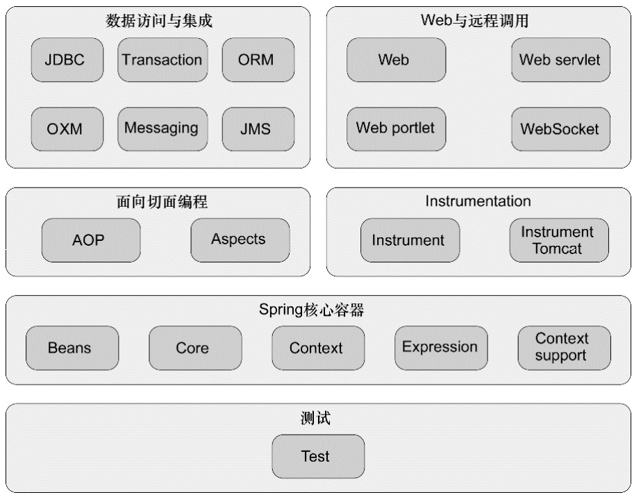

# Spring系列(一) Spring的核心

## Spring 简介

> Spring 是一个开源轻量级企业应用架构，目的是为了简化企业级应用开发。（1）Spring 框架可以帮我们管理对象的生命周期，帮助我们管理对象间的依赖关系，相互协作；（2）Spring 框架提供了一种能力，帮助抽离日志，异常处理，性能统计，安全性以及数据库事务管理等，这些均可以与业务模块分离， 这些得益于Spring面向切面的特性。

### Spring 特点

1. 轻量： api简单,很少配置
2. Bean: 专注于写业务的简单java类
3. 松耦合: AOP,容器,DI等
4. 万能胶: 方便与其他框架整合
5. 设计模式: 经典设计模式

## Spring 核心特性

1. DI
2. AOP

## Spring 初衷和使命

**简化开发** (这点很重要)

1. 面向Bean 基于POJO的轻量级和最小侵入性编程;

        专注于业务代码编写,所有业务类定义均为普通java类(POJO).

2. DI及面向接口实现松耦合;

        依赖注入: 和容器结合,由容器管理对象的创建和生命周期;DI只描述对象的创建方式,不负责创建.
        org.srpingframework.beans包是设计的核心(架构核心是org.springframework.core),BeanFacotry接口是工厂设计模式的实现,支持多种方式创建和检索对象,也可以管理对象间关系.
        BeanFactory支持两种对象模型:
                1. 单例: Singleton
                2. 原型: 每次检索创建单独的对象
        Bean 工厂的概念是Spring作为IOC容器的基础.IOC将处理对象的职责从应用程序代码转移到框架.

3. 基于切面和惯例进行声明式编程;

        AOP是一种编程思想;
        模块化关注点的行为;
        AOP是IOC的补充性技术;
        实现了松耦合;
        AOP核心构造是切面,是规则的定义;

4. 通过切面和模板减少模板化代码

        Tempate method 设计模式的使用, 比如JdbcTemplate类, 简化了数据库操作的重复代码(创建连接,准备语句,清理,关闭连接,异常捕获等), 让程序员只关注要执行的语句.

## 容器

容器通过DI管理Spring应用的对象. 管理对象的创建,依赖关系,配置和组装. Spring中的容器有多种, 大致可以分为BeanFactory工厂类和ApplicationContext应用上下文两大类. BeanFactory 提供了基本的DI支持, ApplicationContext基于BeanFactory构建, 提供应用框架级别的服务.

### Bean的生命周期

1. bean实例化
2. bean注入属性
3. 调用BeanNameAware.setBeanName()
4. 调用BeanFactoryAware.setBeanFactory()方法
5. 调用ApplicatioonContextAware.setApplicationContext()方法
6. 调用BeanPostProcessor.postProcessBeforeInitializaion()方法
7. 调用InitializingBean.afterPropertiesSet()方法,如果使用init-method声明了初始化方法,则也会调用初始化方法
8. 调用BeanPostProcessor.postProcessAfterInitialization()方法
9. bean就绪,存在上下文中
10. 调用DisposableBean.destroy()方法, 如果destroy-method方法被声明, 也同时调用

## AOP

### AOP 使用场景

1. Authentication 权限认证
2. Logging 日志
3. Transaction 事务
4. Lazy Loading 懒加载
5. Context Process 上下文处理
6. Error Handler 错误跟踪 
7. Cache 缓存

## 体系结构

 取自<Spring in Action>

1. 核心容器: Spring最核心的部分, 除了提供应用程序上下文,还提供了许多企业服务(邮件,JNDI,EJB集成);
2. AOP;
3. 数据访问和集成: jdbc(模板方法),orm,transaction,jms(java message service),oxm(Object-to-XML-Mapping); 
4. Web与远程调用: MVC
5. Instrument : 为tomcat提供织入代理功能, 用的比较少
6. Test
