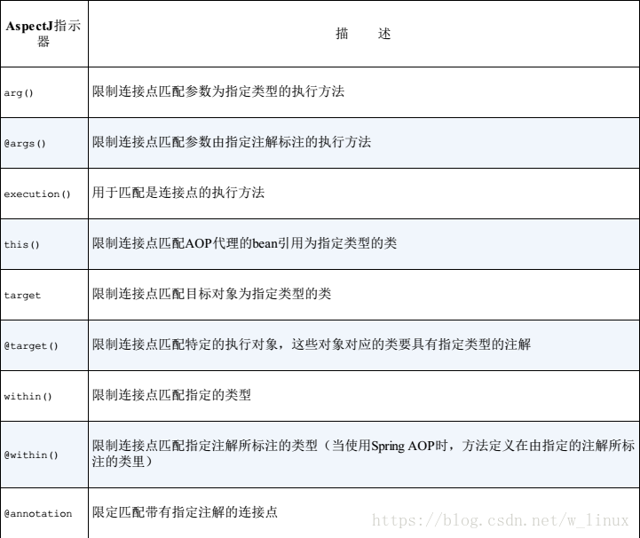

# Spring系列(四) 面向切面的Spring

除了IOC外, AOP是Spring的另一个核心. Spring利用AOP解决应用横切关注点(cross-cutting concern)与业务逻辑的分离, 目的是解耦合. 横切关注点是指散布于代码多处的同一种功能, 比如日志, 事务, 安全, 缓存等.

## AOP编程的基本概念

在OOP中, 如果要复用同一功能, 一般的做法是使用继承或委托. 继承容易导致脆弱的对象体系, 而委托实现起来比较麻烦, 需要对委托对象进行复杂调用. AOP提供了另外一种思路, 使用AOP我们仍然可以在一个地方定义功能, 并通过声明的方式告知何处以哪种方式使用这个功能. 这样我们既可以对功能做统一管理和维护, 同时也简化了业务逻辑模块, 使其更关注自身的业务逻辑. 此外, AOP还可以将新的功能行为添加到现有对象. 

### Spring中AOP的术语

* 切面(Aspect): 切面定义了横切关注点的功能以及使用该功能的声明. 它包含了另外两个术语, 通知(Advice, 功能逻辑代码)和切点(Pointcut,声明). 切面定义了它是什么(what), 以及在何时何处(when,where)完成其功能.
* 通知(Advice): 通知定义了切面的具体功能, 以及何时使用. 

when,何时使用? 前置(Before), 后置(After), 返回(After-returning), 异常(After-throwing), 环绕(Around)

* 切点(Pointcut): 定义了切面定义的功能在哪里(Where)发生作用, 看起来就像从某个点把切面插入进去一样. 切点应该属于连接点中的一个或多个.
* 连接点(Join point): 定义了程序执行过程中可以应用切面的具体时机, 比如方法调用前, 调用后, 结果返回时, 异常抛出时等, 通常某个具体切面只会选择其中一个或几个连接点作为切点.
* 引入(Introduction): 为现有的类添加新的方法或属性叫引入. 
* 织入(Weaving): 织入是把切面应用到目标对象并创建新代理对象的过程. 

织入的方式有三种: 

1. 编译期: 需要特殊的编译器支持, 如AspectJ的织入编译器
2. 类加载期: 需要特殊的类加载器ClassLoader
3. 运行时: Spring AOP 使用该方式织入. AOP容器为对象动态创建一个代理对象.

### Spring 对 AOP的支持

Spring对AOP的支持很多借鉴了AspectJ的方式. 

Spring支持四种方式的织入:

1. 基于代理的经典AOP; (方式太老旧, 不建议使用)
2. 纯POJO切面;(需要XML配置)
3. @AspectJ 注解驱动的切面; (没啥说的,很好用)
4. 注入式AspectJ切面;

* 前三种都是基于动态代理实现, 因此Spring对AOP的支持局限于方法拦截. 如果前三种满足不了需求(比如拦截构造器方法或者字段修改), 可以使用第四种. 
* 与AspectJ不同, Spring的切面就是Java类, Spring使用运行时动态代理, 而AspectJ需要学习特殊的语法以支持特殊的编译器织入.

## 通过切点来选择连接点

Spring 借鉴了AspectJ的切点表达式语言. 如前所述, Spring基于动态代理,只能在方法上拦截, 所以Spring只支持这个层面的表达式来定义.

spring支持的AspectJ指示器如下, 其中execution来执行匹配, 其他均为限制匹配的. 



切点表达式更多使用可以参考[官方文档](https://docs.spring.io/spring/docs/current/spring-framework-reference/core.html#aop-pointcuts)

* spring新增了个bean()指示器

## 使用注解创建切面

一. 定义切面类, 并用 `@Aspect`注解, 该注释用来标记这个类是个切面

二. 定义切面的方法(what), 并使用注解标记方法(when), 可用的注解:  `@Before`,`@After`,`@AfterReturning`,`@AfterThrowing`,`@Around`(功能最强大,后面将单独使用这种通知)

一,二步完成后的代码: 

```Java
@Aspect
public class Audience{

    @Before("execution(** com.xlx.Performance.perform(...))")
    public void silencephone(){
        System.out.println("silencephone");
    }

    @Before("execution(** com.xlx.Performance.perform(...))")
    public void takeSeats(){
        System.out.println("takeSeats");
    }

    @AfterReturning("execution(** com.xlx.Performance.perform(...))")
    public void applause(){
        System.out.println("applause");
    }

    @AfterThrowing("execution(** com.xlx.Performance.perform(...))")
    public void refund(){
        System.out.println("refund");
    }
}
```

上面的代码中切面表达式被重复定义了四次, 无论如何这已经是重复代码了, 下一步优化一下. 

三. 使用注解`@Pointcut`定义切点

``` java
@Aspect
public class Audience{

    //定义切点并修改其他方法重用该切点
    @Pointcut("execution(** com.xlx.Performance.perform(...))")
    public void performance(){

    }

    @Before("performance()")
    public void silencephone(){
        System.out.println("silencephone");
    }

    @Before("performance()")
    public void takeSeats(){
        System.out.println("takeSeats");
    }

    @AfterReturning("performance()")
    public void applause(){
        System.out.println("applause");
    }

    @AfterThrowing("performance()")
    public void refund(){
        System.out.println("refund");
    }
}
```

`@Aspect`注解的类依然是个普通java类, 它可以被装配为bean

```Java
@Bean
public Audience getAudience(){
    return new Audience();
}
```

四. 使用`@EnableAspectJAutoProxy`注解启用自动代理功能, 如果是XML Config ,对应的节点是`<aop:aspectj-autoproxy />`

``` java
@Configuration
@ComponentScan // 包扫描
@EnableAspenctJAutoProxy // 启动自动代理
public class MyConfig{

    // 如果Audience上加了@Component就不需要这个代码了
    @Bean
    public Audience getAudience(){
        return new Audience();
    }
}
```

五. 使用环绕通知`@Around`, 环绕通知同时兼具了`@Before`,`@After` ... 等注解的方法的功能, 下面代码演示了这种能力. 如可以使用它记录方法执行时长.

``` Java
@Aspect
public class Audience{

    //定义切点并修改其他方法重用该切点
    @Pointcut("execution(** com.xlx.Performance.perform(...))")
    public void performance(){

    }

    @Around("performance()")
    public void silencephone(ProcdedingJoinPoint jp){
        System.out.println("silencephone");
        System.out.println("takeSeats");
        try{
            // 如果不是刻意为之, 一定要记得调用jp.proceed();否则实际的方法Performance.perform()将会阻塞
            jp.proceed();
            System.out.println("applause");
        }catch(Exception e){
            System.out.println("refund");
        }
    }
}
```

六. 参数传递 , 在切点表达式中使用`args(paramName)`结合切点方法可以为切面方法传递参数

``` Java
@Aspect
public class Audience{

    //定义切点并修改其他方法重用该切点
    @Pointcut("execution(** com.xlx.Performance.perform(int) && args(actornum)))")
    public void performance(int actornum){

    }

    @Before("performance(actornum)")
    public void countActor(int actornum){
        System.out.println("countActor"+actornum);
    }
}
```

## 通过注解引用新功能

除了拦截对象已有的方法调用, 还可以使用AOP来为对象添加新的属性和行为(引入). 其实现就是通过动态代理生成代理类来实现. 

一. 定义要添加的功能接口

```Java
public interface Encoreable{}
```

二. 定义切面(引入) `@Aspect`注解切面类. `@DeclareParents`注解功能接口静态变量

```java
@Aspect
public class EncoreableIntroducer{
    // 可以解释为: 为Performace的所有子类引入接口Encoreable, 并使用默认实现类DefaultEncoreableImpl
    @DeclareParents(value="xlx.Performace+",defaultImpl=DefaultEncoreableImpl.class)
    public static Encoreable encoreable;
}
```

## 基于XML配置的切面

如果没有办法为类添加注解, 比如没有源代码, 那就不得不使用xml来配置了. 

* 示例1

```xml
<aop:config>
    <aop:aspect ref="aspectBean">
        <aop:pointcut id="pcId" expression="execution(** com.xlx.Performance.perform(int) and args(actornum)))" />
        <aop:before pointcut-ref="pcId" method="count" />
    </aop:aspect>
</aop:config>
```

* 示例2

``` xml
<aop:config>
    <aop:aspect>
        <aop:declare-parents type-matching="xlx.Performace+" implement-interface="xlx.Encoreable" delegate-ref="defaultImpl" />
    </aop:aspect>
</aop:config>
```

## AspectJ 注入

使用AspectJ注入的方式可以解决使用动态代理无法解决的问题(应该比较少见,大多应用使用Spring AOP就可以实现了), 但需要使用AspectJ的特殊语法. 定义好的类需要用xml配置为bean, 使用`factory-method="aspectOf"`属性来制定bean的产生方式. 

```xml
<bean factory-method="aspectOf" class="...ClassName">
    <property name="other" ref="otherref"/>
</bean>
```