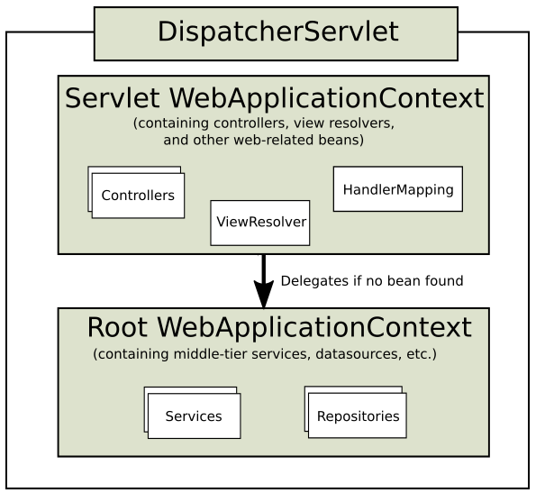
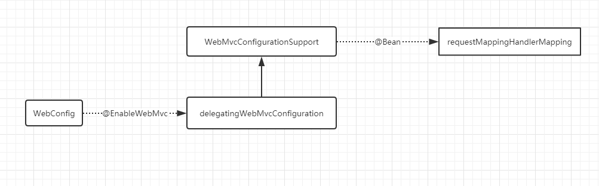

# Spring系列(六) Spring Web MVC 应用构建分析

## DispatcherServlet

`DispatcherServlet` 是 Spring MVC 的前端控制器名称, 用户的请求到达这里进行集中处理, 在Spring MVC中, 它的作用是为不同请求匹配对应的处理器, 将结果传递给视图解析器最终呈现给客户端. 

> 前端控制器模式（Front Controller Pattern）是用来提供一个集中的请求处理机制，所有的请求都将由一个单一的处理程序处理。该处理程序可以做认证/授权/记录日志，或者跟踪请求，然后把请求传给相应的处理程序。

### Servlet WebApplicationContext 和 Root WebApplicationContext

Spring MVC 存在两个应用上下文, 分别为 Servlet WebApplicationContext 和 Root WebApplicationContext . 他们分别初始化不同类型的bean.

下图来自Spring官方文档



在 `DispatcherServlet` 启动的时候, 它会创建 Spring 上下文Servlet WebApplicationContext, 其中包含 Web 相关的 Controller,ViewResolver,HandlerMapping 等. 

另外一个上下文 Root WebApplicationContext 是由 `ContextLoaderListener` 创建的, 包含除了 Web 组件外的其他 bean, 比如包含业务逻辑的 Service , 还有数据库相关的组件等.

### 代码(JavaConfig方式的配置代码)

下面是用 JavaConfig 方式实现的配置代码, 我们先搭建好一个 Spring MVC 项目,然后结合源码分析Spring如何注册 `DispatcherServlet` 实例的. 

``` java
// 继承AbstractAnnotationConfigDispatcherServletInitializer并重写其中的三个方法
public class MvcWebAppInitializer extends AbstractAnnotationConfigDispatcherServletInitializer {
    // 指定Root上下文的配置类
    @Override
    protected Class<?>[] getRootConfigClasses() {
        return new Class[]{ RootConfig.class };
    }

    // 指定Web上下文的配置类
    @Override
    protected Class<?>[] getServletConfigClasses() {
        return new Class[]{ WebConfig.class };
    }

    // url映射
    @Override
    protected String[] getServletMappings() {
        return new String[]{"/"};
    }
}
```

通过重写 `AbstractAnnotationConfigDispatcherServletInitializer` 的三个方法完成配置, `WebConfig` 用来配置Web组件, `RootConfig` 用来配置非 Web 组件. 

``` java
@EnableWebMvc // 启用MVC
@ComponentScan(basePackages = {"com.xlx.mvc.web"}) // 启用组件扫描,只扫描web相关的组件
@Configuration
public class WebConfig implements WebMvcConfigurer {

    // 视图解析器,jsp
    @Bean
    public ViewResolver viewResolver(){
        InternalResourceViewResolver resolver = new InternalResourceViewResolver();
        resolver.setPrefix("/WEB-INF/views/");
        resolver.setSuffix(".jsp");
        resolver.setExposeContextBeansAsAttributes(true);
        return  resolver;
    }

    // 重写以启用默认的处理器, 用来处理静态资源
    @Override
    public void configureDefaultServletHandling(DefaultServletHandlerConfigurer configurer){
        configurer.enable();
    }

}

@Configuration
@ComponentScan(basePackages = {"com.xlx.mvc"},  excludeFilters = {
        @ComponentScan.Filter(type = FilterType.ANNOTATION,classes = EnableWebMvc.class)
}) // 扫描包, 但排除EnableWebMvc注解的类
public class RootConfig {

}
```

### 源码分析

Servlet 3.0 旨在支持基于代码的方式配置 Servlet 容器, 当3.0兼容的 servlet 容器启动的时候会在 ClassPath 查找并调用实现了接口 `ServletContainerInitializer` 的类的 `onStartup()` 方法,  Spring 中提供了这个接口的一个实现类 `SpringServletContainerInitializer` . 其启动方法的代码如下:

```java
@Override
public void onStartup(@Nullable Set<Class<?>> webAppInitializerClasses, ServletContext servletContext)
        throws ServletException {

    List<WebApplicationInitializer> initializers = new LinkedList<>();
    // 应用中 WebApplicationInitializer 的 bean 生成到一个列表中.
    if (webAppInitializerClasses != null) {
        for (Class<?> waiClass : webAppInitializerClasses) {
            if (!waiClass.isInterface() && !Modifier.isAbstract(waiClass.getModifiers()) &&
                    WebApplicationInitializer.class.isAssignableFrom(waiClass)) {
                try {
                    initializers.add((WebApplicationInitializer)
                            ReflectionUtils.accessibleConstructor(waiClass).newInstance());
                }
                catch (Throwable ex) {
                    throw new ServletException("Failed to instantiate WebApplicationInitializer class", ex);
                }
            }
        }
    }

    if (initializers.isEmpty()) {
        servletContext.log("No Spring WebApplicationInitializer types detected on classpath");
        return;
    }

    servletContext.log(initializers.size() + " Spring WebApplicationInitializers detected on classpath");
    AnnotationAwareOrderComparator.sort(initializers);

    // 遍历所有WebApplicationInitializer, 并调用其onStartup方法
    for (WebApplicationInitializer initializer : initializers) {
        initializer.onStartup(servletContext);
    }
}
```

在上面方法的最后, 可以看到其将控制权交给 `WebApplicationInitializer` 的实例并遍历调用了 `onStartup()` 方法, 而我们定义的类 `MvcWebAppInitializer` 就是它的子类. 完整的继承关系为

`WebApplicationInitializer` <--
 `AbstractContextLoaderInitializer` <-- 
 `AbstractDispatcherServletInitializer` <-- 
 `AbstractAnnotationConfigDispatcherServletInitializer` <-- 
 `MvcWebAppInitializer`

在类 `AbstractDispatcherServletInitializer` 中实现了 `onStartup()` 方法, 最终调用 `registerDispatcherServlet()` 方法完成注册, 两个方法的代码如下:

```java
@Override
public void onStartup(ServletContext servletContext) throws ServletException {
    super.onStartup(servletContext);
    registerDispatcherServlet(servletContext);
}

protected void registerDispatcherServlet(ServletContext servletContext) {
    // 获取Sevlet名称, 这个方法返回了默认值"dispatcher"
    String servletName = getServletName();
    Assert.hasLength(servletName, "getServletName() must not return null or empty");

    // 此处调用的方法是抽象方法, 由子类 AbstractAnnotationConfigDispatcherServletInitializer 实现, 其最终调用了自定义类的 getServletConfigClasses() 方法获取配置信息(源码附在本段后面). 用来生成Servlet上下文.
    WebApplicationContext servletAppContext = createServletApplicationContext();
    Assert.notNull(servletAppContext, "createServletApplicationContext() must not return null");

    // 生成dispatcherServlet实例
    FrameworkServlet dispatcherServlet = createDispatcherServlet(servletAppContext);
    Assert.notNull(dispatcherServlet, "createDispatcherServlet(WebApplicationContext) must not return null");
    dispatcherServlet.setContextInitializers(getServletApplicationContextInitializers());

    // 注册DispatcherServlet
    ServletRegistration.Dynamic registration = servletContext.addServlet(servletName, dispatcherServlet);
    if (registration == null) {
        throw new IllegalStateException("Failed to register servlet with name '" + servletName + "'. " +
                "Check if there is another servlet registered under the same name.");
    }

    registration.setLoadOnStartup(1);
    registration.addMapping(getServletMappings());
    registration.setAsyncSupported(isAsyncSupported());

    Filter[] filters = getServletFilters();
    if (!ObjectUtils.isEmpty(filters)) {
        for (Filter filter : filters) {
            registerServletFilter(servletContext, filter);
        }
    }

    customizeRegistration(registration);
}
```

下面附读取Servlet配置类的代码: 类 `AbstractAnnotationConfigDispatcherServletInitializer` 实现了 `createServletApplicationContext()` , 可以看到代码中调用了方法 `getServletConfigClasses()` , 这是个抽象方法, 声明为 `protected abstract Class<?>[] getServletConfigClasses();` . 最终的实现正是在我们自定义的子类`MvcWebAppInitializer`中.

```java
@Override
protected WebApplicationContext createServletApplicationContext() {
    AnnotationConfigWebApplicationContext context = new AnnotationConfigWebApplicationContext();
    // 读取配置类
    Class<?>[] configClasses = getServletConfigClasses();
    if (!ObjectUtils.isEmpty(configClasses)) {
        context.register(configClasses);
    }
    return context;
}
```

上面完成了DispatcherServlet的注册和启动, 接下来可以定义Controller了.

## 请求映射

在此之前需要了解下关于 URL 映射的 Servlet 规范, 注意这是 Servlet 的规范, 当然也适用于 DispatcherServlet , 代码中我们为 DispatcherServlet 映射为"/", 规范中"/"为使用 "default"Servlet, 也就意味着所有的请求默认通过 DispatcherServlet 处理. 

为了处理静态资源, 在 `WebConfig` 中覆盖了方法 `configureDefaultServletHandling()` 已启用静态资源处理器 `DefaultServletHttpRequestHandler` , 它的优先级是最低, 这意味着在匹配不到其他 handler 的时候,servlet 会将请求交给这个 handler 处理.

规则按顺序执行,匹配到就直接返回.

1. 精确匹配, url完全与模式匹配
2. 最长路径匹配, 查找模式中路径最长的匹配项, 例如/user/list/1匹配模式/user/list/*, 而不是/user/*
3. 扩展名匹配
4. 默认Servlet

### 代码

``` java
@Controller
@RequestMapping(value = "/home")
public class HomeController {
    @RequestMapping(value = "/default",method = RequestMethod.GET)
    public String home(){
        return "home";
    }
}
```

### 源码分析

我们的 Controller 以注解( `@RequestMapping` , `@GetMapping` 等)方式定义,  `RequestMappingHandlerMapping` 用来生成请求 url 与处理方法的映射关系(mapping),这个 mapping 最终是由 DispatcherServlet 调用找到匹配到 url 对应的 controller 方法并调用. 

通过查看 Spring 的 bean 依赖关系图(找到类 `WebConfig` , `Ctrl`+`Alt`+`U`并选spring beans dependency)可以找到 `RequestMappingHandlerMapping` 生成的线索. 

简化的关系图如下:



可以看到 `WebmvcConfigurationSupport` 中有个 `@Bean` 注解的方法生成 `RequestMappingHandlerMapping` 的实例, 而 `WebmvcConfigurationSupport` 继承了 `DelegatingWebMvcConfiguration` , 后者是由 `@EnableWebMvc` 注解导入.

```java
/**
    * 
    * 返回排序为0的RequestMappingHandlerMapping实例bean, 用来处理注解方式的Controller请求.
    */
@Bean
public RequestMappingHandlerMapping requestMappingHandlerMapping() {
    RequestMappingHandlerMapping mapping = createRequestMappingHandlerMapping();
    // 顺序为0, 顺便提一句, 静态资源的处理器Handler的顺序为Integer.Max
    mapping.setOrder(0);
    mapping.setInterceptors(getInterceptors());
    mapping.setContentNegotiationManager(mvcContentNegotiationManager());
    mapping.setCorsConfigurations(getCorsConfigurations());

    PathMatchConfigurer configurer = getPathMatchConfigurer();

    Boolean useSuffixPatternMatch = configurer.isUseSuffixPatternMatch();
    if (useSuffixPatternMatch != null) {
        mapping.setUseSuffixPatternMatch(useSuffixPatternMatch);
    }
    Boolean useRegisteredSuffixPatternMatch = configurer.isUseRegisteredSuffixPatternMatch();
    if (useRegisteredSuffixPatternMatch != null) {
        mapping.setUseRegisteredSuffixPatternMatch(useRegisteredSuffixPatternMatch);
    }
    Boolean useTrailingSlashMatch = configurer.isUseTrailingSlashMatch();
    if (useTrailingSlashMatch != null) {
        mapping.setUseTrailingSlashMatch(useTrailingSlashMatch);
    }

    UrlPathHelper pathHelper = configurer.getUrlPathHelper();
    if (pathHelper != null) {
        mapping.setUrlPathHelper(pathHelper);
    }
    PathMatcher pathMatcher = configurer.getPathMatcher();
    if (pathMatcher != null) {
        mapping.setPathMatcher(pathMatcher);
    }
    Map<String, Predicate<Class<?>>> pathPrefixes = configurer.getPathPrefixes();
    if (pathPrefixes != null) {
        mapping.setPathPrefixes(pathPrefixes);
    }

    return mapping;
}
```

好了, 现在有了 DispatcherServlet,  并且有了可以处理映射关系的 RequestMappingHandlerMapping , 接下来再看下当请求到达时, DispatcherServlet 如何为 Url 找到对应的 Handler 方法.

`DispatcherServlet` 中定义了处理请求的 `doService()` 方法, 最终这个方法委托 `doDispatch()` 处理请求, 特别注意中文注释的几个语句, 除此之外, 这个方法还提供了生命周期的一些处理工作.

``` java
protected void doDispatch(HttpServletRequest request, HttpServletResponse response) throws Exception {
    HttpServletRequest processedRequest = request;
    HandlerExecutionChain mappedHandler = null;
    boolean multipartRequestParsed = false;

    WebAsyncManager asyncManager = WebAsyncUtils.getAsyncManager(request);

    try {
        ModelAndView mv = null;
        Exception dispatchException = null;

        try {
            processedRequest = checkMultipart(request);
            multipartRequestParsed = (processedRequest != request);

            // 获取当前请求对应的handler
            mappedHandler = getHandler(processedRequest);
            if (mappedHandler == null) {
                noHandlerFound(processedRequest, response);
                return;
            }

            // 获取当前请求对应handler的适配器
            HandlerAdapter ha = getHandlerAdapter(mappedHandler.getHandler());

            // Process last-modified header, if supported by the handler.
            String method = request.getMethod();
            boolean isGet = "GET".equals(method);
            if (isGet || "HEAD".equals(method)) {
                long lastModified = ha.getLastModified(request, mappedHandler.getHandler());
                if (new ServletWebRequest(request, response).checkNotModified(lastModified) && isGet) {
                    return;
                }
            }

            if (!mappedHandler.applyPreHandle(processedRequest, response)) {
                return;
            }

            // 最终调用Handler的方法
            mv = ha.handle(processedRequest, response, mappedHandler.getHandler());

            if (asyncManager.isConcurrentHandlingStarted()) {
                return;
            }

            applyDefaultViewName(processedRequest, mv);
            mappedHandler.applyPostHandle(processedRequest, response, mv);
        }
        catch (Exception ex) {
            dispatchException = ex;
        }
        catch (Throwable err) {
            // As of 4.3, we're processing Errors thrown from handler methods as well,
            // making them available for @ExceptionHandler methods and other scenarios.
            dispatchException = new NestedServletException("Handler dispatch failed", err);
        }
        processDispatchResult(processedRequest, response, mappedHandler, mv, dispatchException);
    }
    catch (Exception ex) {
        triggerAfterCompletion(processedRequest, response, mappedHandler, ex);
    }
    catch (Throwable err) {
        triggerAfterCompletion(processedRequest, response, mappedHandler,
                new NestedServletException("Handler processing failed", err));
    }
    finally {
        if (asyncManager.isConcurrentHandlingStarted()) {
            // Instead of postHandle and afterCompletion
            if (mappedHandler != null) {
                mappedHandler.applyAfterConcurrentHandlingStarted(processedRequest, response);
            }
        }
        else {
            // Clean up any resources used by a multipart request.
            if (multipartRequestParsed) {
                cleanupMultipart(processedRequest);
            }
        }
    }
}
```

上面代码中, 重点关注 `getHandler` 方法.

```java
protected HandlerExecutionChain getHandler(HttpServletRequest request) throws Exception {
    if (this.handlerMappings != null) {
        for (HandlerMapping mapping : this.handlerMappings) {
            HandlerExecutionChain handler = mapping.getHandler(request);
            if (handler != null) {
                return handler;
            }
        }
    }
    return null;
}
```

可以看到请求所需的handler是取自实例变量 `this.handlerMappings` ,接下来顺藤摸瓜, 看这个变量是何时初始化的.通过引用, 我们查找到了下面方法.

```java
private void initHandlerMappings(ApplicationContext context) {
    this.handlerMappings = null;

    if (this.detectAllHandlerMappings) {
        // 找到上下文中的所有HandlerMapping, 包括祖先上下文
        Map<String, HandlerMapping> matchingBeans =
                BeanFactoryUtils.beansOfTypeIncludingAncestors(context, HandlerMapping.class, true, false);
        if (!matchingBeans.isEmpty()) {
            this.handlerMappings = new ArrayList<>(matchingBeans.values());
            // HandlerMapping排序
            AnnotationAwareOrderComparator.sort(this.handlerMappings);
        }
    }
    else {
        try {
            HandlerMapping hm = context.getBean(HANDLER_MAPPING_BEAN_NAME, HandlerMapping.class);
            this.handlerMappings = Collections.singletonList(hm);
        }
        catch (NoSuchBeanDefinitionException ex) {
            // Ignore, we'll add a default HandlerMapping later.  
            // 这个注释...
        }
    }

    // 保证至少要有一个HandlerMapping.
    if (this.handlerMappings == null) {
        this.handlerMappings = getDefaultStrategies(context, HandlerMapping.class);
        if (logger.isTraceEnabled()) {
            logger.trace("No HandlerMappings declared for servlet '" + getServletName() +
                    "': using default strategies from DispatcherServlet.properties");
        }
    }
}
```

**整理下调用关系**: `DispatcherServlet` initHandlerMappings <-- initStrategies <-- onRefresh <--
               `FrameworkServlet`  initWebApplicationContext <-- initServletBean <--
               `HttpServletBean`   init <--
               `GenericServlet`    init(ServletConfig config)
最后的 `GenericServlet` 是servlet Api的.

## Spring Boot 中的 DispatcherServlet

Spring Boot 微服务中的 DispatcherServlet 装配, 因为其一般使用内置的 Servlet 容器, 是通过 `DispatcherServletAutoConfiguration` 来完成的. 下面是生成 DispatcherServlet bean 的代码, 这个 bean 在内部静态类 `DispatcherServletConfiguration` 中.

``` java
@Bean(name = DEFAULT_DISPATCHER_SERVLET_BEAN_NAME)
public DispatcherServlet dispatcherServlet() {
    DispatcherServlet dispatcherServlet = new DispatcherServlet();
    dispatcherServlet.setDispatchOptionsRequest(
            this.webMvcProperties.isDispatchOptionsRequest());
    dispatcherServlet.setDispatchTraceRequest(
            this.webMvcProperties.isDispatchTraceRequest());
    dispatcherServlet.setThrowExceptionIfNoHandlerFound(
            this.webMvcProperties.isThrowExceptionIfNoHandlerFound());
    return dispatcherServlet;
}
```

上面我们通过注解方式构建了一个 MVC 应用程序, 并且通过源码分析其构建原理, 其中 Spring 使用的前端控制器实现类是 `DispatcherServlet` , 其在 Servlet 容器启动的时候实例化, 并初始化容器中的 Handler 处理器. 当请求到达 `DispatcherServlet` 时会调用其 `doDispatcher()` 方法选择最合适的处理器. 最后我们扫了一眼 Spring Boot 的自动装配 `DispatcherServlet` 方式.
