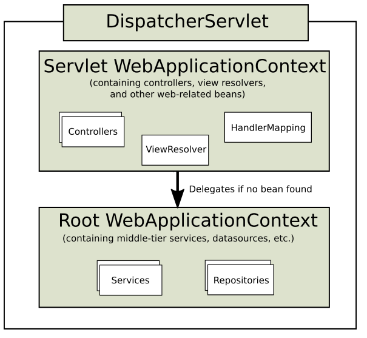

# Spring Boot系列(一) Spring Boot准备知识

本文是学习 Spring Boot 的一些准备知识. 

## Spring Web MVC

### Spring Web MVC 的两个Context

如下图所示, 基于 Servlet 的 Spring Web MVC 启动时会创建两个上下文, 即 `Servlet WebApplicationContext` 和 `Root WebApplicationContext`. 

前者是 `DispatcherServlet`引导创建的, 后者由 `ServletContextListener` 创建, 包含服务,数据库操作等非 Web 相关的组件. 



### DispatcherServlet

`DispatcherServlet` 是前端控制器, Spring MVC 遵循前端控制器模式(具体参看<Java EE 核心模式>一书). 前端控制器是 MVC 模式中 C 的一部分, 除此之外, C 还包括我们定义的 `Controller` 等应用控制器类. 

### HandlerMapping

* 传统 Servlet 的请求 url 模式

Servlet规范中描述了 Servlet 和 Filter 的 URL 匹配模式. 如下;

1. 精确匹配, 如 `/index`
2. 扩展名匹配, 如 `*.jsp`
3. 路径匹配, 如 `/hive/`

优先级按精确匹配 > 最长路径匹配 > 扩展名匹配.

* Spring MVC 中的 `HandlerMapping`

1. `DispatcherServlet`

Spring boot 中使用自动装配来实例化和启动 `DispatcherServlet`. 类名为 `DispatcherServletAutoConfiguration`, 路径默认为 "" 或 "/" . 可以修改配置, 对应的配置类为 `WebMvcProperties` , 对应的配置为 `spring.mvc.servlet.path=/`

从中可以看到 Spring 配置的一般规律, 其他的配置项也可以从配置类中找到依据. 

```java
@AutoConfigureOrder(Ordered.HIGHEST_PRECEDENCE)
@Configuration
@ConditionalOnWebApplication(type = Type.SERVLET)
@ConditionalOnClass(DispatcherServlet.class)
@AutoConfigureAfter(ServletWebServerFactoryAutoConfiguration.class)
public class DispatcherServletAutoConfiguration {
    ...
    @Configuration
	@Conditional(DefaultDispatcherServletCondition.class)
	@ConditionalOnClass(ServletRegistration.class)
	@EnableConfigurationProperties({ HttpProperties.class, WebMvcProperties.class })
	protected static class DispatcherServletConfiguration {
    }
}
```

```java
@ConfigurationProperties(prefix = "spring.mvc")
public class WebMvcProperties {
    ...
    private final Servlet servlet = new Servlet();
    ...
}
```

```java
public static class Servlet {

		/**
		 * Path of the dispatcher servlet.
		 */
		private String path = "/";
}
```

2. `HandlerMapping`

用来找到 URL 匹配的 Handler 方法, 这些方法正是我们定义的 Controller 中的方法. 这些方法被 `@RequestMapping` 标记. 这个注解还有一些变体(CRUD): `GetMapping` , `PostMapping`, `PutMapping`, `DeleteMapping`等. 

> 可以使用实现接口 `HandlerInterceptor` 拦截器来验证 handler 的本质. 其中一个方法的签名是 `boolean preHandle(HttpServletRequest request, HttpServletResponse response, Object handler)`. 注意 `handler` 定义的类型是 `Object`, 说明handler的类型可能不止是 `HandlerMethod` . 

## 异常处理

参看[Spring系列(七) Spring MVC 异常处理](https://www.cnblogs.com/walkinhalo/p/9744656.html)

### Servlet 规范

规范中定义了异常处理相关的返回信息应该包含什么内容. 如: `javax.servlet.error.stauts_code` 定义了错误码; `javax.servlet.error.message` 定义了错误信息; `javax.servlet.error.exception` 定义了异常. 

### Servlet 实现

`web.xml` 的配置如下: 

```xml
<servlet>
    <servlet-name>PageNotFoundServlet</servlet-name>
    <servlet-class>com.xlx.servlet.PageNotFoundServlet</servlet-class>
</servlet>

<servlet-mapping>
    <servlet-name>PageNotFoundServlet</servlet-name>
    <url-pattern>/404.html</url-pattern>
</servlet-mapping>

<error-page>
    <error-code>404</error-code>
    <location>/404.html</location>
</error-page>
```

`PageNotFoundServlet` 实现:

```java
public class PageNotFoundServlet extends HttpServlet{

    public void doGet(HttpServletRequest request,HttpServletResponse response) throws ServletException,Exception{

        // 此处验证request中设置的错误码.
        request.getAttribute("javax.servlet.error.stauts_code");

        response.setCharacterEncoding("UTF-8");
        response.setContentType("text/html;charset=UTF-8");
        PrintWriter writer = response.getWriter();
        writer.println("page not found...");
    }
}
```

### MVC 实现

通过 `RestControllerAdvicer`.

```java
@RestConstrollerAdvice
public class RestControllerAdvicer{

    @ExceptionHandler(NohandlerFoundException.class)
    public Object pageNotFound(HttpStatus status,HttpServletRequest request,Throwable throwable){
        Map<String,Object> errors = new HashMap<>();
        errors.put("stauts_code",request.getAttribute("javax.servlet.error.stauts_code"));
         errors.put("stauts_uri",request.getAttribute("javax.servlet.error.request_uri"));

         return error;
    }
}
```

### Spring Boot 实现

通过实现 `ErrorPageRegistrar` 注册错误页面. 

```java
public class Application implements ErrorPageRegistrar{

    @Override
    public void registerErrorPages(ErrorPageRegistry registry){
        registry.addErrorPages(new ErrorPage(HttpStatus.NOT_FOUND,"404.html"));
    }
}

....

@GetMapping("/404.html")
public Object handle404(){
    // 实现错误处理
}
```

更多参看相关的那篇文章. 

## 视图

### View

接口 `View` 定义了一个 `void render(@Nullable Map<String, ?> var1, HttpServletRequest var2, HttpServletResponse var3) throws Exception;` 方法, 用来渲染视图. 

### ViewReslover

接口 `ViewReslover` 定义解析视图名称的方法 `@Nullable View resolveViewName(String var1, Locale var2) throws Exception;` 用来寻找对应的view对象名称. 

view 名称: prefix + viewname + suffix

前缀 prefix 和 后缀 suffix 同样可以配置

`spring.mvc.view.suffix=.jsp`

### Thymeleaf

`ThymeleafAutoConfiguration` 同样可以找到对应的配置类 `ThymeleafProperties`.

* `ContentNegotiationViewResolver` 内容协调处理器, 处理多个 viewResolver 的情况. 

## 国际化(i18n)

* 理解 `MessageSource` 抽象, 可参看官方Spring文档的 `MessageSource` 部分. 


