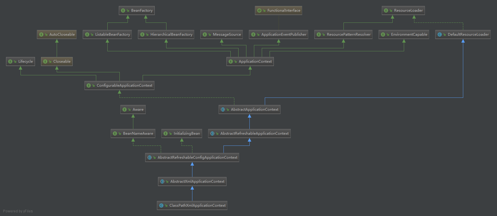

# Spring 源码系列(一) BeanFactory

## IoC/DI 的概念

容器是Spring的核心之一(另一个核心是AOP). 有了容器, IOC才可能实现. 

* 什么使IoC? IoC就是将类自身管理的与其由依赖关系的对象的创建/关联和管理交予容器实现, 容器按照配置(比如xml文件)来组织应用对象的创建和关联.

* 什么使DI? DI是IoC的实现方式, 由容器在程序初始化的时候将类的依赖对象注入进去. 

* IoC和DI的关系? IoC(Inversion of Control)是一种设计原则, 可以减少代码的耦合度, DI(Dependency Injection)是IOC的具体实现方式, 还有其他的实现方式如 DL(Dependency Lookup). 

## Spring 容器

下载Spring源码后用idea打开, 找到类`ClassPathXmlApplicationContext`, idea可以使用 `ctrl`+`N` 输入类名搜索, 打开源文件, 按 `ctrl`+`alt`+`U` 可以生成类图. 



`BeanFactory`和`ResourceLoader`是两个顶层接口. `BeanFactory`是Bean的工厂,定义了IoC基本的功能. `ResourceLoader`是资源加载的策略接口,定义了加载资源的基本规范, `ApplicationContext`需要此接口的功能. 

`BeanFactory`的接口定义如下:
```Java
public interface BeanFactory {
    // 一个标记, 带有此标记开头的类不是bean, 而是工厂本身
	String FACTORY_BEAN_PREFIX = "&";


	/**
	 * Return an instance, which may be shared or independent, of the specified bean.
	 * <p>This method allows a Spring BeanFactory to be used as a replacement for the
	 * Singleton or Prototype design pattern. Callers may retain references to
	 * returned objects in the case of Singleton beans.
	 * <p>Translates aliases back to the corresponding canonical bean name.
	 * Will ask the parent factory if the bean cannot be found in this factory instance.
	 * @param name the name of the bean to retrieve
	 * @return an instance of the bean
	 * @throws NoSuchBeanDefinitionException if there is no bean definition
	 * with the specified name
	 * @throws BeansException if the bean could not be obtained
	 */
	Object getBean(String name) throws BeansException;

	/**
	 * Return an instance, which may be shared or independent, of the specified bean.
	 * <p>Behaves the same as {@link #getBean(String)}, but provides a measure of type
	 * safety by throwing a BeanNotOfRequiredTypeException if the bean is not of the
	 * required type. This means that ClassCastException can't be thrown on casting
	 * the result correctly, as can happen with {@link #getBean(String)}.
	 * <p>Translates aliases back to the corresponding canonical bean name.
	 * Will ask the parent factory if the bean cannot be found in this factory instance.
	 * @param name the name of the bean to retrieve
	 * @param requiredType type the bean must match. Can be an interface or superclass
	 * of the actual class, or {@code null} for any match. For example, if the value
	 * is {@code Object.class}, this method will succeed whatever the class of the
	 * returned instance.
	 * @return an instance of the bean
	 * @throws NoSuchBeanDefinitionException if there is no such bean definition
	 * @throws BeanNotOfRequiredTypeException if the bean is not of the required type
	 * @throws BeansException if the bean could not be created
	 */
	<T> T getBean(String name, @Nullable Class<T> requiredType) throws BeansException;

	/**
	 * Return an instance, which may be shared or independent, of the specified bean.
	 * <p>Allows for specifying explicit constructor arguments / factory method arguments,
	 * overriding the specified default arguments (if any) in the bean definition.
	 * @param name the name of the bean to retrieve
	 * @param args arguments to use when creating a bean instance using explicit arguments
	 * (only applied when creating a new instance as opposed to retrieving an existing one)
	 * @return an instance of the bean
	 * @throws NoSuchBeanDefinitionException if there is no such bean definition
	 * @throws BeanDefinitionStoreException if arguments have been given but
	 * the affected bean isn't a prototype
	 * @throws BeansException if the bean could not be created
	 * @since 2.5
	 */
	Object getBean(String name, Object... args) throws BeansException;

	/**
	 * Return the bean instance that uniquely matches the given object type, if any.
	 * <p>This method goes into {@link ListableBeanFactory} by-type lookup territory
	 * but may also be translated into a conventional by-name lookup based on the name
	 * of the given type. For more extensive retrieval operations across sets of beans,
	 * use {@link ListableBeanFactory} and/or {@link BeanFactoryUtils}.
	 * @param requiredType type the bean must match; can be an interface or superclass.
	 * {@code null} is disallowed.
	 * @return an instance of the single bean matching the required type
	 * @throws NoSuchBeanDefinitionException if no bean of the given type was found
	 * @throws NoUniqueBeanDefinitionException if more than one bean of the given type was found
	 * @throws BeansException if the bean could not be created
	 * @since 3.0
	 * @see ListableBeanFactory
	 */
	<T> T getBean(Class<T> requiredType) throws BeansException;

	/**
	 * Return an instance, which may be shared or independent, of the specified bean.
	 * <p>Allows for specifying explicit constructor arguments / factory method arguments,
	 * overriding the specified default arguments (if any) in the bean definition.
	 * <p>This method goes into {@link ListableBeanFactory} by-type lookup territory
	 * but may also be translated into a conventional by-name lookup based on the name
	 * of the given type. For more extensive retrieval operations across sets of beans,
	 * use {@link ListableBeanFactory} and/or {@link BeanFactoryUtils}.
	 * @param requiredType type the bean must match; can be an interface or superclass.
	 * {@code null} is disallowed.
	 * @param args arguments to use when creating a bean instance using explicit arguments
	 * (only applied when creating a new instance as opposed to retrieving an existing one)
	 * @return an instance of the bean
	 * @throws NoSuchBeanDefinitionException if there is no such bean definition
	 * @throws BeanDefinitionStoreException if arguments have been given but
	 * the affected bean isn't a prototype
	 * @throws BeansException if the bean could not be created
	 * @since 4.1
	 */
	<T> T getBean(Class<T> requiredType, Object... args) throws BeansException;


	/**
	 * Does this bean factory contain a bean definition or externally registered singleton
	 * instance with the given name?
	 * <p>If the given name is an alias, it will be translated back to the corresponding
	 * canonical bean name.
	 * <p>If this factory is hierarchical, will ask any parent factory if the bean cannot
	 * be found in this factory instance.
	 * <p>If a bean definition or singleton instance matching the given name is found,
	 * this method will return {@code true} whether the named bean definition is concrete
	 * or abstract, lazy or eager, in scope or not. Therefore, note that a {@code true}
	 * return value from this method does not necessarily indicate that {@link #getBean}
	 * will be able to obtain an instance for the same name.
	 * @param name the name of the bean to query
	 * @return whether a bean with the given name is present
	 */
	boolean containsBean(String name);

	/**
	 * Is this bean a shared singleton? That is, will {@link #getBean} always
	 * return the same instance?
	 * <p>Note: This method returning {@code false} does not clearly indicate
	 * independent instances. It indicates non-singleton instances, which may correspond
	 * to a scoped bean as well. Use the {@link #isPrototype} operation to explicitly
	 * check for independent instances.
	 * <p>Translates aliases back to the corresponding canonical bean name.
	 * Will ask the parent factory if the bean cannot be found in this factory instance.
	 * @param name the name of the bean to query
	 * @return whether this bean corresponds to a singleton instance
	 * @throws NoSuchBeanDefinitionException if there is no bean with the given name
	 * @see #getBean
	 * @see #isPrototype
	 */
	boolean isSingleton(String name) throws NoSuchBeanDefinitionException;

	/**
	 * Is this bean a prototype? That is, will {@link #getBean} always return
	 * independent instances?
	 * <p>Note: This method returning {@code false} does not clearly indicate
	 * a singleton object. It indicates non-independent instances, which may correspond
	 * to a scoped bean as well. Use the {@link #isSingleton} operation to explicitly
	 * check for a shared singleton instance.
	 * <p>Translates aliases back to the corresponding canonical bean name.
	 * Will ask the parent factory if the bean cannot be found in this factory instance.
	 * @param name the name of the bean to query
	 * @return whether this bean will always deliver independent instances
	 * @throws NoSuchBeanDefinitionException if there is no bean with the given name
	 * @since 2.0.3
	 * @see #getBean
	 * @see #isSingleton
	 */
	boolean isPrototype(String name) throws NoSuchBeanDefinitionException;

	/**
	 * Check whether the bean with the given name matches the specified type.
	 * More specifically, check whether a {@link #getBean} call for the given name
	 * would return an object that is assignable to the specified target type.
	 * <p>Translates aliases back to the corresponding canonical bean name.
	 * Will ask the parent factory if the bean cannot be found in this factory instance.
	 * @param name the name of the bean to query
	 * @param typeToMatch the type to match against (as a {@code ResolvableType})
	 * @return {@code true} if the bean type matches,
	 * {@code false} if it doesn't match or cannot be determined yet
	 * @throws NoSuchBeanDefinitionException if there is no bean with the given name
	 * @since 4.2
	 * @see #getBean
	 * @see #getType
	 */
	boolean isTypeMatch(String name, ResolvableType typeToMatch) throws NoSuchBeanDefinitionException;

	/**
	 * Check whether the bean with the given name matches the specified type.
	 * More specifically, check whether a {@link #getBean} call for the given name
	 * would return an object that is assignable to the specified target type.
	 * <p>Translates aliases back to the corresponding canonical bean name.
	 * Will ask the parent factory if the bean cannot be found in this factory instance.
	 * @param name the name of the bean to query
	 * @param typeToMatch the type to match against (as a {@code Class})
	 * @return {@code true} if the bean type matches,
	 * {@code false} if it doesn't match or cannot be determined yet
	 * @throws NoSuchBeanDefinitionException if there is no bean with the given name
	 * @since 2.0.1
	 * @see #getBean
	 * @see #getType
	 */
	boolean isTypeMatch(String name, @Nullable Class<?> typeToMatch) throws NoSuchBeanDefinitionException;

	/**
	 * Determine the type of the bean with the given name. More specifically,
	 * determine the type of object that {@link #getBean} would return for the given name.
	 * <p>For a {@link FactoryBean}, return the type of object that the FactoryBean creates,
	 * as exposed by {@link FactoryBean#getObjectType()}.
	 * <p>Translates aliases back to the corresponding canonical bean name.
	 * Will ask the parent factory if the bean cannot be found in this factory instance.
	 * @param name the name of the bean to query
	 * @return the type of the bean, or {@code null} if not determinable
	 * @throws NoSuchBeanDefinitionException if there is no bean with the given name
	 * @since 1.1.2
	 * @see #getBean
	 * @see #isTypeMatch
	 */
	@Nullable
	Class<?> getType(String name) throws NoSuchBeanDefinitionException;

	/**
	 * Return the aliases for the given bean name, if any.
	 * All of those aliases point to the same bean when used in a {@link #getBean} call.
	 * <p>If the given name is an alias, the corresponding original bean name
	 * and other aliases (if any) will be returned, with the original bean name
	 * being the first element in the array.
	 * <p>Will ask the parent factory if the bean cannot be found in this factory instance.
	 * @param name the bean name to check for aliases
	 * @return the aliases, or an empty array if none
	 * @see #getBean
	 */
	String[] getAliases(String name);

}
```
