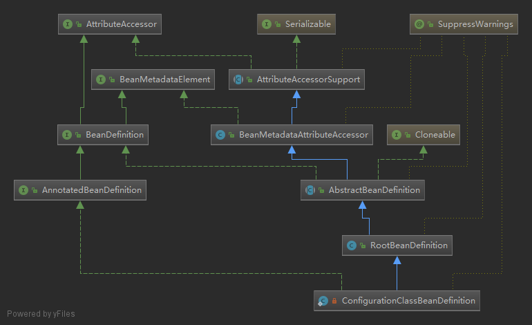

# Spring 源码系列(一) 容器初始化

## IoC/DI 的概念

容器是Spring的核心之一(另一个核心是AOP). 有了容器, IOC才可能实现. 

* 什么使IoC? IoC就是将类自身管理的与其由依赖关系的对象的创建/关联和管理交予容器实现, 容器按照配置(比如xml文件)来组织应用对象的创建和关联.

* 什么使DI? DI是IoC的实现方式, 由容器在程序初始化的时候将类的依赖对象注入进去. 

* IoC和DI的关系? IoC(Inversion of Control)是一种设计原则, 可以减少代码的耦合度, DI(Dependency Injection)是IOC的具体实现方式, 还有其他的实现方式如 DL(Dependency Lookup). 

## Spring 容器

`ClassPathXmlApplicationContext`类应该都比较熟悉, 我习惯从从熟悉的事物开始寻找线索. 

下载Spring源码后用idea打开, 找到类`ClassPathXmlApplicationContext`, idea可以使用 `ctrl+N` 输入类名搜索, 打开源文件, 按 `ctrl+Alt+U` 可以生成类图. 


`BeanFactory`和`ResourceLoader`是两个顶层接口. `BeanFactory`是Bean的工厂,定义了IoC基本的功能. `ResourceLoader`是资源加载的策略接口,定义了加载资源的基本规范, `ApplicationContext`需要此接口的功能. 

`BeanFactory`提供了容器最基本的功能, 所以其中定义的方法会频繁使用, 接口定义如下:
```Java
public interface BeanFactory {
    // 一个标记, 带有此标记开头的类不是bean, 而是工厂本身
	String FACTORY_BEAN_PREFIX = "&";
	// 下面几个方法是各种获取bean的方式
	Object getBean(String name) throws BeansException;
	<T> T getBean(String name, @Nullable Class<T> requiredType) throws BeansException;
	Object getBean(String name, Object... args) throws BeansException;
	<T> T getBean(Class<T> requiredType) throws BeansException;
	<T> T getBean(Class<T> requiredType, Object... args) throws BeansException;
	// 判断bean是否存在
	boolean containsBean(String name);
	// bean作用域是否单例
	boolean isSingleton(String name) throws NoSuchBeanDefinitionException;
	// bean作用域是否原型
	boolean isPrototype(String name) throws NoSuchBeanDefinitionException;
	// bean是否与给定解析类型匹配
	boolean isTypeMatch(String name, ResolvableType typeToMatch) throws NoSuchBeanDefinitionException;
	boolean isTypeMatch(String name, @Nullable Class<?> typeToMatch) throws NoSuchBeanDefinitionException;
	// 获取bean类型
	@Nullable
	Class<?> getType(String name) throws NoSuchBeanDefinitionException;
	//获取bean别名数组
	String[] getAliases(String name);

}
```

`ApplicationContext` 扩展了`BeanFactory`的功能, 除了作为工厂外, 它还提供了消息国际化(`MessageSource`), 获取环境bean(`EnvironmentCapable`), 容器消息发布(`ApplicationEventPublisher`)等功能. 因为它包含了容器以外的这些功能, 所以对我们了解容器来说多少会产生干扰. 事实上, 查看`BeanFactory`的子类(在类图上选中类,或者在源代码视图中按`Ctrl+Alt+B`)能从它的实现中找到`DefaultListableBeanFactory`, 从名称上二者在继承该关系上应该比较近, 功能也比较纯粹, 没有类似ApplicationContext的其他干扰. 

`DefaultListableBeanFactory` 类是最基本的容器实现类, 它的继承关系如下图. 作为bean的工厂, 它的职责就是生产bean, 基本功能正是顶级接口`BeanFactory`定义的那些方法. 它上级的接口扩展了自动装配的能力(`AutowireCapableBeanFactory`), 注册和获取等操作`BeanDefinition`实例的能力(`BeanDefinitionRegistry`).


## BeanDefinition

BeanDefinition 用来抽象bean定义在spring中的抽象, 最终spring将外部配置的bean转化为`BeanDefinition`的实例存储.



## 容器初始化过程

容器初始化过程分为三步, 资源Resource定位, 解析加载, 注册. 

`DefaultListableBeanFactory`只是工厂, 继承它的子类只有一个`XmlBeanFactory`, 它被标注为`@Deprecated`.所以不应该在应用中使用该类, 但它可以作为了解源码的入口. 它有个`XmlBeanDefinitionReader`的私有变量直接new初始化, 参数this将工厂实例传给这个对象, 这样它就有了工厂的引用, 方便内部处理.

```Java
public class XmlBeanFactory extends DefaultListableBeanFactory {

	private final XmlBeanDefinitionReader reader = new XmlBeanDefinitionReader(this);


	public XmlBeanFactory(Resource resource) throws BeansException {
		this(resource, null);
	}

	public XmlBeanFactory(Resource resource, BeanFactory parentBeanFactory) throws BeansException {
		super(parentBeanFactory);
		// 这个是调用实际加载资源的方法
		this.reader.loadBeanDefinitions(resource);
	}
```

到目前为止就可以大概串一下初始化的执行流程了

1. 获得一个`Resource`实例resource, 其实就是xml文件生成的输入流
2. 实例化`DefaultListableBeanFactory`工厂beanFactory, 将resource作为构造参数传入
3. beanFactory实例化, 生成`XmlBeanDefinitionReader`的实例reader, 并将beanFactory的引用传递给他
4. 在beanFactory构造函数中调用reader的方法加载resource, 解析生成一系列`BeanDefinition`的实例, 因为readere由工厂的实例, 所以这些实例可以注册到工厂中

